# DataBase

- [DataBase](#database)
  - [1. Database란?](#1-database란)
  - [2. FakeDatabase 활용](#2-fakedatabase-활용)
    - [2.1 Fake Database](#21-fake-database)
    - [2.2 Request Properties](#22-request-properties)
      - [2.2.1 req.params](#221-reqparams)
      - [2.2.2 req.query](#222-reqquery)
      - [2.2.3 req.body](#223-reqbody)
    - [2.3 Edit Page](#23-edit-page)
    - [2.4 Get Request vs Post Request](#24-get-request-vs-post-request)
    - [2.5 Fake Database 마지막 활용](#25-fake-database-마지막-활용)
  - [3. MongoDB](#3-mongodb)
    - [3.1 MongoDB란](#31-mongodb란)
      - [3.1.1 MongoDB 특징](#311-mongodb-특징)
      - [3.1.2 SQL과 비교](#312-sql과-비교)
    - [3.2 Mongoose](#32-mongoose)
    - [3.3 MongoDB 설치](#33-mongodb-설치)
      - [3.3.1 패키지 관리 시스템에서 사용하는 public key 가져오기](#331-패키지-관리-시스템에서-사용하는-public-key-가져오기)
      - [3.3.2 MongoDB를 위한 List파일 만들기.](#332-mongodb를-위한-list파일-만들기)
      - [3.3.3 로컬 패키지 데이터베이스 불러오기](#333-로컬-패키지-데이터베이스-불러오기)
      - [3.3.4 MongoDB 패키지 설치하기](#334-mongodb-패키지-설치하기)
      - [3.3.5 MongoDB 실행](#335-mongodb-실행)
      - [3.3.6 Mongoose 설치](#336-mongoose-설치)
    - [3.4 MongoDB 세팅](#34-mongodb-세팅)
      - [3.4.1 Database 연결하기](#341-database-연결하기)
      - [3.4.2 Model 생성](#342-model-생성)
  - [4. CRUD](#4-crud)
    - [4.1 CRUD란](#41-crud란)
    - [4.2 CRUD 구현 전에](#42-crud-구현-전에)
      - [4.2.1 Callback function vs Promise](#421-callback-function-vs-promise)
      - [4.2.2 callback function이용해서 data불러오기](#422-callback-function이용해서-data불러오기)
      - [4.2.3 동기 방식 vs 비동기 방식](#423-동기-방식-vs-비동기-방식)
      - [4.2.4 Promise 사용 이유](#424-promise-사용-이유)
      - [4.2.5 Promise 사용 방법](#425-promise-사용-방법)
    - [4.3 Create(생성)](#43-create생성)
      - [4.3.1 upload.pug](#431-uploadpug)
      - [4.3.2 controller.js](#432-controllerjs)
    - [4.4 Read(읽기)](#44-read읽기)
      - [4.4.1 home.pug](#441-homepug)
      - [4.4.2 controller.js](#442-controllerjs)
    - [4.5 Schema 최종 수정](#45-schema-최종-수정)
    - [4.6 Update(갱신)](#46-update갱신)
      - [4.6.1 router.js](#461-routerjs)
      - [4.6.2 edit.pug](#462-editpug)
      - [4.6.3 controller.js](#463-controllerjs)
    - [4.7 Delete(삭제)](#47-delete삭제)
  - [5. 마무리](#5-마무리)
    - [5.1 Search](#51-search)
    - [5.2 Bubble](#52-bubble)

## 1. Database란?

**Front end**는 사용자, 클라이언트 측에게 보여지는 인터페이스를 개발하는 것이고,

**Back end**는 클라이언트 측과 상호작용 하기 위한 서버를 개발하는 일입니다.

**Database**는 여러 사람이 공유하여 사용할 목적으로 체계화하여 통합, 관리하는 데이터의 집합입니다.

현재 이 프로젝트에서 Database를 사용할 목적은 유저의 계정 및 정보, 각종 비디오 등을 관리하는 목적으로 사용될 예정입니다.

## 2. FakeDatabase 활용

**Database**를 활용하는 것을 알아보기 전에 FakeDatabase를 controller에 만들어서 살펴볼 예정입니다.

### 2.1 Fake Database

FakeDatabase는 다음과 같이 되어 있습니다.

videoController.js

```js
let videos = [
  {
    title: "First Video",
    rating: 5,
    comments: 2,
    createdAt: "2 minutes ago",
    views: 59,
    id: 1,
  },
  {
    title: "Second Video",
    rating: 5,
    comments: 2,
    createdAt: "2 minutes ago",
    views: 59,
    id: 2,
  },
  {
    title: "Third Video",
    rating: 5,
    comments: 2,
    createdAt: "2 minutes ago",
    views: 59,
    id: 3,
  },
];

...
```

home.pug

```pug
extends base.pug
include ./mixins/video.pug

block content
    h2 Welcome here you will see the trending videos
    each video in videos
      +video(video)
```

mixins/video.pug

```pug
mixin video(info)
  div
    if  info
      h4
        a(href=`/videos/${info.id}`)=info.title
      ul
        li  #{info.rating}/5.
        li  #{info.comments} comments.
        li  Posted #{info.createdAt}.
        li  #{info.views} views.
    else
      h4 Sorry nothing found.
```

여기서 보면, anchor안에 url적는 부분을 살펴보면 변수 사용할 때 **#{}** 가 아닌 **${}** 로 사용한 것을 확인 할 수 있습니다.

이것은 string안에 #{}을 적으면 변수로 인식하지 못하기 때문입니다.

string안에 변수 사용하는 방식은 두 가지가 있습니다.

```pug
a(href=`/videos/${info.id}`)

a(href="/videos/" + video.id)
```

이렇게 **``(backtick)을 사용해서 ${}** 을 사용하거나 중간에 **" " + variable** 로 사용하는 두 가지 방식이 있습니다.

이제 home에서 anchor을 통해서 이동을 하면 url에 vidoe.id가 추가가 될 것입니다. 이것을 controller에서 받아오려면 어떻게 해야될까요? 그 때 사용하는 것이 **req.params**입니다.

### 2.2 Request Properties

클라이언트가 서버에게 request를 요청하는 과정에서 여러가지 정보가 담겨 있는데 그것은 **req 객체**에 담겨있습니다. 이는 controller에서 확인이 가능합니다.

이와 같이 하면 id값을 가져올 수 있습니다.

videoController.js

```js

...

export const see = (req, res) => {
	const { id } = req.params;
	const video = videos[id - 1];
	return res.render("watch", { pageTitle: `Watching ${video.title}` });
};

...

```

여기서 `const { id } = req.params;`는 **ES6**를 사용함으로써 쓸 수 있는 코드입니다.

다음 두 가지와 동일한 코드입니다.

```js
const id = req.params.id;

const {
  params: { id },
} = req;
```

아래에 req객체 중에서도 자주 쓰이는 property를 정리해 보았다.

#### 2.2.1 req.params

**req.params**는 다음과 같은 정보를 가져올 수 있습니다.

예를 들어 /home/:id 경로가 있으면 **id속성**을 **req.params.id**로 사용할 수 있습니다.

#### 2.2.2 req.query

**req.query**의 경우 경로의 각 Query 문자열 매개 변수에 대한 속성이 포함된 객체 프로퍼티입니다.

예를 들어 `http://home/search?searchResult=thisthis이면` serachResult 매게변수의 thisthis라는 값(argument)를 가져온다.

#### 2.2.3 req.body

JSON 등의 데이터를 담을 때 사용합니다.

주로 POST로 데이터를 전송할 때 사용합니다.

요청 본문에 제출된 **Key-Value**를 포함합니다. 이것은 기본적으로 정의되어 있지는 않으며 **express.json()** 이나 **express.urlencoded()** 와 같은 Middleware를 사용해야 합니다.

**_다시 말하자면, req.body는 body-parser를 사용하기 전에는 default값으로 Undefined로 설정되어 있습니다._**

### 2.3 Edit Page

본격적으로 FakeDatabase를 활용해서 내용을 수정해 볼 것입니다.

Edit Page를 만들기 전에 Edit Page로 어디를 통해서 갈 것인가를 생각해봐야 합니다. 메인 페이지에서 Edit Page로 넘어가기 보다는 동영상 상세 페이지로 넘어가고 나서 그 동영상 수정 페이지로 넘어가는 방식이 일반적입니다.

따라서 watch.pug를 다음과 같이 수정해줍니다.

watch.pug

```pug
extends base.pug

block content
    h3 #{video.views} #{video.views === 1 ? "view" : "views"}
    a(href=`${video.id}/edit`) Edit Video &rarr;
    //- &rarr;은 오른쪽 화살표를 출력합니다.

```

`/videos/:id`를 통해 이 페이지로 들어와 질 것입니다. 그 후 anchor을 통해서 해당 id를 가지고 있는 video를 수정하는 페이지로 넘어가게 될 것입니다.

> **absolute URL vs relative URL**
>
> 만약, /video/ 에서 a(href="/edit")를 타고 이동하면 어디로 이동을 할까요?
>
> 그때 이동하는 페이지는 /video/edit이 아닌 /edit로 이동할 것입니다.
>
> 이것이 바로 absolute URL입니다.
>
> absolute URL의 경우 /"URL"로 입력하면 현재 어디에 있든 상관없이 root경로 + URL 로 이동합니다.
>
> 그렇다면 a(href="edit")로 이동하면 어디로 이동을 할까요?
>
> 그때 이동하는 페이지는 /video/edit로 이동할 것입니다.
>
> Relative URL의 경우 "URL"을 입력하면 현재 위치하고 있는 경로 + URL로 이동을 합니다.
>
> > 만약 현재 페이지가 /video/:id 일 때 /video/:id/edit로 이동하고 싶으면 a(href=`${video.id}/edit`)으로 써야합니다. 만약 상대 URL a(href="edit")을 사용하여 이동하려했을 때 /video/:id/ -> /video/edit 으로 이동하게 될 것입니다.

Edit Page는 다음과 같이 수정합니다.

edit.pug

```pug
extends base.pug

block content
    h4 Change Title of video
    form(method="POST")
        input(name= "title", placehloder="Vidoe Title", type="text", value=pageTitle, required)
        input(value="Save", type="submit")
```

현재 Form의 전송방식을 보면 **POST**로 되어있는 것을 볼 수 있습니다.

### 2.4 Get Request vs Post Request

두 전송방식의 차이점은 URL을 통해서 설명을 할 수 있습니다.

다음은 GET방식을 사용했을 때 URL입니다.

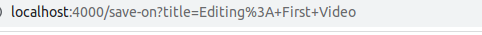

현재 title이라는 변수에 Editing이 들어가 있다는 것을 URL을 통해서 알 수 있습니다. 즉, GET의 경우 Form을 사용하여 서버에 전송을 하면 전송 데이터가 URL에 드러납니다. 검색이나, 동영상 시청 페이지등이 GET방식을 주로 사용합니다.

다음은 POST방식을 사용했을 때 URL입니다.

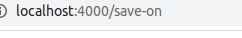

데이터를 전송하는 것은 똑같지만 POST 전송 방식의 경우 데이터가 URL에 드러나지 않습니다. POST방식의 경우 로그인을 할 때나, database에 있는 값을 바꾸려고 할 때 사용합니다.

그렇다면 POST 방식으로 request를 받을 때 서버가 controller를 이용하려면 어떻게 처리해야 될까요?

라우터 객체에 get방식과 동일하게 해주면 됩니다.

Router.js

```js
videoRouter.post("/:id(\\d+)/edit", postEdit);
videoRouter.get("/:id(\\d+)/edit", postEdit);
```

여기서, 코드를 줄일 수 있는 방법이 있는데, 바로 router.route()를 사용하는 것입니다.

```js
videoRouter.route("/:id(\\d+)/edit").get(getEdit).post(postEdit);
```

다음 controller로 가서 postEdit를 만들어 줍니다.

Controller.js

```js
export const postEdit = (req, res) => {
  const { id } = req.params;
  return res.redirect(`/videos/${id}`);
};
```

여기서 사용한 **res.redirect()** 는 브라우저가 자동으로 이동하도록 하는 것입니다.

페이지 이동은 해결을 했습니다.

그렇다면 데이터를 받아서 처리해주는 작업만이 남았습니다.

위에서 설명했듯이 req.body가 POST전송방식에서 자주 쓰이고, 사용하려면 express.urlencoded()를 해줘야 합니다.

따라서 middleware로서 다음과 같이 추가해주고, 데이터 처리도 다음과 같이 해줍니다.

server.js

```js
app.use(express.urlencoded({ extended: true }));
```

controller.js

```js
export const postEdit = (req, res) => {
  const { id } = req.params;
  const { title } = req.body;
  videos[id - 1].title = title;
  return res.redirect(`/videos/${id}`);
};
```

> 만약 req.body의 출력이 undefined로 나온다면, 두 가지를 살펴봅시다.
>
> 1.  Middleware가 정상적으로 적용이 되었는지?
>
> 2.  form에서 data전송할 때 attribute에 name을 넣어줬는지?

현재 배운 내용을 정리해보자면,

**_유저가 form을 get 또는 post하면 등록해둔 controller를 발동시켜서 유저들이 redirect되거나, 페이지에서 뭔가를 보게 됩니다._**

### 2.5 Fake Database 마지막 활용

그렇다면, upload를 하려면 어떻게 처리하면 될까요?

다음과 같이 하면 될 것 같습니다.

1.  anchor을 이용해서 Upload Page로 갈 수 있도록 PUG를 수정하고, Upload Page를 만들어 줍니다.
2.  Upload의 경우 form 전송을 통해서 데이터를 데이터베이스에 넣어두는데, 이 과정은 POST로 이루어 질것입니다.
3.  router객체에 Post를 등록해두고, controller를 생성해서 넣어줍니다.
4.  controller에서 데이터를 받아 저장까지 이루어진 후, redirect를 하면 마무리가 될 것입니다.

이러한 방식으로 처리가 될 것입니다.

코드는 생략하도록 하겠습니다.

## 3. MongoDB

### 3.1 MongoDB란

**NoSQL** 데이터베이스로 분류되는 **MongoDB**는 **JSON**과 같은 동적 **Schema Documents**를 선호함에 따라 전통적인 테이블 기반 관계형 데이터베이스 구조의 사용을 삼갑니다. 이로써 특정한 종류의 애플리케이션을 더 쉽고 더 빠르게 데이터 통합을 가능케 합니다.

> NoSQL
>
> > 일반적인 데이터베이스들은 대부분 관계형 모델에 기반을 두고 있으면 대부분 SQL이라는 질의문에 의해 데이터베이스를 수정, 갱신, 저장, 검색하도록 구성되어 있습니다. 그러나 관계형 데이터베이스 모델과는 다른 데이터베이스 관리 시스템에 대한 관심이 증가했고, 이러한 시스템을 일컬어 NoSQL(Not Only SQL)이라고 합니다.

좀더 쉽게 표현하자면, MongoDB의 경우 sql-base가 아닌 **database docuemnt-based**입니다. **JSON-like-document**로 저장되어지고, 따라서 행으로 된 테이터를 저장할 필요가 없는 것입니다.

#### 3.1.1 MongoDB 특징

- Join이 없으므로 Join이 필요 없도록 데이터 구조화가 필요
- 다양한 종류의 쿼리문을 지원(필터링, 수집, 정렬, 정규표현식 등)
- 관리의 편의성
- 스키마 없는(Schemaless) 데이터베이스를 이용한 신속 개발. 필드를 추가하거나 제거하는 것이 매우 쉬워짐
- 쉬운 수평 확장성
- 인덱싱 제공

#### 3.1.2 SQL과 비교

일반적으로 많이 사용되는 것은 SQL입니다. 그래서 MongoDB 공식 사이트에서 SQL문과 비교해 놓은 것이 있는데, 다음과 같이 비교해보면서 익혀봅시다.

| MySQL 용어  | MongoDB 용어/개념     |
| ----------- | --------------------- |
| database    | database              |
| table       | collection            |
| index       | index                 |
| row         | JSON document         |
| column      | JSON field            |
| join        | embedding and linking |
| primary key | \_id field            |
| group by    | aggregation           |

### 3.2 Mongoose

**Mongoose**는 NoSQL 데이터베이스를 지원하는 노드의 확장 모듈로 가장 많이 쓰입니다. 가장 많이 쓰이는 모듈 중 하나인 이유는 Object를 만들고, Object와 data를 묶어서 사용하는 **ODM(Object Data Mapping)** 의 특성 때문입니다.

쉽게 말하자면, **Moogoose**는 **node.js와 MongoDB를 이어주는 다리 역할**을 해줍니다. JavaScript를 적으면 mongoose가 mongoDB로 건네주고, validatioin, query building, hook, ... 여러가지를 수행할 수 있게 되는 것입니다.

### 3.3 MongoDB 설치

#### 3.3.1 패키지 관리 시스템에서 사용하는 public key 가져오기

먼저 터미널에서 다음 명령어를 실행하여 MongoDB public GPG key를 가져옵니다.

    $ wget -qO - https://www.mongodb.org/static/pgp/server-5.0.asc | sudo apt-key add -
    //  MongoDB 공식 사이트에서 최신 코드를 참고하자.

성공적으로 처리가 되었을 경우 OK라고 출력이 될 것입니다.

만약 gnupg가 installed되지 않아서 오류가 났을 경우 설치를 해주고 나서 위의 명령어를 실행하면 됩니다.

#### 3.3.2 MongoDB를 위한 List파일 만들기.

List파일 만드는 방법은 우분투 버전에 따라 다르기 때문에, 20.04기준에 맞춰서 적었습니다.

/etc/apt/sources.list.d/mongodb-org-5.0.list파일을 이와 같은 경로에 만들 것인데 5.0인것은 version 5.0을 의미합니다.

    $ echo "deb [ arch=amd64,arm64 ] https://repo.mongodb.org/apt/ubuntu focal/mongodb-org/5.0 multiverse" | sudo tee /etc/apt/sources.list.d/mongodb-org-5.0.list

#### 3.3.3 로컬 패키지 데이터베이스 불러오기

MongoDB패키지 설치를 위해, 다음 명령어를 통해 로컬 패키지 데이터베이스를 불러옵니다.

    $ sudo apt-get update

#### 3.3.4 MongoDB 패키지 설치하기

다음 명령어를 통해 안정된 최신 버전의 MongoDB를 설치할 수 있습니다.

    $ sudo apt-get install -y mongodb-org

#### 3.3.5 MongoDB 실행

MongoDB실행은 터미널 창에서 다음과 같이 입력하면 됩니다.

    $ service mongod start
    $ sudo service mongod start

정지 시키고 싶다거나 mongod의 현재 상태를 확인하고 싶으면 다음과 같이 입력하면 됩니다.

    $ service mongod stop
    $ service mongod status

status를 확인했을 때 active(running)으로 되어 있다면, **mongod**를 치고 **mongo**를 치면 mongoDB안으로 즉, Database안으로 들어갈 수 있습니다.

> 만약 mongo를 쳤는데 error가 뜨고 start를 하고나서 status를 확인했을 때도 active가 아닌 fail이 뜬다면 다음과 같이 하면 됩니다.
>
> > sudo cat var/log/mongodb/mongodb.log를 입력하면 로그가 나오는데, 맨 하단에 aborting after fassert() faulure가 나온다면 다음 명령어를 입력하자.<br />
> > sudo rm /tmp/mongodb-27017.sock 입력후 다시 start를 하면 됩니다.
>
> > 이 오류는 service mongod start를 하지 않은 상태 즉, mongoDB가 active한 상태가 아닐 때 mongod나 mongo를 입력하면 발생하는 오류입니다. **주의**

#### 3.3.6 Mongoose 설치

현재 사용하고 있는 node.js와 연결하기 위해 사용하는 Mongoose설치는 다음과 같이 하면 됩니다.

    $ npm i mongoose

### 3.4 MongoDB 세팅

현재 프로젝트에서 **Mongoose Model**을 사용하기 위해선 **데이터베이스 연결**과 **모델 정의**를 해야합니다.

#### 3.4.1 Database 연결하기

분리 시켜 관리하기 위해 db.js를 생성해주고 컴퓨터에 실행하고 있는 mongo database에 연결해 줄 것입니다.

db.js

```js
import mongoose from "mongoose";

mongoose.connect("mongodb://127.0.0.1:27017/nameofdatabase");
```

**nameofdatabase**자리엔 사용하려는 database이름이 들어가면 됩니다.

위의 URL은 터미널에서 **mongo**를 입력하였을 때 출력되는 URL을 사용하면 됩니다.

현재 이렇게 해놓고 기존에 하고 있던 프로젝트와 연결 시켜줘야합니다. import를 사용해서 연결해줍니다.

server.js

```js
import "./db.js";

...
```

5.0 version에선 warning이 발생하지 않았지만 server를 열어주면 options를 주라고 warning이 발생할 수 있습니다. 보고 아래와 같이 추가하라는 것은 추가하면 됩니다.

또한, database에서 event가 발생할때 생기는 오류를 확인하기 위해서 console.log를 해주는 것도 좋습니다.

db.js

```js
import mongoose from "mongoose";

mongoose.connect("mongodb://127.0.0.1:27017/nameofdatabase", {
  useNewUrlParser: true,
  useUnifiedTopology: true,
});

const db = mongoose.connection;

const handleOpen = () => console.log("✅ Connected to DB");
const handleError = (error) => console.log("❌ DB Error", error);

db.on("error", handleError);
db.once("open", handleOpen);
```

- on: 발생할 때 마다 실행시켜줍니다.
- once: 처음 발생할 때 한번만 실행합니다.

#### 3.4.2 Model 생성

**Mongoose의 모델**은 MongoDB에서 데이터를 저장하는 기본 단위인 Document의 형태를 의미합니다. 이것은 Mongoose에서 제공하는 **Schema**라는 인터페이스를 통해 생성할 수 있습니다. 모델을 생성하기 위해 다음과 같은 **Schema**가 필요하다.

models/Video.js

```js
import mongoose from "mongoose";

const videoSchema = new mongoose.Schema({
  title: String,
  description: String,
  createdAt: Date,
  hashtags: [{ type: String }],
  meta: {
    views: Number,
    rating: Number,
  },
});

const Video = mongoose.model("Video", vidoeSchema);
export default Video;
```

코드 분석을 해보자면, title, description, createdAt, ...은 **JSON field**에 해당합니다. 안에 넣어주는 **형식 타입**을 위와 같이 해준것이고, **hashtags**를 살펴보면 **[{ }]** 이러한 식으로 되어 있습니다. 이것은 **Array 객체**라는 것을 말해주고 그 안에 들어가는 **element의 형식이 String**이라는 것입니다.

더 많은 옵션이 들어 갈수 있습니다. [Mongoose Document](https://mongoosejs.com/docs/guide.html)

    const Video = mongoose.model("Video", vidoeSchema);

이 코드는 앞서 생성한 videoSchema를 이용하여 Video라는 모델을 생성하는 코드입니다. **첫번째 인자**로 들어가는 것이 **Collection의 이름**입니다. **두번째 인자**로 들어가는 것이 **Schema**입니다.

그 이후 default로 export 해줌으로써 다른 파일에서도 사용할 수 있게 해줬습니다.

> 현재까지 폴더 및 파일 관리를 하면서 server.js에서 서버 관리와 애플리케이션(app)를 같이 관리해 왔는데, 분리할 필요가 있습니다.

이렇게 함으로써 **Mongoose Model**을 사용할 세팅을 완료했습니다. 나머지는 아래 Part에서 덧붙여가며 설명하겠습니다.

## 4. CRUD

### 4.1 CRUD란

**CRUD**는 대부분의 컴퓨터 소프트웨어가 가지는 데이터 처리 기능인 **Create(생성), Read(읽기), Update(갱신), Delete(삭제)** 를 묶어서 일컫는 말입니다. 이 Part에선 **Mongoose Model**를 활용하여 **CRUD를 목표로 합니다.**

### 4.2 CRUD 구현 전에

**데이터 베이스에 CRUD를 하기 위해선** 먼저 **어디서 CRUD가 이루어지는지**를 생각해 봐야합니다. 현재 페이지를 이동할 때마다 router를 통해서 함수를 실행시키는데 이때 이 함수가 **controller** 즉, **Callback function**입니다.

controler에서 CRUD가 이루어질 것이고, 그러기 위해선 controller.js에서 Model을 import를 해줘야 합니다.

controller.js

```js
import Video from "./models/Video";

...
```

#### 4.2.1 Callback function vs Promise

Read Part에서 설명하겠지만, 먼저 **async와 await의 중요성**을 설명하기 위해 find()함수를 사용해서 코드를 통해 설명하겠습니다. 간단히 말하자면 **find()** 는 **조건을 주어줘서 database의 data를 불러오는 함수**입니다. 이를 이용해서 두가지 활용 방법이 있는데 **callback function**을 사용하거나, **promise**를 활용하는 방법입니다.

#### 4.2.2 callback function이용해서 data불러오기

**Callback function**은 무언가가 발생하고 난 다음 호출되는 function을 말합니다. 즉, 실행이 되는것을 기다려야만 하는 것입니다. **Mongoose Model**같은 경우에도 **_JavaScript내에서 데이터를 처리하는 것이 아니라 외부에서 데이터를 가져오는 것이기 때문에 데이터가 완전히 전송될 때 까지 기다려야 합니다._** 하지만 Callback function은 그렇게 친절하지 않습니다.

다음과 같은 코드가 있다고 해봅시다.

```js
export const home = (req, res) => {
  Video.find({}, (error, videos) => {
    console.log("error", error);
    console.log("video", videos);
  });
  console.log("hello");
  return res.render("home", { pageTitle: "Home", videos: [] });
};
// find({}, function())에서 중괄호{}는 search terms라고 하고 안에가 비어있다는 것은 모든 형식을 찾는다는 것입니다.
```

이와 같이 되어있을 때 출력 순서가 어떻게 될 것인가요?

처음에 생각했을 때 error -> videos -> "hello"일 것 같앗지만 결과는 다음과 같았습니다.

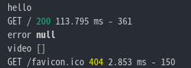

"hello"가 나온 시점에서 연결이 된것이고, template을 render한 다음 errors와 videos가 출력된 것입니다.

즉, 유저가 request하고 "hello"를 출력한 뒤 render 과정을 거쳐야 logger를 얻게 되는 것입니다.

좀 더 직관적으로 보이기 위해 다음과 같이 코드를 수정 후 실행해봅시다.

```js
export const home = (req, res) => {
  console.log("Starting Search");
  Video.find({}, (error, videos) => {
    console.log("error", error);
    console.log("video", videos);
    console.log("Finished Search");
  });
  console.log("I should be the last one");
  return res.render("home", { pageTitle: "Home", videos: [] });
};
```

결과는 다음과 같습니다.

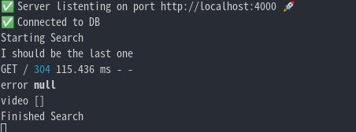

이러한 방식을 **비동기 방식**이라고 합니다. 이 **비동기 방식(callback)** 에는 문제점이 있습니다. 그건 [아래](#424-동기-방식-vs-비동기-방식)에서 살펴보기로 하고 순차적으로 처리하기 위해 다음과 같이 코드를 해보았습니다.

> 참고로 기본적으로 callback은 비동기 처리 방식입니다.

렌더링을 나중에 하기 위해 다음과 같이 했습니다.

```js
export const home = (req, res) => {
  console.log("Start");
  Video.find({}, (error, videos) => {
    console.log("Finished");
    return res.render("home", { pageTitle: "Home", videos });
  });
  console.log("I finish first");
};
```

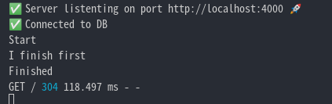

출력된 순서로 보면 확실히 콜백 함수가 뒤늦게 실행 되는 것을 알 수 있습니다.

이제 마지막 console.log를 지우고 출력을 해봅시다.

```js
export const home = (req, res) => {
  console.log("Start");
  Video.find({}, (error, videos) => {
    console.log("Finished");
    return res.render("home", { pageTitle: "Home", videos });
  });
};
```

database 검색이 끝나야 rendering이 시작됩니다.

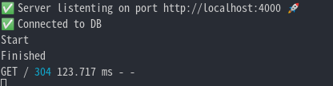

하지만 이 코드를 살펴보면, home function안에 또 다른 function이 들어간 상황입니다. 만약 데이터를 찾기만 하는 것이 아닌 찾고 수정하고 여러 과정이 필요하다면?

콜백 함수안에 또다른 콜백 함수가 들어갈 것이고 계속해서 들어갈 것입니다. 이것을 **콜백 지옥**이라고 합니다. **Promise**는 이것을 해결해 줍니다. 비동기 방식을 동기 방식으로 바꿔서 처리가 완료될 때 까지 기다려줍니다.

> 그렇다면 Promise는 단순히 '콜백 지옥'을 해결하기 위해 사용하는 것일까? 데이터를 불러오는 동시에 코드가 진행 되는것이 속도적인 측면에서 좋은것 아닌가라는 생각이 듭니다.

#### 4.2.3 동기 방식 vs 비동기 방식

- **동기 방식**은 서버에서 요청을 보냈을 때 응답이 돌아와야 다음 동작을 수행할 수 있습니다. 즉, A작업(렌더링)이 모두 진행될 때까지 B작업(find())은 대기해야합니다. **_만약, find()가 동기방식이라면, 데이터베이스 탐색은 얼마나 오래 걸릴지도 모르는데 렌더링 까지 기다려야 되는 상황인 것입니다._**

- **비동기 방식**은 반대로 요청을 보냈을 때 응답 상태와 상관없이 다음 동작을 수행 할 수 있습니다. **_즉, A작업(렌더링)이 시작하면 동시에 B작업(find())이 실행됩니다. A작업은 결과값이 나오는대로 출력됩니다._**

이러한 **비동기 방식**을 통해서 오래 걸릴지도 모를 데이터베이스 탐색을 따로 병행해서 진행하고 렌더링도 동시에 진행하는 것입니다.

즉, 간단하게 비유해서 설명하자면 카페에서 알바생이 혼자라 주문 받은대로 만들고 내주고 하는 방식이 **동기방식**이고, 여러 알바생이 있어서 주문 받고 옆에서 다른 알바생이 만드는 동시에 주문 받고 처리 하는 방식이 **비동기 방식**이라고 보면 됩니다.

> 비동기적 코드의 실행 결과는 동기적 코드가 전부 실행 되고나서 값을 반환합니다.

비동기 방식 예시를 하나 봅시다.

JavaScript는 대부분 **비동기 방식**으로, 처리 요청을 받으면 알려만 주고 바로 다음으로 넘어갑니다. 서버 쪽으로 요청을 보내고 결과 값을 받아온 후 화면에 출력을 해야 하는 작업이 있는데 **비동기 처리 방식**때문에 처리 결과가 오기도 전에 화면에 출력을 해버리기 때문에 **빈 화면**을 보게 되는 경우가 발생합니다. 대부분의 홈페이지가 이러한 방식으로 구현되어 있는 것 같습니다.

여기까지 살펴봤을 때, 동기 방식보다 비동기 방식으로 처리하는 것이 훨씬 더 좋아 보입니다.

그렇다면 동기 방식은 언제 쓰는 것인가?

**은행 계좌 처리**를 생각해봅시다.

한 사람이 ATM기기에서 돈을 출금했는데, 그 계좌 잔고의 변화가 즉각 갱신이 일어나지 않으면, 이것이 조금씩 커져 결국 전체 시스템의 문제로 발생할 것 같습니다.

> 그렇다면, Promise를 사용하는 이유는 무엇일까..? 정말 단순히 '콜백 지옥'의 해결로 인한 편한 가독성때문인 것일까?

#### 4.2.4 Promise 사용 이유

비동기 요청을 사용함으로써 발생할 수 있는 **안티 패턴**은 '콜백 지옥'말고도 여러가지 있습니다. 이것을 **Promise**로 해결할 수 있고 현재 페이지를 참고 했지만 이해하기 어려워 일단 링크만 달아 놓습니다.[자바스크립트 콜백의 문제점과 프로미스 쓰는 이유](https://yuddomack.tistory.com/entry/%EC%9E%90%EB%B0%94%EC%8A%A4%ED%81%AC%EB%A6%BD%ED%8A%B8-%EC%BD%9C%EB%B0%B1%EC%9D%98-%EB%AC%B8%EC%A0%9C%EC%A0%90%EA%B3%BC-%ED%94%84%EB%A1%9C%EB%AF%B8%EC%8A%A4-%EC%93%B0%EB%8A%94-%EC%9D%B4%EC%9C%A0)

> 안티 패턴은 간단히 말하자면, 실제 많이 사용되는 패턴이지만 비효율적이거나 비생산적인 패턴을 의미합니다.

지금은 **콜백 지옥**을 해결해 줌으로써 **가독성을 높이는 것**과 데이터를 받아오기도 전에 데이터를 다 받아온 것처럼 렌더링 해버리면 **오류가 발생하거나 빈 화면이 뜰 수 있는 것을 방지**하기 위해서 사용한다고 생각하자.

#### 4.2.5 Promise 사용 방법

**Promise**는 **async** 와 **await**를 이용하여 사용합니다.

```js
export const home = async (req, res) => {
  try {
    console.log("I start");
    const videos = await Video.find({});
    console.log("I finish");
    console.log(videos);
    return res.render("home", { pageTitle: "Home", videos });
  } catch (error) {
    return res.render("server-error", { error });
  }
};
```

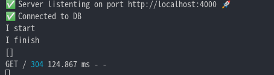

**await**를 **비동기 함수(find)** 앞에 적음으로 써 순자적으로 코드를 진행 시킨다. 즉 **callback**이 아니다라고 말해주는 것 입니다. **error**인자가 사라진 것은 **try catch구문**을 사용하여 대체해줄 수 있습니다.

**async**와**await**의 아주 큰 장점은 database 사용을 기다려 줌으로써 직관적으로 된다는 것입니다. 즉, Javascript가 어디서 어떻게 처리하고 있는지 알 수 있게 됐다는 것입니다.

> await를 쓸 때 async를 안쓰면 오류가 날 것입니다.

### 4.3 Create(생성)

먼저 데이터베이스에 Model을 통해서 Data를 넣어주고 싶으면 Data를 넣어주는 Upload Page가 필요하다.

#### 4.3.1 upload.pug

home에서 link를 통해 upload.pug로 이동합니다고 생각해 보자. 먼저 home과 base.pug에 다음과 같이 upload anchor을 만들어주자. 이후에 [Search Part](#51-search)에서 사용될 Search page도 미리 만들어 놓자.

base.pug

```pug
doctype html
html(lang="ko")
    head
        title #{pageTitle} | Wetube
        link(rel="stylesheet" href="https://unpkg.com/mvp.css")
    body
        header
            h1=pageTitle
            nav
                ul
                    li
                        a(href="videos/upload") Upload Video
                    li
                        a(href="/") Home
                    li
                        a(href="/search") Search
        main
            block content
    include partials/footer.pug
```

home.pug

```pug
extends base
include mixins/video

block content
    each video in videos
        +video(video)
    else
        li Sorry nothing found.
```

upload페이지로 이동할 때 get방식으로 이동함으로써 router객체에 get매소드를 추가해 놓고 controller에선 upload로 rendering해주면 됩니다. 이 부분 코드는 생략하도록 하겠습니다.

upload.pug는 다음과 같이 되어 있습니다.

upload.pug

```pug
extends base.pug

block content
    if errorMessage
        span=errorMessage
    form(method="POST")
        input(placeholder="Title", required, type="text", name="title", maxlength=80)
        input(placeholder="Description", required, type="text", name="description", minlength=20)
        input(placeholder="Hashtags, separated by comma.", required, type="text", name="hashtags")
        input(type="submit", value="Upload Video")
```

pug는 기본적으로 html의 코드를 pug만의 코드로 사용하는 것이기 때문에 속성값주는 것에선 크게 차이가 없습니다.

이후 submit을 눌러 전송을 하게 되면 POST 전송방식을 사용하게 됩니다.

#### 4.3.2 controller.js

아직 router에 [post메소드를 등록](#24-get-request-vs-post-request)해놓지 않았기에 등록합니다.

router.js

```js
videoRouter.route("/upload").get(getUpload).post(postUpload);
```

이와 같이 하고 controller를 살펴봅시다. controller에선 POST로 넘겨준 Data를 받아서 Database에 넣어주는 과정이 필요합니다. 위에서 살펴봤듯이 POST로 넘겨준 Data는 [req.body](#223-reqbody)를 사용하면 됩니다.

controller.js

```js
export const postUpload = async (req, res) => {
  const { title, description, hashtags } = req.body;
  try {
    await Video.create({
      title,
      description,
      hashtags: hashtags.split(",")
      .map((word) => (word.startsWith("#") ? word : `#${word}`));,
    });
    return res.redirect("/");
  } catch (error) {
    return res.render("upload", {
      pageTitle: "Upload Video",
      errorMessage: error._message,
    });
  }
};
```

코드 분석을 해보자.

먼저 async 와 await는 [위에서](#425-promise-사용-방법) 설명해 놓았습니다. hashtags의 경우 [split()](https://developer.mozilla.org/ko/docs/Web/JavaScript/Reference/Global_Objects/String/split)을 이용하여 ,로 구분해 String => Array로 바꿔준 후 [map()](https://developer.mozilla.org/ko/docs/Web/JavaScript/Reference/Global_Objects/Array/map)을 통해서 #word형태로 만들어 줍니다. 이때 [startsWith()](https://developer.mozilla.org/ko/docs/Web/JavaScript/Reference/Global_Objects/String/startsWith) 과 [삼항 조건 연산자](https://developer.mozilla.org/ko/docs/Web/JavaScript/Reference/Operators/Conditional_Operator)를 사용해서 #이 있을 때는 해쉬 태그가 추가되지 않도록 해줍니다.

만약 video객체를 만들고나서 그것을 저장하고 싶으면 **video.save()** 를 이용하면 됩니다.

에러가 날 경우 **error.\_message**를 띄우도록 해놓았다. 이렇게 하면 데이터를 **Create(생성)** 할 준비는 끝이 났다. 만약 데이터 생성에 성공을 했고 데이터가 잘 들어 갔는지 확인하고 싶다면 다음과 같이 하면 됩니다.

먼저, 터미널로 가서 다음 명령어를 입력합니다.

    $ mongod
    $ mongo

MongoDB안으로 들어간 후 다음 명령어를 통해 database가 생성되었는지 확인합니다.

    $ show dbs

[위에서](#341-database-연결하기) URL뒤에 데이터 베이스 이름을 명명해놨을 것입니다. 그 이름이 show dbs를 했을 때 보여야 됩니다. database안으로 들어가 봅시다.

    $ use databaseName

Collections을 확인해야 되는데 Collections은 document의 묶음이라고 생각하면 됩니다. [위에서](#312-sql과-비교) 설명 했듯이 SQL로 따지면 table이라고 생각하면 됩니다. 다음을 입력하면 저장된 데이터를 확인할 수 있습니다.

    $ db.collectionName.find()

find()는 현재 collections안에 들어가있는 데이터 전부를 출력해줍니다. 저장이 잘 되었다면 다음과 같이 보여야 됩니다.

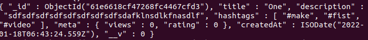

MongoDB의 경우 SQL의 primary key와 비슷한 역할을 하는 **\_id를 자동으로 16진수로 구성된 24자리의 string으로 생성**해 줍니다.

### 4.4 Read(읽기)

유저가 upload페이지로 가서 데이터를 생성하는 것 까지 완료를 했습니다. home page에 저장되어 있는 데이터가 출력이 되게 해주면 됩니다.

#### 4.4.1 home.pug

base.pug와 home.pug를 살펴보자. base.pug와 home.pug의 경우 위에 [4.3.1](#431-uploadpug)에서 코드를 적어놓았다. home.pug만 코드를 적어놓고 코드 분석을 해보자.

home.pug

```pug
extends base
include mixins/video

block content
    each video in videos
        +video(video)
    else
        li Sorry nothing found.
```

현재 보면 mixin처리를 해서 video를 출력해오고 있습니다. video라는 Object를 controller에서 받고 그것을 home page에 출력해주고 있는 것입니다. mixin까지 살펴보자.

mixins/vidoe.pug

```pug
mixin video(video)
    div
        h4
            a(href=`/videos/${video.id}`)=video.title
        p=video.description
        ul
            each hashtag in video.hashtags
                li=hashtag
        small=video.createdAt
        hr
```

현재 video Object에서 사용하고 있는 key를 살펴보면 id, title, description, hashtags, createdAt으로 위에서 **Upload할때 데이터에 넣어준 값들**을 출력하게 해놓았습니다.

> JavaScript의 경우 객체 프로퍼티에 접근 하는 방식이 두가지가 있습니다.
>
> - vidoe.title
> - video["title"]

이제 controller에서 Database에 저장되어 있는 데이터를 넘겨주기만 하면 될 것 같습니다.

#### 4.4.2 controller.js

controller에서 렌더링할 때 pug에게 변수를 넘겨주는 방법을 우리는 위에서 배웠습니다. 그 방법을 사용해서 불러온 데이터들을 넘겨주면 될 것 같습니다. Database에서 data를 불러오는 방법으로 **find()** 를 사용할 것입니다.

controller.js

```js
export const home = async (req, res) => {
  const videos = await Video.find({}).sort({ createdAt: "asc" });
  return res.render("home", { pageTitle: "Home", videos });
};
```

코드 분석을 해봅시다.
**async와 await**를 활용하여 데이터베이스에서 데이터를 불러오는 동안 멈춰있도록 해놓았습니다. Model.find({})는 [위에서](#422-callback-function이용해서-data불러오기)도 설명했다시피 {}는 search terms라고 하고 안에가 비어있다는 것은 모든 형식을 찾는다는 것입니다.

[sort()](https://developer.mozilla.org/ko/docs/Web/JavaScript/Reference/Global_Objects/Array/sort)의 경우 불러온 **데이터를 어떤 순서로 정렬**할 것인가고, **asc**는 Ascending의 줄임말로 오름차순입니다. **des**는 Descending의 줄임말로 내림차순입니다.

이렇게 하면 성공적으로 출력이 될 것입니다. 결과는 다음과 같습니다.

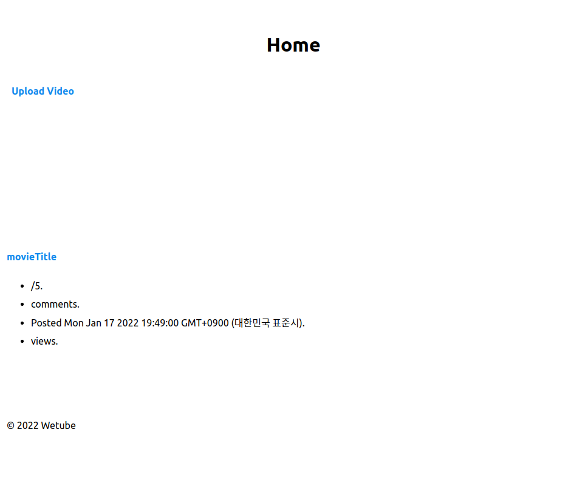

### 4.5 Schema 최종 수정

현재 Upload Page를 만들었는데, 유저가 입력하는 정보는 title, description, hashtags 이렇게 3가지를 입력합니다. Schema를 다시 한번 봐보자.

models/Video.js

```js
import mongoose from "mongoose";

const videoSchema = new mongoose.Schema({
  title: String,
  description: String,
  createdAt: Date,
  hashtags: [{ type: String }],
  meta: {
    views: Number,
    rating: Number,
  },
});

const Video = mongoose.model("Video", vidoeSchema);
export default Video;
```

**createAt**의 경우 upload되는 시점을 default값으로 주면 좋을 것 같습니다.
또한, **views와 rating**의 경우 새로 올리는 데이터이기에 0으로 default값을 주면 될 것 같습니다. 또 필요할 것 같은 옵션들을 다 준다고 할 때 다음과 같이 될 것 같습니다.

models/Video.js

```js
import mongoose from "mongoose";

const videoSchema = new mongoose.Schema({
  title: { type: String, required: true, trim: true, maxLength: 80 },
  description: { type: String, required: true, trim: true, minLength: 20 },
  createdAt: { type: Date, required: true, default: Date.now },
  hashtags: [{ type: String, trim: true }],
  meta: {
    views: { type: Number, default: 0, required: true },
    rating: { type: Number, default: 0, required: true },
  },
});
const Video = mongoose.model("Video", videoSchema);

export default Video;
```

input 옵션과 비슷하기에 넘어가고 **trim**은 띄어쓰기를 지워주는 것입니다.

> 만약, required를 한 필드에 맞지 않는 타입을 저장하려면 어떻게 될까?
>
> 예를 들어, Number를 받는 field에 문자를 넣으면 어떻게 되는 것일까?
>
> > **에러가 발생하여 response를 하지 못한채 무한로딩이 걸릴 것입니다.**
>
> 그렇다면 required가 없는 필드에 맞지 않는 타입을 저장하면?
>
> > **해당 field는 저장할 때 제외되고 저장이 될 것입니다**
>
> Mongoose는 이와 같이 데이터 타입의 유효성 검사를 도와줍니다.

### 4.6 Update(갱신)

이제 유저가 데이터를 수정할 수 있게 해주는 작업을 할 것입니다. Edit Page로 만들건데 Edit Page는 기본적으로 id를 통해서 watch Page로 들어간다음 만들어야 될 것 같습니다. mixin video를 코드를 다시 살펴 보면,

mixins/video.pug

```pug
mixin video(video)
    div
        h4
            a(href=`/videos/${video.id}`)=video.title
        p=video.description
        ul
            each hashtag in video.hashtags
                li=hashtag
        small=video.createdAt
        hr
```

link를 video.title에 달아 놨습니다.

#### 4.6.1 router.js

watch(detail page)로 이동을 할 때 문제가 발생합니다. 현재까지 Fake Database를 사용하면서 우리는 video 객체가 가지고 있는 id는 숫자로만 이루어져있는 것으로 간주해서 router객채에 get메소드를 다음과 같이 해놨다.

router.js

```js
...

Router.get("/:id(\\d+)", getEdit);

...
```

현재 **Regular Expression(정규 표현식)** 을 사용하여 숫자만 받는 변수를 생성했습니다. 하지만, MongoDB에서 제공해주는 **id는 16진수로 되어있는 24자리의 문자열**을 받는 상황입니다. 수정이 필요할 것 같습니다.

정규 표현식을 확인하는 사이트는 [Regex Tester](https://www.regexpal.com/)를 이용하여 확인하면 됩니다. 24 자리를 나타내는 것은 **{24}** 이고, 16진수는 0부터9, a부터 f까지 있으므로 **[0-9a-f]** 와 같이 나타낼 수 있습니다.

따라서 **[0-9a-f]{24}** 로 사용하면 됩니다.

router.js

```js
...

videoRouter.route("/:id([0-9a-f]{24})/edit").get(getEdit).post(postEdit);

...
```

edit의 경우 get 과 post방식 둘다 필요함으로 **route함수**를 사용하여 처리했습니다.

이제 edit.pug를 손 봐줄 차례입니다.

#### 4.6.2 edit.pug

edit page는 기본적으로 upload와 크게 다를 바 없어 보입니다. 유저가 입력했던 것들은 수정을 할 수 있게 해줘야 합니다.

```pug
extends base.pug

block content
    h4 Update Video
    form(method="POST")
        input(name= "title", placehloder="Vidoe Title", type="text", value=video.title, required)
        input(placeholder="Description", required, type="text", value=video.description name="description", minlength=20)
        input(placeholder="Hashtags, separated by comma.", required, type="text", value=video.hashtags.join(),name="hashtags")
        input(value="Save", type="submit")
```

크게 다를 바 없지만 hashtag의 경우 Upload를 할 때 String을 ,로 분리하여 각각에 해쉬 태그(#)를 앞에 붙여두었습니다. **_만약 value=videl.hashtags만 했을 경우 다음과 같이 됩니다._**

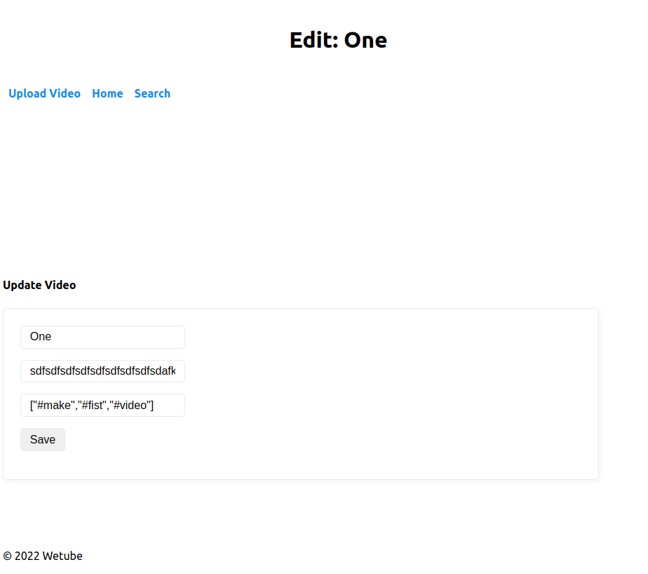

이것을 [join()](https://developer.mozilla.org/ko/docs/Web/JavaScript/Reference/Global_Objects/Array/join)을 사용하여 Array => String으로 바꿔서 출력하면 다음과 같이 됩니다.

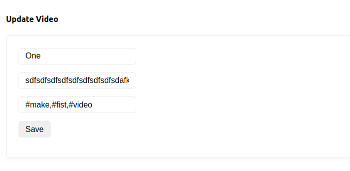

이제 마지막으로 controller를 수정하면 될 것 같습니다.

#### 4.6.3 controller.js

Post메소드로 위의 데이터를 받아서 기존에 데이터 베이스에 저장되어 있는 것을 수정해 줘야 합니다.

**두 가지 방식**으로 처리할 수 있습니다. 먼저 첫번째 방식으로 일일히 다 처리하는 방식입니다.

controller.js

```js
export const postEdit = async (req, res) => {
  const { id } = req.params;
  const { title, description, hashtags } = req.body;
  const video = await Video.findById(id);
  if (!video) {
    return res.render("404", { pageTitle: "Video not found." });
  }
  video.title = title;
  video.description = description;
  video.hashtags = hashtags
    .split(",")
    .map((word) => (word.startsWith("#") ? word : `#${word}`));
  await video.save();
  return res.render("edit", { pageTitle: `Edit: ${video.title}`, video });
};
```

> **findById() vs findByOne()**
>
> findById는 findOne에서 파생된 것으로 findByOne은 여러 조건을 걸어서 찾는 방식이라면 findById는 Id로만 데이터를 찾는 방법입니다.
>
> **findOnd({\_id: id})** 를 줄인 것이 **findById(id)** 인 것입니다.

두번째는 Mongoose에서 제공하는 function을 사용합니다. Id를 통해서 update하는 **findByIdAndUpdate()** 를 사용하는 것이 두 번째 방식입니다.

controller.js

```js
export const postEdit = async (req, res) => {
  const { id } = req.params;
  const { title, description, hashtags } = req.body;
  const video = await Video.exists({ _id: id });
  if (!video) {
    return res.render("404", { pageTitle: "Video not found." });
  }
  await Video.findByIdAndUpdate(id, {
    title,
    description,
    hashtags: hashtags
      .split(",")
      .map((word) => (word.startsWith("#") ? word : `#${word}`)),
  });
  return res.redirect(`/videos/${id}`);
};
// 주의: 대문자 Video는 Model이고, video는 변수입니다.
// video객체를 전부 가져올 필요가 없으므로 id와 일치하는 것이 있는지 없는지 check해주는 exists()를 활용.
```

여기서 upload에서도 저 hashtags처리를 해주고 edit에서도 처리를 해줍니다. Mongoose에선 **데이터를 저장 혹은 업데이트하기 전에 함수를 실행 시킬 수 있는 기능**을 가지고 있습니다. 바로 **Middleware**라고 합니다.

pre를 사용하여 이와같이 처리하면 됩니다.

> - pre: 특정 동작 이전에 어떤 행동을 취할지 정의를 할 수 있습니다.
> - post: 특정 동작 이후에 어떤 행동을 취할지 정의를 할 수 있습니다.
> - hook: hook를 건다는 느낌으로, 특정 동작을 의미합니다.

models/Video.js

```js
videoSchema.pre("save", async function () {
  this.hashtags = this.hashtags[0]
    .split(",")
    .map((word) => (word.startsWith("#") ? word : `#${word}`));
});
// 반드시 Schema가 생성된 후, Model이 생성되기 전인 부분에 코드를 작성해야 됩니다.
```

여기서 현재 **this**는 저장하려는 데이터를 의미합니다.

**현재 hashtags의 type은 Array 안에 String 타입**입니다. 이것은 만약 내가 a,b,c를 입력해 넣는다면 ['a' , 'b', 'c'] 가 아닌 ['a, b, c']로 저장되는 것입니다.
그래서 **this.hashtags[0]** 를 사용한 것입니다.

하지만, 여기서 문제점이 있습니다.

위에서 **Update(갱신)** 할 때 사용한 **findByIdAndUpdate**를 위한 **pre Middleware**는 없다.

**findByIdAndUpdate**는 **findByOneAndUpdate**를 호출합니다. **findByOneAndUpdate**를 위한 **Middleware**는 있습니다. 다만, 문제는 **findByOneAndUpdate**는 **save hook**를 호출하지 않는다. **findByOneAndUpdate**에서는 업데이트 하려는 문서에 접근을 할 수 없는 것입니다. 결국 지금 save와 update 둘다 필요한 상황인데 위의 방식으로는 한계가 있습니다. 그래서 사용할 수 있는 것이 **Schema.static( '만들고자 하는 static이름' , function())** 입니다.

models/Video.js

```js
videoSchema.static("formatHashtags", function (hashtags) {
  return hashtags
    .split(",")
    .map((word) => (word.startsWith("#") ? word : `#${word}`));
});
```

controller.js

```js
...

  await Video.findByIdAndUpdate(id, {
    title,
    description,
    hashtags: Video.formatHashtags(hashtags),
  });
...
```

이와 같이 깔끔해졌습니다.

> 참고로 export const formatHashtags = (hasgtags) => { ... }이 방법도 가능하긴 합니다.

### 4.7 Delete(삭제)

이제 **CRUD**중에 마지막 **Delete Part**만이 남았습니다.
여기 까지 왔으면 Delete Part는 그다지 어렵지 않습니다.

다음과 같은 방식으로 할 것입니다.

1.  watch로 가서 delete puage로 갈 수 있는 link만들어 주기
2.  post로 하지 않고 URL을 방문하여서 삭제하게 합니다.
3.  controller에선 id를 받아 function을 구현하여 데이터를 삭제한 후 redirect로 home("/")으로 보내주면 됩니다.

**req.params** 와 **findByIdAndDelete**를 사용하면 문제 없이 해결됩니다.

> mongoDB에 들어가서 삭제하고 싶으면 다음과 같은 방식으로 하면 됩니다.

    $ mongod  ->  mongo ->  use databaseName  ->  db.collectionsName.remove({})

## 5. 마무리

### 5.1 Search

Search Page로 마무리가 지어집니다. SearchPage를 만들려면 다음과 같은 순서로 하면 될 것 같습니다.

1.  HomePage에서 link를 만들어 Search Page로 이동할 수 있게 만들어 놉니다.
2.  serch.pug를 만듭니다.
3.  controller.js를 손봐줍니다.

이때 생각해야 될 것은 serch의 경우 form에서 보낸 **데이터를 server로 보내서 findOne({title})을 사용**할 것 같습니다. 이때 사용하는 것은 **req.query**가 될 것입니다. 그렇다면, GET 메소드를 사용하는 것인데, 처음에 HomePage에서 SearchPage로 이동할 때는 **req.query**에 아무런 데이터도 없을 것입니다. 이 부분을 신경 써서 처리해야 될 것입니다.

먼저 pug 부분은 다음과 같이 하고 controller로 바로 넘어가겠습니다.

search.pug

```pug
extends base.pug
include mixins/video

block content
  form(method="GET")
    input(type="text", name="keyword", placeholder="Serach by title...")
    input(type="submit", value="Search now")

  div
    each video in videos
      +video(video)
```

controller.js

```js
export const search = async (req, res) => {
  const { keyword } = req.query;
  let videos = [];
  if (keyword) {
    videos = await Video.find({
      title: {
        $regex: new RegExp(`${keyword}`, "i"),
      },
    });
  }
  return res.render("search", { pageTitle: "Search", videos });
};
```

코드 분석을 해보면 **Condition(if)** 를 사용하여 **keyword**를 받아올 때와 못 받아 왔을 때 상황을 나눈 것이고, keyword가 비어 있을 지라도 페이지 렌더링을 했을 때 오류가 발생하지 않습니다. **_그 이유는 let videos = [];로 해서 아예 없는 것(undefined)을 보낸것이 아닌 빈 배열을 보낸 것이기 때문입니다._** find()를 이용하여 title이 다음과 같을 때 데이터를 가져와 주는 상황입니다.

    $regex: new RegExp(`${keyword}`, "i"),

[new RegExp](https://developer.mozilla.org/ko/docs/Web/JavaScript/Reference/Global_Objects/RegExp)의 경우 정규 표현식 객체의 생성자입니다.

[$regex](https://docs.mongodb.com/manual/reference/operator/query/regex/#definition)의 경우 mongoDB에서 정규표현식을 사용하는 방법입니다.

**i**의 경우 대/소문자를 구분하지 않는다것을 의미합니다.

### 5.2 Bubble

현재 이코드는 문제를 안고 있습니다. 무슨 문제인지 생각해봅시다.

```js
export const search = async (req, res) => {
  const { keyword } = req.query;
  if (keyword) {
    const videos = await Video.find({
      title: keyword,
    });
  }
  return res.render("search", { pageTitle: "Search", videos });
};
```

if문 안에서 videos 객체를 생성했습니다. 이것은 if문 안에서만 존재합니다. 외부와는 공유되어 있지 않은 상태라고 할 수 있습니다.
