# Deployment

- [Deployment](#deployment)
  - [1. Set-Up](#1-set-up)
  - [2. Heroku](#2-heroku)
  - [3. MongoDB Atlas](#3-mongodb-atlas)
  - [4. Modify Code](#4-modify-code)
  - [4. AWS](#4-aws)

## 1. Set-Up

이제 우리 서버에서만 사용하는 것이 아니라 남들도 다 볼수 있게끔 배포를 해볼 것이다.

현재 우리는 production Mode가 아니라 Deployment Mode를 사용하고 있기도 하고, 현재 저장되는 Video나 Avatar같은 자료들이 우리 컴퓨터에 저장되고 있다. 또한, DB도 우리만 사용할 수 있는 상태다.

이러한 것들을 수정하고 배포를 진행해 볼 것이다.

먼저 우리가 배포할 때 사용할 것은 **Heroku**이다.

> **Heroku란?**
>
> Heroku는 Java, Node.js, Python등 여러 언어를 지원하는 클라우드 Pass이다.

> **Pass란?**
>
> 서비스형 플랫폼(Platform as a Service, PaaS)은 클라우드 컴퓨팅 서비스 분류 중 하나다.
> 일반적으로 앱을 개발하거나 구현할 때, 관련 인프라를 만들고 유지 보수하는 복잡함 없이 애플리케이션을 개발, 실행, 관리할 수 있게 하는 플랫폼을 제공한다. SaaS(Software-as-a-Service)의 개념을 개발 플랫폼에도 확장한 방식으로, 개발을 위한 플랫폼을 구출할 필요 없이, 필요한 개발 요소를 웹에서 쉽게 빌려쓸 수 있게 하는 모델이다.

Heroku에 배포를하기 전에 node.js환경을 바꿔줘야 하고, DB도 바꿔주면서, 파일들을 아마존에 올려줄 것이다.

먼저, 우리의 코드를 Deployment 방식으로 빌드하는 것이 아닌, **production 방식으로 빌드하여, 코드를 압축(modify)해야 한다.**

먼저 해야할 것은 **현재 우리가 만든 코드를 실행하려면 nodemon을 사용해서 babel-node를 실행해야 한다.**

babel-node는 실제로 서비스 되는 것이 아니라 개발할 때만 사용하는 목적으로 사용한다.

> babel-node는 스크립트를 ES6를 이용해서 코딩을 할 수 있도록 해주는 것이다.
>
> babel-node를 사용하면 performance 문제가 있는데, babel-node는 빠르지 않다.

그래서 우리는 코드를 일반적인 javascript코드로 바꿔줘야 한다.

그때 사용하는 것이 Babel CLI이다.

    npm install --save-dev @babel/core @babel/cli

설치를 한 후, package.json으로 가서 "scripts"에 해당 코드를 추가해주자.

    "build:server": "babel src -d build",

file을 빌드하는 것인데 src에 있는 모든 파일들을 빌드할 것이고, -d는 특정 directory를 지정하는 것으로 build폴더에 빌드를 할 것이다.

> build폴더의 경우 .gitignore에 넣어주자.

이제 "scripts"에 "start"라는 명렁어를 추가할 것이다.

빌드된 init.js를 실행할 것이다.

    "start": "node build/init.js",

실행 결과 두 가지 오류가 있다.

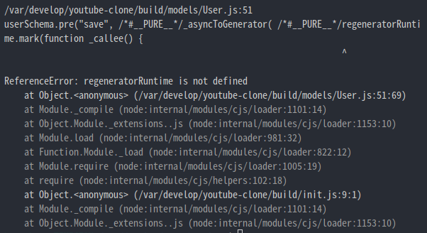

1.  regeneratorRuntime이 정의되지 않았다.
2.  src를 빌드했는데 그 중 폴더 하나가 없다.

먼저 첫 번째 오류는 Recorder Chapter에서도 봤듯이, Frontend에서 async와 await를 사용하려고 할 때 발생하는 오류다.

두 번째 오류는 build폴더에 pug파일이 존재하지 않는다.

먼저 첫번째 오류를 고치기 위해서 서버에서 사용하고 있던 init.js에 regenerator-runtime을 import해주자.

    import "regenerator-runtime";

> **npm start로 입력해도 실행된다.**
>
> 그 이유는 npm start가 기본 명렁어이기 때문이다.

그리고 두 번째 오류를 보자.

왜 views폴더가 build폴더에 없는 것일까?

그 이유는 server.js에 있다.

views를 설정하는 부분을 보면,

    app.set("views", process.cwd() + "/src/views");

이와 같이 되어 있다.

> process.cwd()는 현재 working directory에서 node를 실행한 폴더 위치를 말한다.
>
> package.json이 있는 폴더를 의미하고, root폴더라고도 말한다.

build 폴더 밖에 위치하고 있고, src 폴더의 바깥이다.

build의 backend가 직접 /src/views로 이동했기 때문에 views폴더를 옮기지 않아도 된다.

**즉, build폴더 안에 views폴더가 없어도 문제 없다.**

이제 클라이언트 코드를 빌드해야 한다.

webpack에는 두가지 모드가 있는데,

**development**와 **production**모드가 있다.

production코드가 훨씬 더 작다.

그래서 assets을 이용하여 빌드해보자.

webpack.config.js에 있던 mode를 지우고 package.json에 적어주면서 실행과 동시에 mode를 설정하도록 해놓자.

package.json

```json
...
    "build:assets": "webpack --mode=production",
    "dev:assets": "webpack --mode=development"
...
```

여기서 build:assets을 하면 종료가 되지않고 계속해서 실행되고 있는 것을 확인할 수 있다.

왜 그럴까?

우리는 development를 이용하면서 client코드가 실시간으로 바뀌는 것을 대응하기 위해 watch Mode를 켜놨다. 이것을 수정해줘야 한다.

webpack.config.js에서 watch부분을 지워주고, package.json가서 "scripts"에 다음 코드를 추가하자.

    "dev:assets": "webpack --mode=development -w"

이제 production-ready된 자바스크립트 코드를 얻었다.

마지막으로 build명령어를 합치자.

    "build": "npm run build:server && npm run build:assets",

## 2. Heroku

이제 우리 서버를 Heroku에 올릴 것이다.

먼저 Heroku에서 계정을 만들고 dashboard에 새로운 app을 만들 것이다.

다음 순서로 진행해주자.

1.  Heroku홈페이지에서 계정을 생성
2.  create new app을 눌러서 app을 만들기

이것이 완료되면, Heroku에 이제 백엔드 서버를 업로드 할 것인데 두 가지 방식이 있다.

하나는 **Github**, 다른 하나는 **Heroku Git**을 이용하는 것이다.

필자는 Github랑 Heroku가 연동이 안되었기에 **Heroku Git만 이용해서 업로드를 진행**했다.

Heroku Git으로 배포하기 위해서 Heroku CLI를 설치해야 한다.

현재 우분투를 사용하고 있기 때문에 다음 command를 입력해서 다운로드 하였다.

    curl https://cli-assets.heroku.com/install.sh | sh

이제 다음 명령어를 입력해보자.

    heroku login

입력하면 아무키나 누르거나 q를 눌러서 종료하라고 뜨고 만약 아무키나 입력했을 경우 브라우저가 뜨면서 Log in 창이 보일 것이다. 눌러서 진행하면 다음 화면이 나온다.

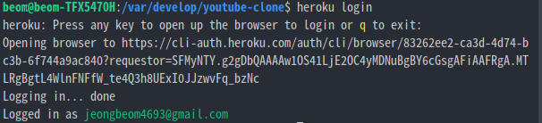

이제 내 서버를 배포해 볼 것인데, 이때 **git repository**가 필요하다.

만약, git repository가 없다면 git init을 해주자.

그 후, remote명령어를 이용하여 연결해주면 된다.

    heroku git:remote -a wetube-beom

여기서 wetube-beom자리에는 본인의 앱 이름을 적어주면 된다.

> 만약 코드를 바꾸고 commit을 하지 않는 다면 Heroku는 수정된 코드를 볼 수 없다는 것에 주의하자.

> git이 볼 수 있는 코드만 Heroku가 볼 수 있는 것이다.

이제 매포해주면 되는데 그 전에, Heroku의 상태를 확인해보자.

    heroku logs --tail

--tail은 실시간 log를 보여준다.

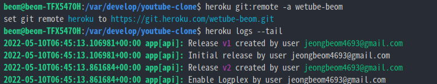

이게 현재 내 heroku 서버이고, 아직 아무것도 없는 상태이다.

이제 배포하고나서 확인해 보자.

    git push heroku master

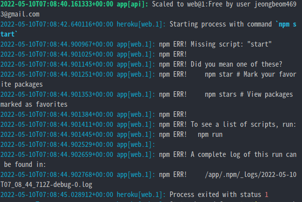

현재 스크린샷을 보면 Error가 존재한다.

**start명령어 조차 못찾겠다고 써있다.**

무엇이 문제일까??

이것은 내가 적은 build명령이 git에 없기 때문이다.

여기서 굉장히 유요한 기능을 확인할 수 있는데,

VsCode를 보면 다음과 같은 메뉴가 있다.

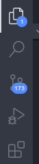

여기서 **세 번쨰 Menu**인 **Source Control**을 보면 **어떤 부분이 변경되었고, 어떻게 git에 올라갔는지 확인할 수 있다.**


왼쪽이 현재 내 파일의 버전이다.

현재 이 파일을 heroku가 보고 있는 것이다.

보통 코드를 수정해서 heroku에 배포할텐데 정상적으로 동작하지 않는 경우가 많다. 왜냐면 **변경만으론 부족하기 때문이다.**

commit을 해줘야 하는 것이다.


이렇게 하고 나니 build는 되었는데 log를 확인해보니 다음과 같은 오류가 나왔다.

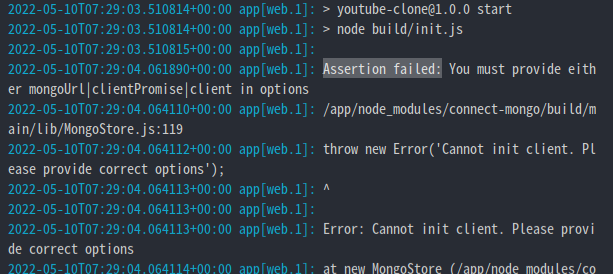

오류를 보면 Assertion failed로,

mongoUrl이나 clientPromise나 client를 줘야 한다고 적혀있다.

위에서 말했다시피 **heroku가 보는 모든 파일은 Github가 보는 파일이다.**

DB의 url은 process.env.DB_URL을 사용한다.

문제는 **현재 우리는 .env를 .gitignore**에 넣어놓았다.

그러면 .env파일을 업로드 해야할까? 아니다. 절대 하면 안되는 짓이다.

어떻게 해야할까?

Heroku에서 지원하는 기능으로 이 문제를 해결할 수 있다.

**Heroku의 admin panel을 사용**할 것이다.

Heroku로 가서 서버에 들어간 다음 settings로 가서

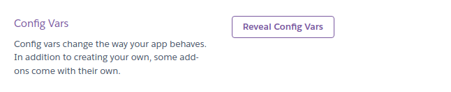

이것을 누르면 Key와 Value를 입력하는 칸이 보이고 추가할 수 있을 것이다.

그래서 Heroku가 실행 될 때 해당 Key가 코드에 있으면 적어놨던 value를 받을 것이다.

env에 있는 것들을 전부 넣어주도록 하자.

## 3. MongoDB Atlas

이제 mongoDB Atlas 계정을 만들어보자.

여기서 MongoDB 데이터 베이스를 얻을 수 있다.

순서는 다음과 같이 해주자.

1.  새 프로젝트를 만들기
2.  cluster를 추가(**cluster는 database group과 같은 것**)
3.  MongoDB의 native driver를 사용해서 앱과 연결.

3번 까지 진행하면 Connect your application이 보이고 클릭하면 URL이 보일 것이다.

이것이 DB_URL이 될 것이다.

이것을 Heroku와 연결해줄 것이다.

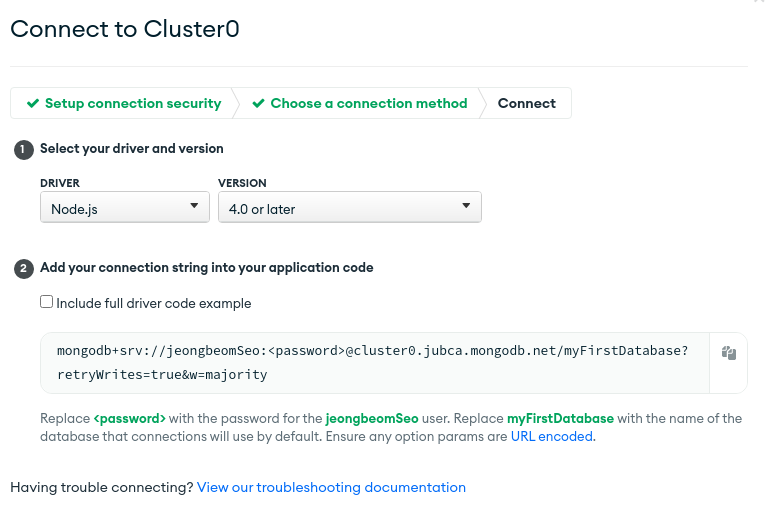

여기서 보이는 URL을 Heroku에 변수 넣는 곳에 넣어주면 되고, 여기서 패스워드는 MongoDB Atlas에서 cluster를 만들때 나왔던 패스워드를 적어주면 된다.

> 참고로 <>(꺽쇠 표시)는 지워줘야 한다.

log를 켜둔 상태라면 성공적으로 DB_URL이 설정되었다는 메세지를 받을 수 있을 것이다.

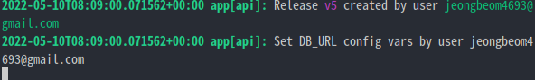

## 4. Modify Code

추가적으로 수정해야 될 것은, **Heroku로 실행할 때는 Heroku에서 주는 Port로 서버를 열어야 된다는 부분이다.**

그래서 다음과 같이 해주자.

    const PORT = process.env.PORT || 4000;

또, github로그인을 실행하니 문제가 발생한다.

무슨 문제인가 봤더니 되돌아오는 Callback Url이 다음과 같다.

    http://localhost:4000/users/github/finish?code=ec02f51e25839a409a06

현재 우리는 github에서 setting해둔 Callback Url이 이와 같다. 그래서 이 부분도 수정을 해줘야 한다.

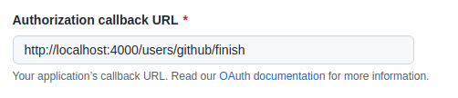

이 부분을 수정해줄 것인데, 다음과 같이 수정해주자.

    https://wetube-beom.herokuapp.com/users/github/finish

> 여기서 wetube-beom.herokuapp.com이부분은 Heroku app으로 실행했을 경우 뜨는 url이다.

> 문제가 하나 있는데, 내 서버로 실행할 때는 Port가 4000으로 할 것이라서 내 서버로 실행해서 github로 로그인을 하려고 하면 github페이지가서 Callback Url을 수정해줘야 한다. 번거롭지만 어쩔 수 없는 부분이다.

위의 문제를 해결하기 위해서 APP을 두개 만들기도 한다.

요번엔 Heroku App을 이용해서 Avatar를 업로드 해보니 파일이 보이지 않는다.

무슨 문제인가 해서 개발자 도구로 사진의 Url을 확인해 보니 이러한 방식으로 되어있었다.

    /https://wetube-beom.herokuapp.com/1231231241242353

뒤에 url은 임의로 적었다. 중요한 것은 여기서 앞에 슬래시가 붙는 것이다.

코드를 수정해줄 필요가 있다.

이 부분은 **아래에서 배우는 기능(NODE_ENV)** 으로 해결이 될 것이다. 뒤에서 확인하자.

## 4. AWS

이제 파일을 저장하기 위해서 AWS를 사용할 것이다.

먼저 AWS 계정을 생성해주자.

그 후 Service -> Storage -> S3으로 이동한 후 **bucket을 만들어 주자.**

create bucket을 누르면 bucket name을 지으라고 뜬다. 이때 고유명이여야 한다.

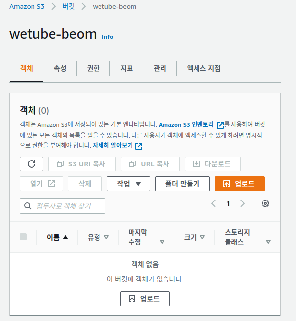

Bucket생성까진 되었다. 이젠**API key를 만들어줄 차례**이다.

1.  검색창에 IAM을 쳐서 이동하자.
2.  Add User를 클릭 -> user name 추가
3.  Programmatic access 클릭 (이것을 하지 않으면 웹사이트에 로그인 할 때마다 비밀번호를 입력해야 한다.)

> 이건 로그인 할 때 access key를 사용하는 것인데, key ID와 secret Key이다. 그래서 Node.js서버가 로그인 할 수 있다.

4. Next Permission을 클릭

> 여기선 어떤 권한이든 줄 수 있는 페이지가 나온다.
>
> 여기서 만약, AdministratorAccess를 눌러서 허용한다면 이 key를 누군가 얻으면 내 계정으로 뭐든지 할 수 있는것. 물론, 클릭하지 않을 것이다.

5. s3를 검색해서 파일에 대해서만 S3에서 할 수 있는 모든 권한을 주는 AmazonS3FullAccess 허용
6. Next:tag 클릭 ( tag는 붙일 필요 없으니 Pass)
7. Review페이지에서 잘 설정됬는지 확인 후 Create user를 해주자

> **Secret access key는 단 한번만 너에게 보여주니깐 access key ID와 secret access key를 복사해야 한다.**

이 key들은 .env에 복사해주고 heroku의 settings의 Config Vars에 추가해주면 된다.

> **이 부분은 AWS 설정하는 과정에서 에러가 발생할 경우 참고하라고 적어놓았다.**

> **[AccessControlListNotSupported: The bucket does not allow ACLs 오류 해결]**
>
> 위와 같은 오류가 뜨시는 분들은 버킷에 ACL권한을 변경해주시면 됩니다.
>
> **권한 -> 객체 소유권 편집 -> ACL 비활성화됨(권장)을 ACL 활성화됨로 변경 -> ACL이 복원된다는 것을 확인합니다. 체크 -> 버킷 소유자 선호 체크 -> 변경사항 저장**
> 위의 방법까지 해보시고, 그래도 안 되시는 분들은 **ACL(액세스 제어 목록)에서 편집->모든 사람(퍼블릭 액세스)에 나열, 읽기 체크해주신 후 변경사항 저장**해서 테스트해보시면 될 거 같습니다.

> **[No 'Access-Control-Allow-Origin' header is present on the requested resource. 오류 해결]**

> 위와 같은 오류가 콘솔창에 뜨시는 분들은 권한 -> CORS(Cross-origin 리소스 공유) 편집 -> 아래 코드를 추가해주시고 변경사항 저장하시면 됩니다.
> https://stackoverflow.com/questions/17533888/s3-access-control-allow-origin-header

```
[
{
"AllowedHeaders": [
"*"
],
"AllowedMethods": [
"GET",
"HEAD"
],
"AllowedOrigins": [
"*"
],
"ExposeHeaders": [],
"MaxAgeSeconds": 3000
}
]
```

> 추가적으로 이미지 태그와 비디오 태그에 crossorigin속성을 추가해주시면 됩니다.
> img(src=`이미지 주소` crossorigin)
> video(src=`비디오 주소` crossorigin)

> CORS 구성
> Cross-Origin 요청을 허용하도록 버킷을 구성하려면 CORS 구성을 생성합니다.
> https://docs.aws.amazon.com/ko_kr/AmazonS3/latest/userguide/ManageCorsUsing.html

> AllowedOrigins을 설정하는 이유
> 허용하지 않은 origin에서 리소스에 접근 및 사용을 막기 위해서이다.
> 다시 말해, 허용하지 않은 클라이언트에게 리소스를 주지 않기 위함이고, 허용할 대상에 대한 설정이 AllowedOrigins이다.

이제 **Multer S3라는 패키지를 사용**할 것이다.

Multer S3는 Multer를 사용할 수 있게 도와준다.

    	npm install --save multer-s3
    	npm install aws-sdk

항상 multer를 사용하지만 storage가 다르기에 수정을 해줘야 한다.

현재 middleware를 보면 다음과 같이 되어있다.

middleware.js

```js
export const avatarUpload = multer({
  dest: "uploads/avatars",
  limits: {
    fileSize: 3000000,
  },
});

export const videoUpload = multer({
  dest: "uploads/videos",
  limits: {
    fileSize: 10000000,
  },
});
```

이것을 다음과 같이 수정해주자.

```js
import multerS3 from "multer-s3";
import aws from "aws-sdk";

const s3 = new aws.S3({
  credentials: {
    accessKeyId: process.env.AWS_ID,
    secretAccessKey: process.env.AWS_SECRET,
  },
});

const multerUploader = multerS3({
  s3: s3,
  bucket: "wetube-beom",
});

export const avatarUpload = multer({
  dest: "uploads/avatars",
  limits: {
    fileSize: 3000000,
  },
  storage: multerUploader,
});

export const videoUpload = multer({
  dest: "uploads/videos",
  limits: {
    fileSize: 10000000,
  },
  storage: multerUploader,
});
```

S3 object를 만들고 storage를 준 것이다.

bucket에는 자신의 bucket이름을 적으면 되겠다.

> heroku에도 같은 변수 이름 적는것에 주의하자.

여기서 두 가지 문제점이 발생하는데,

1. 우리 object가 공개되지 않는다.
2. Access Control List를 전달해줘야 한다.

1번의 경우 aws에서 permission을 수정해주면 된다.

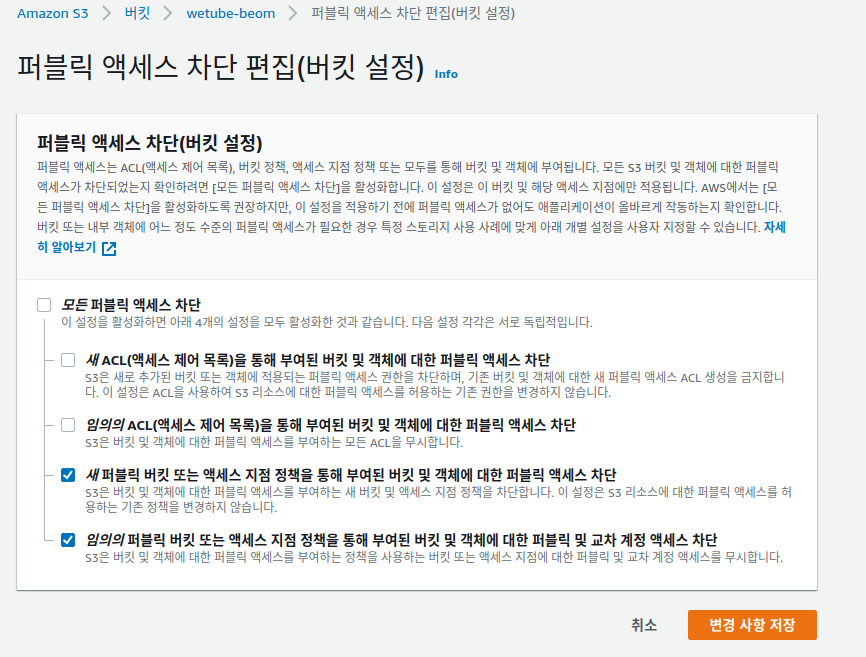

두 번째의 경우 ACL은 기본적으로 object의 권한인데, 이것을 public-read해줘야 한다.

```js
const multerUploader = multerS3({
  s3: s3,
  bucket: "wetube-beom",
  acl: "public-read",
});
```

이것만 해선 저장할 때 마다 avatarUrl이 null이 될 것이다.

**현재 저장하는 과정에서 처리하는 것은 controller**이기 때문에 controller를 가보자.

postEdit을 가보면 현재 file이라는 변수를 받아서 이와 같이 처리한다.

    avatar: file? file.path : avatarUrl,

하지만 여기서 null값이 들어간다는 것은 file.path가 없다는 것이다.

> file은 있다. 왜냐하면 이전 avatarUrl로 대체된게 아니라 이미지가 없다는 null값이 들어갔기 때문이다.

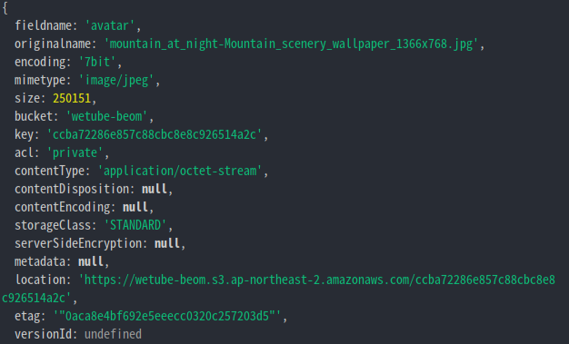

path로 들어가는 것이 아니라 location으로 들어간다.

그래서 이와 같이 바꿔주면 된다.

    avatar: file? file.location : avatarUrl,

> videoController에도 path변수 명을 사용하고 있다. 전부 수정해주면 된다.

이제 경로도 잘 들어가는 것 같다.

여기서 middleware를 좀만 더 수정할 것인데 **현재 aws를 확인해보면 avatar파일과 video파일이 구분없이 들어가는 것을 확인할 수 있다.**

또한 내 컴퓨터에서 작업을 한다면 multer s3을 사용하지 않아야 한다.

**오직 Heroku에서 작업할 때만 multer s3을 사용해야 한다.**

그때 사용하는 환경변수가 다음과 같다.

    process.env.NODE_ENV

참고로, 필자는 리눅스라서 그런지 NODE_ENV가 process.env에 담기지 않기 때문에 직접 추가 하는 형태로 진행했다.

코드는 이와 같이 수정이 들어가면 된다.

middleware.js

```js
const isHeorku = prcess.env.NODE_ENV === "production";

...

const s3ImageUploader = multerS3({
  s3: s3,
  bucket: "wetube-beom/images",
  acl: "public-read",
});

const s3VideoUploader = multerS3({
  s3: s3,
  bucket: "wetube-beom/videos",
  acl: "public-read",
export const avatarUpload = multer({
  dest: "uploads/avatars",
  limits: {
    fileSize: 3000000,
  },
  storage: isHeorku ? s3ImageUploader : undefined,
});

export const videoUpload = multer({
  dest: "uploads/videos",
  limits: {
    fileSize: 10000000,
  },
  storage: isHeorku ? s3VideoUploader : undefined,
});
```

아까 위에서 보였던 multerUploader는 지워줬다.

그것을 지우고 Video 파일과 Avatar파일을 구분하기 위해서 위와 같이 해준 것이다.

이 변수는 여러가지로 활용이 된다.

위에서 controller를 수정할 때 Heroku가 아니면 file.path를 활용해야 한다. 그때 다음과 같이 해주면 된다.

    avatarUrl: file ? (isHeroku ? file.location : file.path) : avatarUrl,

또한 Template에서 위에서 문제있었던 Url문제를 해결할 수 있을 것이다.

전역 변수로 활용하기 위해 res.locals에 넣어주자.

middleware.js

```js
  ...
  // In localsMiddleware function
  res.locals.isHeorku = isHeorku
```

template에선 다음과 같이 주면 될 것이다.

header.pug

```pug
...

                li
                    a(href=`/users/${loggedInUser._id}`)
                        if loggedInUser.avatarUrl === ""
                            span 🙂
                        else
                            if isHeroku
                                img.header__avatar(src=loggedInUser.avatarUrl)
                            else
                                img.header__avatar(src="/" + loggedInUser.avatarUrl)
...

```

필요한 부분에 전부 적용할 수 있을 것이다.

이것으로 해당 프로젝트를 종료가 되었다.
