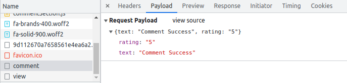
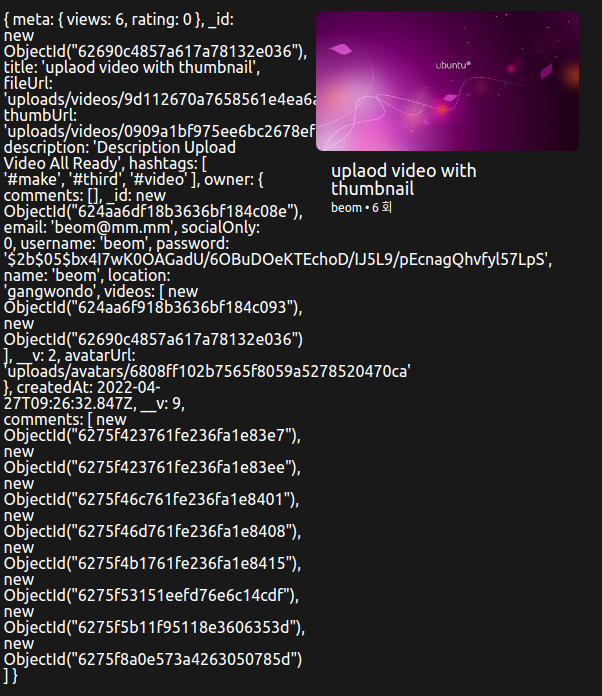

# Flash Message and Comment

- [Flash Message and Comment](#flash-message-and-comment)
  - [1. Flash Message](#1-flash-message)
    - [1.1 Where using it?](#11-where-using-it)
    - [1.2 How using it?](#12-how-using-it)
  - [2. Comment](#2-comment)
    - [2.1 Schema 제작](#21-schema-제작)
    - [2.2 FrontEnd:SetUp](#22-frontendsetup)
    - [2.3 FrontEnd:JavaScript](#23-frontendjavascript)
    - [2.4 Front-Back-Communication -- Very Important](#24-front-back-communication----very-important)
    - [2.5 Backend:Controller and DB](#25-backendcontroller-and-db)
    - [2.6 Create Real Time Comments](#26-create-real-time-comments)
    - [2.7 Delete Comment](#27-delete-comment)
  - [3. Error Correcting](#3-error-correcting)

## 1. Flash Message

요번엔 Flash Message라는 것에 대해서 알아보고 간단하게 구현해보기로 하고 Comment로 넘어가 볼것이다.

**Flash Message**가 무엇일까?

앱 개발시 사용자에 알림을 줄 때는 보통 휘발성 메세지를 이용한다. 어떤 조건에 만족했을 경우 딱 한번 메세지를 보여주고 사라지는 것을 의미한다.

예를 들어보자.

본인 소유권이 아닌 영상을 삭제하려거나 수정하려고하면 권한이 없다는 메세지를 받고 그 알림은 새로고침을 하면 그 자리에 남아있는 것이 아니라 사라진다. 이러한 경우 휘발성 메세지를 사용한다고 할 수 있다.

### 1.1 Where using it?

어디에 사용할 것인가? 현재 Middleware를 보면 다음과 같은 함수를 구현해 놓았다.

```js
export const publicOnlyMiddleware = (req, res, next) => {
  if (!req.session.loggedIn) {
    return next();
  } else {
    return res.redirect("/");
  }
};
```

이것은 로그인 되어 있지 않으면 들어갈 수 없는 페이지에 접근하지 못하도록 하기 위해서 만든 Middleware였다.

근데 문제는 render이아닌 **redirect를 사용하고 있어서 Message를 담지 못하여**, **사용자에게 무엇이 문제인지를 알려줄 수 없다.**

그래서 사용하는 것이 **Flash Message**이다.

### 1.2 How using it?

먼저 설치부터 해보자.

    npm i express-flash

> Flash Message는 session에 근거하기 때문에 한 사용자만이 볼 수 있다.

이제 server에 import해주고 본격적으로 사용해보자.

server.js

```js
import flash from "express-flash";

app.use(flash());
```

> 이때 위에서도 말했다시피 flash는 내부적으로 session을 이용하기 때문에 session보다 아래쪽에서 미들웨어를 바인딩해줘야 합니다.

위의 **flash()** 가 session에 연결을 할 수 있었고, flash()미들웨어를 설치한 순간부터 우리는 **req.flash**를 사용할 수 있어서 이것을 이용하여 메세지를 남길 것이다.

예를 들어서, 로그아웃된 사람이 URL에 접근하려고 할 때 req.flash()를 해주고 그 메세지의 타입과 내용을 입력해줘서 사용하면 된다.

```js
export const publicOnlyMiddleware = (req, res, next) => {
  if (!req.session.loggedIn) {
    return next();
  } else {
    req.flash("error", "Not authorized");
    return res.redirect("/");
  }
};
```

백에서는 이와 같이 사용한다. 예시를 조금 더 확인해보자.

```js
export const getEdit = async (req, res) => {
  const { id } = req.params;
  const {
    user: { _id },
  } = req.session;
  const video = await Video.findById(id);
  if (!video) {
    return res.status(404).render("404", { pageTitle: "Video not found." });
  }
  if (String(video.owner) !== String(_id)) {
    req.flash("error", "Not authorized");
    return res.status(403).redirect("/");
  }
  return res.render("edit", { pageTitle: `Edit: ${video.title}`, video });
};

...

export const logout = (req, res) => {
  req.session.destroy();
  req.flash("info", "Bye Bye");
  return res.redirect("/");
```

이러한 식으로 Middleware는 물론, Controller에서도 사용이 가능하다.

**redirect() 위에 적어주면 된다.**

**템플릿을 rendering하는 경우 메세지를 건네 줄 수 있기 때문에 보통 redirect하는 경우에 주로 쓰이는 것이다.**

백에서 우리가 하는 것은 **req.flash()를 이용해서 locals 속성을 만드는 것**을 하였다.

그렇다면 이것을 프론트에선 어떻게 활용할 것인가? **global variable인 req.locals**에 담긴 변수들을 사용했던 방법 기억나는가?

그와 동일하다.

base.pug

```pug
doctype html
html(lang="ko")
    head
        title #{pageTitle} | #{siteName}
        link(rel="stylesheet", href="https://cdnjs.cloudflare.com/ajax/libs/font-awesome/6.1.1/css/all.min.css")
        link(rel="stylesheet", href="/static/css/styles.css")
    body
        if messages.error
            span=messages.error
        if messages.info
        		span=messages.info
        include partials/header
        main
            block content
    include partials/footer.pug
    script(src="/static/js/main.js")
    block scripts
```

이와 같히 해주고 오류가 났을 경우 다음과 같이 출력이 된다.


왼쪽 위의 Not authorized가 출력된 것을 확인할 수 있고 이것을 새로고침하면 사라진다.

결국 사용방법을 정리하자면 다음과 같다.

1.  Flash Middleware 사용
2.  req.flash 사용
3.  message.locals를 생성

이것을 알림처럼 만들기 위해 프론트에서 다음과 같이 작업해주고 마무리하자.

먼저, mixins/message.pug를 만들자.

```pug
mixin message(kind, text)
  div.message(class=kind)
    span=text
```

> 여기서 div에는 두개의 class가 들어가는 것이다. 하나는 message 다른 하나는 변수로 받은 kind

base.pug

```pug
include mixins/message

doctype html
html(lang="ko")
    head
        title #{pageTitle} | #{siteName}
        link(rel="stylesheet", href="https://cdnjs.cloudflare.com/ajax/libs/font-awesome/6.1.1/css/all.min.css")
        link(rel="stylesheet", href="/static/css/styles.css")
    body
        if messages.error
            +message("error", messages.error)
        if messages.info
            +message("info", messages.info
        if messages.success
            +message("success", messages.success)
        include partials/header
        main
            block content
    include partials/footer.pug
    script(src="/static/js/main.js")
    block scripts
```

이제 HTML에 필요한 작업들은 마무리 되었으니 CSS 작업만 하면된다.

```css
@keyframes goAway {
  from {
    transform: none;
    opacity: 1;
  }
  to {
    transform: translateY(-50px);
    opacity: 0;
  }
}

.message {
  position: absolute;
  top: 10px;
  left: 0;
  right: 0;
  margin: 0 auto;
  max-width: 200px;
  padding: 10px 20px;
  border-radius: 10000px;
  text-align: center;
  animation: goAway 0.5s ease-in-out forwards;
  animation-delay: 5s;
  &.error {
    background-color: tomato;
    color: white;
  }
}
```

CSS는 참고삼아 넣어봤으니 가볍게 보고 넘어가자.

## 2. Comment

이제 본격적으로 댓글창을 만들것인데, 이번 기능을 구현하면서 앞서 배웠던 모든 것들을 이용하게 될 것이다.

순서를 예상해보자.

1.  먼저, 당연히 DB에 들어가야 하기 때문에 **Schema**가 필요할 것이다.
2.  Schema를 만들고 Comment를 **어디서 어떻게** 올릴지 결정해야 한다.
3.  정해졌으면, Template을 만들고 **router객체에 등록해주면서 controller**를 만들어주면된다.
4.  기본적인 controller를 구성하는 것까지 완료가 되었으면, 필요한 조건부 상황들을 생각해서 마지막으로 **기능을 추가**해준다면 마무리가 될 것이다.

대략적인 순서는 이와 같을 것 같다.

### 2.1 Schema 제작

model/Comment.js를 만들어서 그 안에 Schema제작을 해보자.

```js
import mongoose from "mongoose";

const commentSchema = new mongoose.Schema({
  text: { type: String, required: true },
  owner: { type: mongoose.Schema.Types.ObjectId, required: true, ref: "User" },
  video: { type: mongoose.Schema.Types.ObjectId, required: true, ref: "Video" },
  createdAt: { type: Date, required: true, default: Date.now },
});

const Comment = mongoose.model("Comment", commentSchema);
export default Comment;
```

**모델을 만들 때 생각해야될 것은 이 모델의 경우 독립적인 모델인가를 생각해봐야 한다.**

Comment의 경우 어디서 사용할 것인가를 생각해보면 비디오를 보는 페이지 즉, watch.pug를 렌더링하는 페이지에서 사용하게 될 것이다. 또한, 누가 사용하는 것인가를 생각해보면 작성자 즉 유저가 작성하게 될 것이다.

그렇다면, reference는 User, Video 둘 다 들어가 줘야 할 것이다.

그러면 이제 먼저 Comment모델에서 생각해보자.

**Comment모델 안에 User나 Video의 정보가 들어가야 될 것인가?**

당연히, 들어가야된다.

만약, Comment안에 Video나 User의 정보가 담겨있지 않으면 Comment를 보고 이 Comment가 어느 비디오에 달린 것인지, 누가 Comment를 단 것인지 알 수가 없다.

**이제 반대로 User모델이나 Video모델에서도 Comment정보가 필요로 할까?**

만약 User모델이나 Video모델에서 Comment에 대한 정보가 필요로 하다면, 아마 필드도 새로 만들어 줘야 할 것이다.

물론 필요로 할 것이다. 이유는 위와 동일하게 해당 비디오에 어떤 Comment가 달린것인지 알 필요가 있고, 해당 User가 어떤 Comment를 달았는지 알 필요가 있다.

그러면 이제 VideoSchema에 다음 필드를 추가해주자.

mondels/Video.js

```js
  comments: [
    { type: mongoose.Schema.Types.ObjectId, required: true, ref: "Comment" },
  ],
```

다음은 models/User.js에 추가해주자.

```js
comments: [{ type: mongoose.Schema.Types.ObjectId, ref: "Comment" }],
```

> 이전 챕터에서도 말했지만, ref에 담기는 값은
>
> ```js
> const Comment = mongoose.model("Comment", commentSchema);
> ```
>
> 여기에서 String에 적어준 것을 그대로 적어주면 된다. 첫 번째 Argument로 들어가는 저 String은 model이름이라고 생각하면 된다.

> - mongoose.model()을 통해 스키마를 인스턴스 화 시켜 타 모듈에서 import하여 사용할 수 있게끔 export 합니다.
>   - mongoose.model('모델 이름', 스키마)

### 2.2 FrontEnd:SetUp

이제 FrontEnd쪽에서 작업을 할 것인데, comment를 어디 페이지에서 작업할 것인가를 생각해보면, watch.pug을 렌더링하는 페이지에서 작업할 것 같다.

그래서 따로 pug파일 즉, Template을 만들 필요는 없고 watch.pug를 조금 만 수정해주면 될 것이다.

그에 앞서, 페이지를 interactive하게 만들기 위해 **client/js로 가서 javascript를 사용할 수 있는 환경**을 만들어 놓자.

client/js/commentsection.js를 만들어주고, webpack.config.js로 가서 환경을 만들어 놓자.

webpack.config.js

```js
const BASE_JS = "./src/client/js/";

module.exports = {
  entry: {
    main: BASE_JS + "main.js",
    videoPlayer: BASE_JS + "videoPlayer.js",
    recorder: BASE_JS + "recorder.js",
    commentSection: BASE_JS + "commentSection.js",
  },
  ...
```

이와 같이 해주고, template을 수정을 해주자.

watch.pug의 전체코드는 다음과 같다.

```pug
extends base

block content
    div#videoContainer(data-id=video._id)
        video(src="/" + video.fileUrl)
        div#videoControls.videoControls
            div.videoControls__play
                span#play.videoControls__playBtn
                    i.fas.fa-play
                div.videoControls__time
                    span#currenTime 00:00
                    span  /
                    span#totalTime 00:00
            input(type="range",step="1", value="0", min="0")#timeline.videoControls__timeline
            div.videoControls__volume
                input(type="range",step="0.1", value=0.5, min="0", max="1")#volume
                span#mute
                    i.fas.fa-volume-up
            div
                span#fullScreen
                    i.fas.fa-expand

    div.video__data
        p.video__title=video.title
        small.video__owner Uploaded by
            a(href=`/users/${video.owner._id}`)=video.owner.name
        small.video__createdAt=new Date(video.createdAt).toLocaleDateString("ko-kr", {weekday: 'long', year: 'numeric', month: 'long', day: 'numeric'})
        if String(video.owner._id) === String(loggedInUser._id)
            a(href=`${video.id}/edit`) Edit Video &rarr;
            br
            a(href=`${video.id}/delete`) Delete Video &rarr;
    if loggedIn
        div.video__comments
            form.video__comment-form#commentForm
                textarea(cols="30", rows="10", placeholder="Write a nice commment...")
                button Add Comment

block scripts
    script(src="/static/js/videoPlayer.js")
    script(src="/static/js/commentSection.js")
```

이제 JavasScript를 다뤄볼 차례이다.

### 2.3 FrontEnd:JavaScript

필요한 기능들을 생각해보자.

1.  사용자가 뭔가를 작성하고 버튼을 누른다면 그것을 감지하고 기능을 활성화 시켜야 될 것이다.
2.  사용자가 작성한 text를 백으로 건네줘야 한다.(데이터베이스에 추가하기 위해서)
3.  댓글은 작성하자마자 바로 보이도록 구현해야 한다.

이정도를 생각해볼만 하다.

이것을 염두해두고 코드를 작성해 나가보자.

```js
const videoContainer = docuemnt.getElementById("videoContainer");
const form = document.getElementById("commentForm");
const textarea = form.querySelector("textarea");

const handleSubmit = (event) => {
  event.preventDefault();
  const text = textarea.value;
  const video = videoContainer.dataset.id;
};

form.addEventListner("submit", handleSubmit);
```

여기 까지 코드 분석을 해보자.

먼저 필요한 부분들을 받아서 **form안에 있는 버튼이 눌렀을 때 발생하는 default action인 submit**을 조건으로 걸어서 addEventListner만들어 놓았다.

그리고 submit을 했을 때 **페이지 이동하는 것을 방지하기 위해 preventDefault()** 를 사욯했다.

그리고 DB에 넣어주기 위해서는 어느 비디오에 달린지 알아야 한다. 이것은 watch.pug를 보면 우리가 이전 챕터에서 data-id를 이용하기위해 만들어 놓은 것이 있다. 그것을 사용한 것이다.

이것을 실행했을 때 결과는 다음과 같다.


**이것은 null값에서 querySelector를 사용하려고 해서 발생한 Error이다.**

위의 코드를 보면, form.querySelector를 적어놓았다. 그 말은 form이 null인 경우가 있다는 것이다.

watch.pug를 보면 if loggedIn을 적어 놓았다.

즉, loggedIn이 True인 경우에만 form을 가져오고 False인 경우에는 null값인 것이다.

이 오류는 두 가지 방법으로 해결할 수 있는데 두 가지 다 해놓자.

1.  로그인을 했을 경우에만 script를 불러오기
2.  JavaScript를 수정

1번의 경우 다음과 같이 하면된다.

    if loggedIn
          script(src="/static/js/commentSection.js")

굉장히 간단하다.

2번의 경우 다음과 같이 수정하면 된다.

```js
const videoContainer = docuemnt.getElementById("videoContainer");
const form = document.getElementById("commentForm");

const handleSubmit = (event) => {
  event.preventDefault();
  const textarea = form.querySelector("textarea");
  const text = textarea.value;
  const video = videoContainer.dataset.id;
};

if (form) {
  form.addEventListner("submit", handleSubmit);
}
```

이렇게 함으로써 form이 실행된 경우에만 즉, loggedIn된 경우에만 Element들을 들고오기 때문에 문제 없이 작동될 것이다.

### 2.4 Front-Back-Communication -- Very Important

**★ 매우 중요한 파트이다 ★**

**Backend로 정보를 건네줄 시간이다.**

이전에 우리는 url을 만들고 fetch를 사용해서 프론트에서 발생한 상황을 토대로 백에서 기능을 구현한 적이 있다.

Video Part에서 views기능을 구현할 때 사용했다.

이번엔 Front의 정보도 건네줘야 한다.

일단 fetch를 사용할 수 있는 환경을 다시 한번 확인해보자.

먼저 commentSection.js안에 fetch코드를 적어주자.

```js
// In function handleSubmit
fetch(`api/videos/${video}/comment`);
```

server.js

```js
...
app.use("/api", apiRouter);
...
```

apiRouter.js

```js
import express from "express";
import { registerView } from "../controllers/videoController";

const apiRouter = express.Router();

apiRouter.post("/videos/:id([0-9a-f]{24})/view", registerView);

export default apiRouter;
```

위의 코드는 이전 챕터에서 사용한 코드 그대로 가져온 것이다.

현재 이정도로 작성되어 있다.

얼추 필요한 것은 다 있다.

fetch를 했을 때 app객체가 타고갈 router객체도 바인딩한 상태고 router객체에서도 URL만 정해지면 작성할 수 있는 상황이다.

이제 다시 JavaScript로 돌아와서 작성을 해줄 것인데, **text를 보내야 한다는 것을 생각하자.**

이를 보내주기 위해서 **req.body**를 이용할 것이다.

> 현재 우리는 form을 submit해서 백엔드로 정보를 보내면 req.body안에 정보가 담겨서 온다는 것을 알고 있다.

> 우리는 fetch를 이용해서 req.body에 정보를 넣어서 보내는 방식을 사용할 것이다.

다음 코드를 보자.

```js
fetch(`api/videos/${videoId}/comment`, {
  method: "POST",
  body: {
    text,
  },
});
```

apiRouter.js

```js
apiRouter.post("/videos/id([0-9a-f]{24})/comment", createComment);
```

videoController.js

```js
export const createComment = (req, res) => {
  console.log(req.params);
  console.log(req.body);
  return res.end();
};
```

결과는 다음과 같다.


일단 req.body에 아무런 출력도 안되는 상황이다.

왜 이런 상황이 나왔는지 확인하기 위해 Network에서 comment의 Payloads를 확인한 결과가 두번째 스크린샷이다.

**[object object]** 이것은 우리가 원하는 형태가 아니다.

처음부터 생각해보자.

서버가 우리에게 어떻게 req.body를 주었는가?

맨 처음부터 우리는 req.body를 사용할 수 있었는가? 아니다.

Middleware를 사용함으로써 req.body에 정보를 받아올 수 있었다.

    app.use(express.urlencoded({ extended: true }));

이 코드는 우리가 서버에게 제공한 Middleware로 서버가 form으로부터 오는 data를 이해할 수 있도록 해주었다.

우리가 해야할 것은 **서버가 fetch로부터 오는 데이터를 이해하도록 해주는 것**이다.

**fetch를 통해서 보내는 데이터는 JSON데이터이다.**

만약 너가 object를 보내고 싶다면 JS Object를 그냥 보내면 안된다.

우리가 보내는 text를 브라우저와 서버에서 받아서 String으로 바꿨던 것이고 그래서 위와 같은 결과가 나온 것이다.

> 착각하면 안된다.
>
> ```js
>   body: {
>    text,
>  },
> ```
>
> 이것은 String을 보내고 있는 것이 아니라 Object를 보내고 있는 것이다. text: text인 형태로.


만약 우리가 정말 object는 보낼 것도 없이 text만 보내고 싶다면, 다음과 같이 해도 된다.

```js
fetch(`/api/videos/${videoId}/comment`, {
  method: "POST",
  body: text,
});
```

이와 같이 해주고 server.js에 text를 받을수 있도록 middleware를 추가해주면 된다.

```js
app.use(express.text());
```

이러면 backend에서는 text(String)을 이해할 수 있다.


하지만, 보통 text만 보낼까? 아니다. 댓글을 보낼 때 평점같은 것도 같이 보낼 수도 있고 다른 정보도 같이 보낼 수도 있다.

이 방식은 좋아 보이지는 않는다.

그렇다면 어떻게 해야할까?

**JS Object를 받아서 String으로 돌려주는 stringify를 사용할 것이다.**

```js
fetch(`/api/videos/${videoId}/comment`, {
  method: "POST",
  body: JSON.stringify({ text: text, rating: "5" }),
});
```

Express에선 Stirng을 받아서 Json으로 바꿔주는 Middleware가 있는데 그것을 이용할 것이다.

server.js

```js
app.use(express.json());
```

이제 출력할 수 있도록 Controller만 수정해주자.

videoController.js

```js
export const createComment = (req, res) => {
  console.log(req.params);
  console.log(req.body.text, req.body.rating);
  return res.end();
};
```

기본적인 원리는 이와 같다.


이제 결과를 확인해보자.


아직도 undefined이다.

무엇이 부족한 것일까?

**Express는 우리의 String을 받아서 JSON으로 바꾸려고 할텐데 이걸 위해서 우리는 Express에게 JSON을 보내고 있다고 알려줘야 한다.**

왜냐하면 지금 Express는 우리가 text를 보내고 있다고 생각하고 있기 때문이다.

```js
fetch(`/api/videos/${videoId}/comment`, {
  method: "POST",
  headers: {
    "Content-Type": "application/json",
  },
  body: JSON.stringify({ text: text, rating: "5" }),
});
```

> 간단히 말하자면, 그냥 String이 아닌 JsonString이라고 알려주는 것이다.




**이 방식이 Backend와 Frontend간에 정보를 보내는 방법이다.**

매우 큰 object를 보내야 할 때도 사용하는 방법이다.

최종 코드는 다음과 같다.

```js
const videoContainer = document.getElementById("videoContainer");
const form = document.getElementById("commentForm");

const handleSubmit = (event) => {
  event.preventDefault();
  const textarea = form.querySelector("textarea");
  const text = textarea.value;
  const videoId = videoContainer.dataset.id;
  if (text === "") {
    return;
  }
  fetch(`/api/videos/${videoId}/comment`, {
    method: "POST",
    headers: {
      "Content-Type": "application/json",
    },
    body: JSON.stringify({ text: text, rating: "5" }),
  });
};

if (form) {
  form.addEventListener("submit", handleSubmit);
```

### 2.5 Backend:Controller and DB

이제 text를 넘겨주는 것까진 구현이 되었다.

backend에서 데이터를 받았으니 이제 필요한 정보들을 DB에 넣어주자.

이전에도 말헀지만, **backend로 보내는 모든 request는 쿠키와 함께 온다.**

**쿠키를 보내면 backend는 세션을 찾아본다.**

이것을 이용해서 controller에서 comment를 작성한 user를 불러올 수 있을 것이다.

videoController.js

```js
export const createComment = (req, res) => {
  console.log(req.params);
  console.log(req.body);
  console.log(req.body.text, req.body.rating);
  console.log(req.session.user);
  return res.end();
};
```

결과를 확인하면 다음과 같다.


> 브라우저는 우리가 같은 frontend에서 backend 즉, localhost:4000 -> localhost:4000으로 보낸다는 것을 알고 있기 때문에 쿠키의 원칙에의해 우리는 쿠키를 자동으로 받을 수 있는 것이다.

controller를 좀 정리해 줄 것인데, 이전 시간에도 사용한 **sendStatus**를 사용할 것이다.

> sendStatus를 사용하면 request를 kill하는 것으로 끊어버리는 것이다.

comment Model을 import해주고 다음과 같이 코드를 짜보자.

```js
export const createComment = async (req, res) => {
  const {
    session: { user },
    body: { text },
    params: { id },
  } = req;
  const video = await Video.findById(id);
  if (!video) {
    return res.sendStatus(404);
  }
  const userDB = await User.findById(user._id);
  if (!userDB) {
    return res.sendStatus(404);
  }
  const comment = await Comment.create({
    text,
    owner: user._id,
    video: id,
  });
  video.comments.push(comment._id);
  await video.save();
  userDB.comment.push(comment._id);
  await userDB.save();
  return res.sendStatus(201);
};
```

결과는 다음과 같다.


> **주의할 점!**
>
> 현재 Comment Model을 생성했을 때 다른 Model과 ref가 있는지 생각해봐야 한다.
>
> 이 경우 User Model 과 Video Model 둘 다 ref로 연결되어 있기 때문에 저장할 때도 삭제할 때도 같이 해줘야 한다.

> SQL DB같은 다른 DB들은 자동적으로 해주기는 하지만, MongoDB는 직접 해줘야 한다.

### 2.6 Create Real Time Comments

이제 실시간으로 댓글 달리는 것을 구현해 보자.

먼저 Template에서 만들고 Template에서 받은 것을 토대로 기능 구현을 한 다음, 직접 JS에서 Element를 만들어서 삽입하는 과정까지 이루어 질 예정이다.

**이렇게 하는 이유은** Template에서 작성을 하고 실시간으로 구현을 하려고 하면 새로고침을 할 수 밖에 없는 이유때문이다.

먼저 watch.pug가서 코드를 손봐주자.

```pug
...

    if loggedIn
        div.video__add-comments
            form.video__comment-form#commentForm
                textarea(cols="30", rows="10", placeholder="Write a nice commment...")
                button Add Comment
    div.video__comments
        ul
            each comment in video.comments.reverse()
                li.video__comment=comment.text
```

**reverse()** 함수를 사용한 이유는 최신 댓글이 위로 올라오게끔 하기 위함이다.

여기서 필자는 Error가 발생했는데 그 부분은 [아래에서](#3-error-correcting) 다뤄보도록 하겠다.

자동적으로 새로고침을 하여 실시간으로 댓글달리는 것을 보고 싶다면, async와 await로 해결을 할 수 있긴하다.

commentSection.js

```js
const handleSubmit = async (event) => {
  event.preventDefault();
  const textarea = form.querySelector("textarea");
  const text = textarea.value;
  const videoId = videoContainer.dataset.id;
  if (text === "") {
    return;
  }
  await fetch(`/api/videos/${videoId}/comment`, {
    method: "POST",
    headers: {
      "Content-Type": "application/json",
    },
    body: JSON.stringify({ text: text, rating: "5" }),
  });
  textarea.value = "";
  window.location.reload();
};
```

하지만, 이 방법을 사용하기 보다는 실제로 실시간으로 달리는 것을 구현하자.

**여기서 주목해야 할 점은 fetch에서 넘어가는 시점에서 이미 실패, 성공 여부와 상관없이 종료되면 넘어간다.**

fetch는 끝난 후 response를 return 해주는데 확인해보자.

```js
const response = await fetch(`/api/videos/${videoId}/comment`, {
  method: "POST",
  headers: {
    "Content-Type": "application/json",
  },
  body: JSON.stringify({ text: text, rating: "5" }),
});
console.log(response);
```


이와 같이 statusCode를 확인할 수 있다.

성공적으로 넘어갔을 경우 status code가 201이 뜨는 것을 이용 하여 다음과 같이 해줄 수 있겠다.

```js
const { status } = await fetch(`/api/videos/${videoId}/comment`, {
  method: "POST",
  headers: {
    "Content-Type": "application/json",
  },
  body: JSON.stringify({ text: text, rating: "5" }),
});
textarea.value = "";
if (status === 201) {
  addComment(text);
}
```

그리고 현재 위에 보이는 Pug처럼 Comment가 들어 갈 수 있게 끔 Comment를 백에서 전부 만들고 넘겨줄 것이다.

```js
const addComment = (text) => {
  const videoComments = document.querySelector(".video__comment ul");
  const newComment = document.createElement("li");
  const icon = docuemnt.createElement("i");
  icon.className = "fas fa-comment";
  console.log("icon:", icon);
  const span = document.createElement("span");
  span.innerText = ` ${text}`;
  console.log("span:", span);
  newComment.appendChild(icon);
  newComment.appendChild(span);
  console.log(newComment);
};
```


최종 코드는 다음과 같다.

```js
const addComment = (text) => {
  const videoComments = document.querySelector(".video__comment ul");
  const newComment = document.createElement("li");
  newComment.className = "video__comment";
  const icon = document.createElement("i");
  icon.className = "fas fa-comment";
  const span = document.createElement("span");
  span.innerText = ` ${text}`;
  newComment.appendChild(icon);
  newComment.appendChild(span);
  videoComments.prepend(newComment);
};
```

### 2.7 Delete Comment

이제 Comment를 지울 수 있는 기능을 구현할 것인데, 어떻게 해야할까?

1. 눌렀을 때 지울 수 있는 버튼 구현
2. 버튼을 클릭했을 경우 DB에서 해당 Comment 데이터 전부 지우기
3. Frontend에서도 지워지게 하기

이렇게 하면 될 것 같다.

좀 더 자세하게 보면, 버튼을 눌렀을 때 어떻게 DB에서 Comment 데이터를 지울 것인가?

이것은 좀 더 크게 보면, **Frontend에서 건네주는 데이터를 이용해서 Backend에서 데이터를 받아서 조건이 충족 되었을 경우 DB에서 해당 댓글을 삭제**해주면 된다.

이것은 흡사, views와 비슷해 보인다.

그래서 버튼을 눌렀을 경우 **fetch request**를 이용하면 될 것이다.

그리고 지울 때 주의할 점은 댓글을 지우려고하는 유저가 쓴 댓글이 맞는지 확인해야 한다.

우린 이것을 Frontend에서도 구현하고 Backend에서도 구현할 것이다.

먼저, Frontend에서 구현을 시작해 보자.

먼저 고려해야 할 점은 **눌렀을 때 해당 comment가 무슨 comment인지 알아야 한다.**

이것이 무슨말이냐?

comment는 비디오와 다르게 하나의 HTML에 굉장히 여러개가 들어갈 것이고, 구조도 비슷할 것이다.

**comment끼리의 차이점이 무엇이 있을까?**

그것을 알아야만 그 차이점을 이용해서 DB에서 삭제를 해줄 수 있지 않을까?

하나의 Comment가 가지고 있는 고유한 값. 바로 **id**이다.

그러면 이것을 어떻게 Front에서 Back에 건네줄 수 있을까?

이전에도 사용했던 **data-id**를 사용하면 된다.

pug에 다음과 같이 해주자.

```pug
    div.video__comments
        ul
            each comment in video.comments.reverse()
                li.video__comment(data-id=comment._id)
                    i.fas.fa-comment
                    span #{comment.text}
                    if String(comment.owner._id) === String(loggedInUser._id)
                        span.deleteComment ❌
```

코드 분석을 좀 해보자면 video\_\_comment에 data-id를 주면서 백에서 이용할 수 있도록 만들어 놓았다.

또한 위에서 말했다시피 Dlelete 버튼은 Comment를 작성한 주인이 아니면 삭제할 수 없게 버튼이 안보이도록 구현해 놓았다.

이것으로 이제 data-id를 사용할 수 있는데 문제가 있다.

위에서 addComment로 새롭게 만들어지는 Comment들은 data-id를 받아올 수가 없다.


이와 같이 말이다.

그래서 이와 같은 경우 **생성되는 과정에서 fetch request를 보내고 그러면 controller를 거치니깐 controller를 이용할 수 있을 것 같다.**

```js
export const createComment = async (req, res) => {
  const {
    session: { user },
    body: { text },
    params: { id },
  } = req;
  const video = await Video.findById(id);
  if (!video) {
    return res.sendStatus(404);
  }
  const userDB = await User.findById(user._id);
  if (!userDB) {
    return res.sendStatus(404);
  }
  const comment = await Comment.create({
    text,
    owner: user._id,
    video: id,
  });
  video.comments.push(comment._id);
  await video.save();
  userDB.comment.push(comment._id);
  await userDB.save();
  return res.status(201).json({ newCommentId: comment._id });
};
};
```

현재 코드는 마지막 부분이 바뀌었는데

    res.sendStatus(201); => res.status(201).json({ newCommentId: comment._id });

이렇게 바뀌었다.

이것을 어떻게 받을까?

```js
...
const handleSubmit = async (event) => {
  event.preventDefault();
  const textarea = form.querySelector("textarea");
  const text = textarea.value;
  const videoId = videoContainer.dataset.id;
  if (text === "") {
    return;
  }
  const response = await fetch(`/api/videos/${videoId}/comment`, {
    method: "POST",
    headers: {
      "Content-Type": "application/json",
    },
    body: JSON.stringify({ text: text, rating: "5" }),
  });
  if (response.status === 201) {
    const { newCommentId } = await response.json();
    addComment(text, newCommentId);
    textarea.value = "";
  }
};
...
```

코드 분석을 해보자면,

fetch가 들어가는데 fetch앞에 무엇이 있을까? **await** 굉장히 중요하다.

**await가 있다는 것은 fetch를 타고 들어가서 해당 Url을 타고 router객체로 가서 controller까지 거친 후 사명을 마치고 나온 후 status Code가 저 response객체에 담기는 것이다.**

그래서 조건문을 사용한 것이고,

controller에서 보내준 json은

    await response.json();

이 코드를 통해 받을 수 있다.

addComment에 새로운 Argument를 추가해줬다. addComment function으로 가서 dataset을 추가해주면 될 것이다.

```js
// In addComment Function
const newComment = document.createElement("li");
newComment.dataset.id = id;
```

Argument명을 id로해서 받아 이렇게 처리를 했다.

이제 id까지 다 받았다. 삭제할 일만 남았다.

삭제 순서를 정리해보자면, 다음과 같다.

1. Click Event를 추가해준다.
2. fetch request를 DELETE Method로 처리하여 보내준다.
3. router에 url을 추가해주고 controller를 만들면서 작성자인지 확인해주는 절차를 넣어준다.
4. 성공적일 시에 HTML코드도 삭제해준다.

> **주의할 점**
>
> CommentSection의 맨 마지막에 DB로 부터 받아온 Comment들도 Event가 처리될 수 있도록 처리를 해줘야 한다.

이 부분은 [watch.pug](../../src/views/watch.pug), [commentSection.js](../../src/client/js/commentSection.js), [apiRouter.js](../../src/routers/apiRouter.js), [videoConroller.js](../../src/controllers/videoController.js)를 확인해보자.

**참고**

- [Element.remove() - Web APIs | MDN](https://developer.mozilla.org/en-US/docs/Web/API/Element/remove)
- [Node.removeChild() - Web APIs | MDN](https://developer.mozilla.org/en-US/docs/Web/API/Node/removeChild)

## 3. Error Correcting

아까 저 위에 부분에서 에러가 났는데, 무슨 에러였냐


Text를 받아오지 못하는 상황이다.

어떤 문제가 있을까 해서 코드를 살펴보기 시작했다.

먼저, controller, commentSection, pug이 세가지를 확인했다.

videoController.js

```js
export const createComment = async (req, res) => {
  const {
    session: { user },
    body: { text },
    params: { id },
  } = req;
  const video = await Video.findById(id).populate("owner").populate("comments");
  if (!video) {
    return res.sendStatus(404);
  }
  const comment = await Comment.create({
    text,
    owner: user._id,
    video: id,
  });
  video.comments.push(comment._id);
  video.save();
  console.log(video);
  return res.sendStatus(201);
};
```

commentSection.js

```js
const videoContainer = document.getElementById("videoContainer");
const form = document.getElementById("commentForm");

const handleSubmit = (event) => {
  event.preventDefault();
  const textarea = form.querySelector("textarea");
  const text = textarea.value;
  const videoId = videoContainer.dataset.id;
  if (text === "") {
    return;
  }
  fetch(`/api/videos/${videoId}/comment`, {
    method: "POST",
    headers: {
      "Content-Type": "application/json",
    },
    body: JSON.stringify({ text: text, rating: "5" }),
  });
  textarea.value = "";
};

if (form) {
  form.addEventListener("submit", handleSubmit);
}
```

watch.pug

```pug
extends base

block content
    div#videoContainer(data-id=video._id)
        video(src="/" + video.fileUrl)
        div#videoControls.videoControls
            div.videoControls__play
                span#play.videoControls__playBtn
                    i.fas.fa-play
                div.videoControls__time
                    span#currenTime 00:00
                    span  /
                    span#totalTime 00:00
            input(type="range",step="1", value="0", min="0")#timeline.videoControls__timeline
            div.videoControls__volume
                input(type="range",step="0.1", value=0.5, min="0", max="1")#volume
                span#mute
                    i.fas.fa-volume-up
            div
                span#fullScreen
                    i.fas.fa-expand

    div.video__data
        p.video__title=video.title
        small.video__owner Uploaded by
            a(href=`/users/${video.owner._id}`)=video.owner.name
        small.video__createdAt=new Date(video.createdAt).toLocaleDateString("ko-kr", {weekday: 'long', year: 'numeric', month: 'long', day: 'numeric'})
        if loggedInUser
            if String(video.owner._id) === String(loggedInUser._id)
                a(href=`${video.id}/edit`) Edit Video &rarr;
                br
                a(href=`${video.id}/delete`) Delete Video &rarr;
    if loggedIn
        div.video__add-comments
            form.video__comment-form#commentForm
                textarea(cols="30", rows="10", placeholder="Write a nice commment...")
                button Add Comment
    div.video__comments
        ul
            each comment in video.comments.reverse()
                li.video__comment
                    i.fas.fa-comment
                    |   #{comment.text}


block scripts
    script(src="/static/js/videoPlayer.js")
    if loggedIn
        script(src="/static/js/commentSection.js")
```

먼저, pug에서 comment.text를 comment로 수정을 해보왔지만 다음과 같았다.


이 text는 무엇일까?

다른 것도 이렇게 나오는지 확인하고 싶어서 요번엔, mixin으로 가서 video.pug를 수정하고 결과를 확인해 보았다.

mixins/video.pug

```pug
...
span=video
...
```



object는 이렇게 나와야 한다. 그러면 나는 지금 object를 건네주고 있는 것이 아니라 objectId만 건네주고 있는것을 확인할 수 있었다.

무엇이 문제였을까?

정답은 올바르게 사용하지 못한 **populate**이다.

현재 나는 populate를 createComment함수에서 사용하고 있는데, 사실 createComment함수에서 populate를 사용하는 것은 의미없다.

**populate를 왜하는 것인가?** 이것이 굉장히 중요하다.

populate를 사용하는 이유는 DB에서 가져오는 하나의 Object에서 연결되어 있는 다른 Model Object도 같이 사용하고 싶어서이다.

그럼 이것을 어디서 사용하는 것일까??

답은 **Template**이다.

**백엔드에선 그냥 DB에서 불러오면 되지만, 프론트에선 DB에 접근할 수 있는 것이 아니라 백에서 접근한 DB의 데이터를 넘겨줬을 경우에 사용할 수 있는 것이다.**

그래서 createComment에 사용하는 것이 아니라 watch.pug를 렌더링해주고 있는 watch함수에 사용해줘야 하는 것이다.

watch.pug

```pug
export const watch = async (req, res) => {
  const { id } = req.params;
  const video = await Video.findById(id).populate("owner").populate("comments");
  if (!video) {
    return res.render("404", { pageTitle: "Video not found." });
  }
  return res.render("watch", { pageTitle: video.title, video });
};
```

createComment.js에서 video객체에 다른 Model들을 populate한 것은 지워도 문제 없다.
