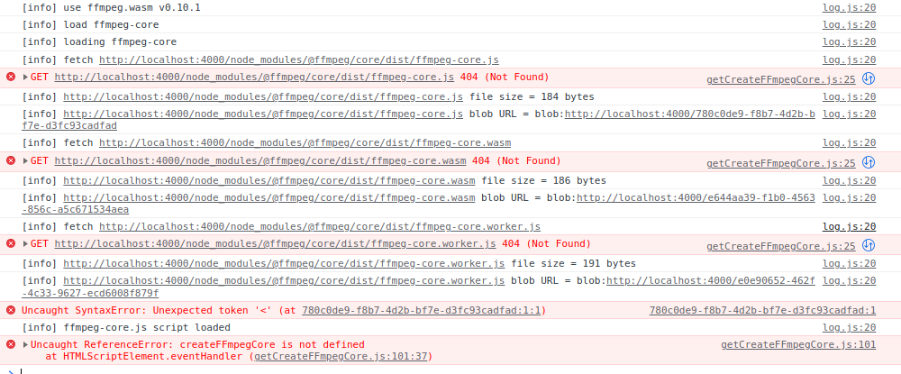

# Video Player

- [Video Player](#video-player)
  - [1. Introduction](#1-introduction)
  - [2. Set Up before input video](#2-set-up-before-input-video)
  - [3. Video Player](#3-video-player)
    - [3.1 Play(재생)](#31-play재생)
    - [3.2 Mute(음소거)](#32-mute음소거)
    - [3.3 Time(시간)](#33-time시간)
      - [3.3.1 Time Formatting](#331-time-formatting)
      - [3.3.2 Time Update](#332-time-update)
    - [3.4 Full Screen](#34-full-screen)
    - [3.5 Display Button](#35-display-button)
  - [4. Views](#4-views)
  - [5. Video Recorder](#5-video-recorder)
    - [5.1 init Recording](#51-init-recording)
    - [5.2 Start Recording](#52-start-recording)
    - [5.3 Download Recording](#53-download-recording)
    - [5.4 convert Recording](#54-convert-recording)
      - [5.4.1 FFmpeg](#541-ffmpeg)
  - [6. Thumbnail(썸네일)](#6-thumbnail썸네일)

## 1. Introduction

먼저 이번 챕터에서 무슨 내용을 다룰 것인지를 설명하고 그리고 진행을 해볼 예정이다.

HTML에선 video를 넣을 수 있는 **\<video> tag**가 존재한다.

기본적으로 제공해주는 display가 있지만, 이것을 직접 만들어 볼 것이고, 직접 녹화를 하여 upload를 해주는 작업까지 진행을 해 볼 예정이다.

## 2. Set Up before input video

현재 우리는 HTML을 프론트엔드에서 사용하는 것이 아니라 백엔드에서 만들어서 **렌더링하여 프론트엔드에게 건네주는 방식**으로 사용하고 있다. 또한, video player를 display만 하는 것이 아니라 **저장 해주는 공간**이 필요로 하다.

따라서 사용자가 업로드를 하거나 비디오 녹화를 해서 업로드 했을 때 저장할 공간을 만들어 줘야 한다.

이것을 하기 전에 Javascript 파일을 만들어서, JavaScript파일을 필요한 페이지에 포함 시켜주는 작업을 해야한다.

예를 들어, 홈페이지에서는 어떤 JavasScript도 불러오지 않을 것이다.

이것을 위해선 entry를 수정해줄 필요가 있다.

먼저 client -> js -> videoPlayer.js라는 파일을 만들어 준 후,

    console.log("Video Player");

해당 코드를 적어주고 entry를 수정하자.

webpack.config.js

```js
module.exports = {
  entry: {
    main: "./src/client/js/main.js",
    videoPlayer: "./src/client/js/videoPlayer.js",
  },
  mode: "development",
  watch: true,
  plugins: [
    new MiniCssExtractPlugin({
      filename: "css/styles.css",
    }),
  ],
  output: {
    filename: "js/main.js",
    path: path.resolve(__dirname, "assets"),
    clean: true,
  },
  ...
```

이렇게 하고 보니 output에도 이름이 있다.

모든 js파일들이 main.js로 변하는 것을 원하지 않는다.

이 상태로 webpack을 재시작한다면 다음과 같은 오류가 나오면서 main 파일이 두개 생성될 것이다.


해당 오류는 여러 코드가 같은 파일 이름을 asset을 생성하고 있다고 나온 것이다.

여기서 우리는 webpack에서 제공하는 **변수 사용방식**을 이용하면 된다.

```js
  output: {
    filename: "js/[name].js",
    path: path.resolve(__dirname, "assets"),
    clean: true,
  },
```

이제 실행하면 assets폴더에도 main.js와 videoPlayer.js 둘 다 잘 생성된 것을 확인할 수 있다.

위에서 말했다시피 우리는 필요한 페이지에만 script를 불러오고 싶다.

그리서 template에서 할 수 있는 것은 **inheritance**이다.

base.pug

```pug
doctype html
html(lang="ko")
    head
        title #{pageTitle} | #{siteName}
        link(rel="stylesheet", href="https://cdnjs.cloudflare.com/ajax/libs/font-awesome/6.1.1/css/all.min.css")
        link(rel="stylesheet", href="/static/css/styles.css")
    body
        include partials/header
        main
            block content
    include partials/footer.pug
    script(src="/static/js/main.js")
```

여기서 전부 적용할 js파일만 적어주고 나머지는 inheritance를 이용하면 된다.

    script(src="/static/js/main.js")
    block scripts

이제 기본 Setting작업은 끝났다. 본격적으로 비디오 만드는데 집중해보자.

## 3. Video Player

먼저 template을 만들어 줘야 한다.

watch.pug

```pug
    video(src="/" + video.fileUrl, controls)
    div
        button#play Play
        button#mute Mute
        span#time 00:00/00:00
        input(type="range", step="0.1" min="0" max="1")#volume
```

이것을 client -> js -> videoPlayer.js로 가서 사용하면 된다.

### 3.1 Play(재생)

기본적인 부분은 건너 뛰고 필요한 event와 함수를 생성했을 때 코드를 살펴보자.

videoPlayer.js

```js
const video = document.querySelector("video");
const playBtn = document.getElementById("play");
const muteBtn = document.getElementById("mute");
const time = document.getElementById("time");
const volume = document.getElementById("volume");

const handlePlayClick = (e) => {
  if (video.paused) {
    video.play();
  } else {
    video.pause();
  }
};

const handlePause = () => (playBtn.innerText = "Play");
const handlePlay = () => (playBtn.innerText = "Pause");

const handleMute = (e) => {};

playBtn.addEventListener("click", handlePlayClick);
muteBtn.addEventListener("click", handleMute);
video.addEventListener("pause", handlePause);
video.addEventListener("play", handlePlay);
```

여기서 들을 수 있는 의문점은 **handlePause와 handlePlay 변수의 경우 버튼을 클릭했을 때 발생시키면 되니깐 handlePlayClick에 넣어줘도 되는거 아닌가?** 라는 의문점이 들을 수 있다.

이 경우 버튼만을 이용해서 동영상을 재생 또는 정지하는 경우에만 적용되므로 문제가 있다. 스페이스바를 이용해서 멈출수도 있고, 동영상을 클릭했을 때 멈출 수도 있는 것을 생각해야 한다.

> 변수명을 만들 떄 playBtn과 같이 정확하게 명시해 줌으로써 모호함을 없애면서 나중에 변수가 겹치지 않도록 방지해주도록 하자.

### 3.2 Mute(음소거)

**Mute버튼**을 만들 때 주의해야 할 점은, Mute버튼을 눌러서 음소거가 되는 순간 **볼륨바(Range)** 도 움직여야 되는 것이다.

먼저 볼륨바를 신경 쓰지 않고 버튼만을 코딩했을 경우 다음과 같다.

```js
const handleMute = (e) => {
  if (video.muted) {
    video.muted = false;
  } else {
    video.muted = true;
  }
  muteBtn.innerText = video.muted ? "Unmute" : "Mute";
};
```

여기서 주목할 점은 삼항 연산자의 유용성이다. 조건문을 다 거치고 나와서 마무리 단계에서 상항 연산자를 상요하여 변경해주는 방식. 이 방식은 위에서 사용한 재생 버튼과 video 재생과의 관계에서도 사용할 수 있을 것 같다.

```js
const handlePlayClick = (e) => {
  if (video.paused) {
    video.play();
  } else {
    video.pause();
  }
  playBtn.video.paused ? "Play" : "Paused";
};
```

이제 볼륨바를 만들어 줄 것인데, 두가지를 신경써줘야 한다.

1.  Mute를 눌렀을 때 Range Bar Value 값이 0으로 가면 된다.
2.  unMute를 눌렀을 때 Range Bar Value 값이 이전 상태로 돌아가야 한다.

> 먼저 기본적으로 input range의 기본 value값은 0.5이다.

그래서 먼저 JavaScript에서

    video.volume = 0.5;

이 부분을 위에 적어두고 시작하자.

Range가 변화하는 것을 감지해야 하는데 그때 사용하는 eventListner가 **change**이다.

문제는 **change**는 드래그를 하고 있는 동안이 아닌 드래그를 다 하고 놓았을 때 발생한다.

볼륨같은 경우 실시간으로 변화에 따라가는 것을 원한다.

그래서 사용하는 것이 **input**이다.

```js
const handleVolumeChange = (event) => {
  const {
    target: { value },
  } = event;
  video.volume = value;
};

volumeRange.addEventListener("input", handleVolumeChange);
```

현재 까지 코드는 다음과 같다.

```js
const video = document.querySelector("video");
const playBtn = document.getElementById("play");
const muteBtn = document.getElementById("mute");
const time = document.getElementById("time");
const volumeRange = document.getElementById("volume");

let volumeValue = 0.5;
video.volume = volumeValue;

const handlePlayClick = (e) => {
  if (video.paused) {
    video.play();
  } else {
    video.pause();
  }
  playBtn.innerText = video.paused ? "Play" : "Paused";
};

const handleMuteClick = (e) => {
  if (video.muted) {
    video.muted = false;
  } else {
    video.muted = true;
  }
  muteBtn.innerText = video.muted ? "Unmute" : "Mute";
  volumeRange.value = video.muted ? 0 : volumeValue;
};

const handleVolumeChange = (event) => {
  const {
    target: { value },
  } = event;
  if (video.muted) {
    video.muted = false;
    muteBtn.innerText = "Mute";
  }
  volumeValue = value;
  video.volume = value;
};

playBtn.addEventListener("click", handlePlayClick);
muteBtn.addEventListener("click", handleMuteClick);
volumeRange.addEventListener("input", handleVolumeChange);
```

### 3.3 Time(시간)

이제 동영상의 길이 즉, 시간을 해결할 것이다.

시간은 크게 두 가지를 구현해줘야 한다.

    1. 현재 재생되고 있는 시점에서의 시간
    2. 최종 비디오 길이(시간)

먼저 최종 비디오 길이부터 해결하자.

homepage에서 video를 클릭해서 해당 video page로 갔을 경우 비디오의 길이가 보여야 한다.

그럴라면 페이지가 로드 될 때 바로 event가 발생해야 하는 것이다.

그럴 때 사용하는 **eventListener**이 [loaded meta data event](https://developer.mozilla.org/en-US/docs/Web/API/HTMLMediaElement/loadedmetadata_event)이다.

이 event는 meta data가 로드될 때 실행이 될 것이다.

> **meta data는 무엇인가?**
>
> meata data는 비디오를 제외한 모든 것을 말한다.
>
> 예를 들어, 비디오의 시간이라든가 가로, 세로 크기 등 움직이는 이미지들을 제외한 모든 Extra를 말한다.

현재 PUG에는 span#time 00:00/00:00 이와 같이 써져있는데 이것을 수정해서 사용할 필요가 있다.

```pug
...
        div
            span#currentTime 00:00
            span    /
            span#totalTime 00:00
...
```

이와 같이 해주고 javascript에서 손 봐주면 되겠다.

```js
...
const handleLoadedMetadata = () => {
  totalTime.innerText = video.duration;
}
video.addEventListener("loadedmetadata", handleLoadedMetadata);
...
```

이와 같이만 해줘도 tatalTime이 적용되는데 그 이유는 이 function이 호출해서 비디오의 길이를 알 수 있게 해주기 때문이다.

이제 currentTime을 위해서 다른 event를 쓸 것인데, 그것은 [timeupdate](https://developer.mozilla.org/en-US/docs/Web/API/HTMLMediaElement/timeupdate_event)이다.

이것은 currentTime 속성이 변경되는 시점에 발생한다.

```js
const handleTimeUpdate = () => {
  currentTime.innerText = Math.floor(video.currentTime);
};
video.addEventListner("timeupdate", handleTimeUpdate);
```

#### 3.3.1 Time Formatting

유튜브나 넷플릭스를 보면 **00:00/00:00** 이러한 방식으로 시간이 나오는데 현재 우리에게 보이는 시간은 초밖에 보이지 않는다. 총 29초 동영상이면 0/29 이렇게 보이고 있는 것이다.

그래서 수정해줄 필요가 있는데, 여기서 사용할 함수는 [new Date()](https://developer.mozilla.org/ko/docs/Web/JavaScript/Reference/Global_Objects/Date/Date), [toISOString()](https://developer.mozilla.org/ko/docs/Web/JavaScript/Reference/Global_Objects/Date/toISOString), [substring()](https://developer.mozilla.org/ko/docs/Web/JavaScript/Reference/Global_Objects/String/substring) 이렇게 3가지를 사용할 것이다.

**new Date()**에서 Date 객체는 1970년 1월 1일 09:00 시점을 이후로 date를 만들어 준다.

주의할 점은 **new Date**를 사용할 때 신경써야 될 것은 시간의 단위가 ms이기 때문에 매개변수에 초단위로 넣고 싶다면 **n \* 1000**로 적어줘야 한다는 것이다.

**toISOString()** 은 단순화한 확장 ISO 형식의 문자열을 반환합니다.

**substring()** 은 입력한 처음 index부터 마지막 index까지의 string을 뽑아 줍니다.


코드는 다음과 같을 것이다.

```js
...
const formatTime = (seconds) => {
  new Date(seconds * 1000).toISOString().substring(11, 8);
};

const handleLoadedMetadata = () => {
  totalTime.innerText = formatTime(Math.floor(video.duration));
};

const handleTimeUpdate = () => {
  currentTime.innerText = formatTime(Math.floor(video.currentTime));
};
...
```

#### 3.3.2 Time Update

이제 비디오 시간을 업데이트해주는 기능을 만들어 보자.

먼저, watch.pug에 또 다른 div를 추가해줄 필요가 있다.

```pug
div
    input(type="range", step="1" value="0" min="0")#timeline
```

- range input의 step에는 어느 크기 정도로 넘길지 써주면 된다.
- min값은 주지만 max값은 주지 않는 이유는 max는 동영상 길이가 될 것이기 때문이다.

이 두가지는 기억해 두자.

이제 javascript에 가서 max값을 주면서 time을 계속해서 update해주면 된다.

**loadedmetadata event**가 일어날 때 발생하는 function인 **handleLoadedMetadata**에서 timeLine의 maximum value를 세팅해 줄 것이다.

```js
const handleLoadedMetadata = () => {
  totalTime.innerText = formatTime(Math.floor(video.duration));
  timeline.max = Math.floor(video.duration);
};
```

이제 비디오 시간이 변화 할 때 처리만 해주면 되는데 사실 우리는 해당 event를 사용하고 있다.

**timeupdate event**가 일어날 때 발생하는 function인 handleTimeUpdate에서 사용하고 있다.

```js
const handleTimeUpdate = () => {
  currentTime.innerText = formatTime(Math.floor(video.currentTime));
  timeline.value = Math.floor(video.currentTime);
};
```

이와같이 **timeline.value**를 계속해서 업데이트 해주도록 function안에 적어준다.

반대의 상황에서도 내가 만든 bar랑 동영상이랑 연결을 해줘야 한다.

현재 내가 만든 bar를 움직여도 동영상 시간에 영향을 주지 않는다.

볼륨바에서도 봤듯이, 내가 클릭하고 움직일때 마다 처리해주는 event인 **input**을 적어주면 된다.

```js
const handleTimelineChange = (event) => {
  const {
    target: { value },
  } = event;
  video.currentTime = value;
};
timeline.addEventListener("input", handleTimelineChange);
```

### 3.4 Full Screen

먼저 Full Screen Button을 추가해줘야 한다. pug에 가서 추가하도록 하자.

watch.pug

```pug
extends base.pug

block content
    div#videoContainer
        video(src="/" + video.fileUrl)
        div#videoControls
            button#play Play
            button#mute Mute
            input(type="range", step="0.1" min="0" max="1")#volume
            div
                span#currentTime 00:00
                span    /
                span#totalTime 00:00
            div
                input(type="range", step="1" value="0" min="0")#timeline
            div
                button#fullScreen Enter Full Screen
```

**requestFullscreen()** 를 사용할 것인데, [Element.requestFullscreen()](https://developer.mozilla.org/en-US/docs/Web/API/Element/requestFullScreen)는 요소를 전체 화면 모드로 표시하기 위해 비동기식 요청을 발생시킵니다.

```js
const handleFullScreen = () => {
  videoContainer.requestFullscreen();
};
```

css를 적용시키기 전에 두가지를 해결하자.

1. 전체화면이 되었을 때 Exit Full Screen으로 버튼의 innerText를 변경
2. 전체화면일 때 버튼을 누르면 전체화면에서 원래 화면으로 돌아가기.

1번의 경우 기존에 했던 방식과 동일하게 해주면 된다.

2번의 경우 현재 화면이 FullScreen인지 알려주는 **document.fullscreenElement**를 사용하면 된다.

```js
const handleFullScreen = () => {
  const fullscreen = document.fullscreenElement;
  if (fullscreen) {
    document.exitFullscreen();
    fullScreenBtn.innerText = "Enter Full Screen";
  } else {
    videoContainer.requestFullscreen();
    fullScreenBtn.innerText = "Exit Full Screen";
  }
};
```

### 3.5 Display Button

유튜브나 넷플릭스를 보면 **video display에서 마우스를 움직이면 각종 버튼들이 보이다가 가만히 있거나 display밖으로 나가면 버튼이 사라지고 동영상만 보이는 기능**을 본 적이 있을 것이다.

해당 기능을 구현해보도록 하자.

javascript에서 다음과 같이 해주자.

```js
const handleMouseMove = () => {
  videoControls.classList.add("showing");
};

const handleMouseLeave = () => {
  setTimeout(() => {
    videoControls.classList.remove("showing");
  }, 3000);
};
video.addEventListener("mousemove", handleMouseMove);
video.addEventListener("mouseleave", handleMouseLeave);
```

여기서 **controls에 class를 추가한 것**은 나중에 css로 구현해서 표현하기 위함이다.

또한, **setTimeout 을 쓴 이유**는 넷플릭스나 유튜브 동영상을 보면 마우스 커서가 동영상 밖으로 나간다고 해서 바로 controls이 사라지는 것이 아니라 조금 시간이 지니고 사라지는 것을 볼 수 있을 것이다.

하지만, 여기까지 구현하고 보니 문제가 있다.

마우스가 동영상 안에 있다가 나가고 3초 안에 다시 동영상 안에 들어가면 controls이 남아 있어야 하지만 처음 3초가 지나면 사라져버린다.

첫번째로 해야할 것은, **timeout의 return type**을 이해해야한다.

```js
const handleMouseLeave = () => {
  const id = setTimeout(() => {
    videoControls.classList.remove("showing");
  }, 3000);
  console.log(id);
};
```


이 숫자가 의미하는 것은 무엇일까?

이것은 timeoutID로서 setTimeout()이 생성한 타이머를 식별할 때 사용하는 반환값이다.

해당 페이지를 참고하자: [setTimeout document](https://developer.mozilla.org/ko/docs/Web/API/setTimeout)

이 숫자는 handleMouseMove()안에서도 사용할 수 있어야 한다.

그래서 사용하는 것이 **global 변수**이다.

```js
let controlsTimeout = null;

const handleMouseMove = () => {
  if (controlsTimeout) {
    clearTimeout(controlsTimeout);
    controlsTimeout = null;
  }
  videoControls.classList.add("showing");
};

const handleMouseLeave = () => {
  controlsTimeout = setTimeout(() => {
    videoControls.classList.remove("showing");
  }, 3000);
};
```

이제 해줘야 할 것은, 마우스가 멈추는 것을 감지하는 것이다.

동영상 안에 마우스가 가만히 있을 때 어느정도 시간이 지나면 controls이 사라지는 기능을 구현해 보자.

mousestop이라는 event는 없기 때문에 **timeout과 clearTimeout**을 사용하여 구현한다.

일단, 마우스가 움직일 때, timeout을 시작해야 한다. 코드의 중복성도 해결할 겸 코드를 길게 다 써보자.

```js
const hideControls = () => {
  videoControls.classList.remove("showing");
};

const handleMouseMove = () => {
  if (controlsTimeout) {
    clearTimeout(controlsTimeout);
    controlsTimeout = null;
  }
  videoControls.classList.add("showing");
  setTimeout(hideControls, 3000);
};

const handleMouseLeave = () => {
  controlsTimeout = setTimeout(hideControls, 3000);
};
```

이제 timeout의 id를 받고 clear를 해주면 된다.

global 변수로써 다음과 같이 해주고

    let controlsMovementTimeout = null;

코드는 다음과 같다.

```js
...
const handleMouseMove = () => {
  if (controlsTimeout) {
    clearTimeout(controlsTimeout);
    controlsTimeout = null;
  }
  if(controlsMovementTimeout) {
    clearTimeout(controlsMovementTimeout);
    controlsMovementTimeout = null;
  }
  videoControls.classList.add("showing");
  controlsMovementTimeout = setTimeout(hideControls, 3000);
};
...
```

코드 분석을 해보자.

위의 if는 무슨 역할이며, 아래 if는 무슨 역할을 하고 있는 것일까?

**첫번째 if**는 아래 조건때문에 필요하다.

마우스가 동영상 안에 있다가 나갔을 때 3초뒤에 controls가 사라지게 만들었는데 그 시간 사이에 마우스가 다시 들어오면 timeout이 취소가 되게끔하기 위해 구현해놓았다.

그렇다면, **두번째 if**는 무엇 때문일까?

마우스가 동영상 내에서 움직이다가 멈췄을 때 controls가 사라지도록 하기 위해서이다. 즉 이말은, 동영상 내에서 움직이면 controls는 사라지지 않는다라는 말과 같은 말인 것 같다.

첫번째 if문은 두번째 if문 조건을 채워주지 못하지만 두번째 if문은 첫번째 if문 조건을 채워주고 있다는 것이다.

**마지막 움직인 시점에서 마우스가 멈추든 나가있든 똑같이 봐도 무방한 것이다.**

이로써 Video 기능 구현은 끝이 났다. CSS 설명은 생략하도록 하겠다.

## 4. Views

**Views**는 우리가 동영상을 봤을 때 올라가는 조회수를 의미한다.

현재 우리가 하는 프로젝트와는 다르게 대부분 인터넷에선 백엔드에서 렌더링을 하지 않는다.

**대부분의 웹 애플리케이션은 프론트와 백이 나눠져있다.**

백엔드가 인증, DB등을 처리하고 프론트엔드는 좀 다르다.

보통 VanillaJS, Svelte, ReactJS 등으로 만드는데 우리는 SSR(Server Side Rendering)방식을 사용하고 있습니다.

서버가 템플릿을 렌더링 하는 일까지 처리한다는 것이다.

요즘에는 React를 이용해서 프론트엔드를 만들고 지금 우리가 배우고 있는 NodeJS로 백엔드를 만든다.

보통 NodeJS로는 템플릿을 렌더링하지 않는다.

이번에는 **템플릿을 렌더링하지 않는 views**를 만들것이다. 이것을 하고나면 템플릿을 렌더링하는 views와 api views의 차이를 알게 될 것이다.

**API**는 프론트 엔드와 백엔드가 서버를 통해 통신하는 방법을 말한다.

우선 Router를 만들자.

videoRouter.js에서 만들어도 되지만 새롭게 apiRouter라는 것을 만들고 내용을 채우자.

routers/apiRouter.js

```js
import express from "express";

const apiRouter = express.Router();

export default apiRouter;
```

server.js

```js
...
app.use("/api", apiRouter);
...
```

이제 유저가 영상을 시청하면 백엔드에 요청을 보낼건데, 이 요청으로는 URL을 바꾸지 않을 것이다.

즉, **요청을 보내더라도 URL을 바꾸지 ㅇ낳고 템플릿을 렌더링 하지 않겟다는 것**이다.

router.js에 다음코드를 추가하자.

    apiRouter.post("/videos/:id([0-9a-f]{24})/view", registerView);

이것은 **localhost:4000/api/videos/:id/view인 URL에 Post요청을 보내면 조회수를 기록하게 만들것**을 의미한다.

videoController.js

```js
export const registerView = async (req, res) => {
  const { id } = req.params;
  const video = await Video.findById(id);
  if (!video) {
    return res.status(404);
  }
  video.meta.views = video.meta.views + 1;
  await video.save();
  return res.status(200);
};
```

이제 이 URL프론트엔드 에서 호출해야 하는데, 우리는 보통 브라우저에서 URL을 호출하는 것에 익숙하다.

하지만, 이번엔 이동없이 URL을 호출할 수 있는 방법을 해보는 것이다.

interactive 하게 만들수 있는 가장 기본적인 방법이다.

> interactivity라 함은 URL이 바뀌지 않아도 페이지에서 변화가 생기는 것을 말한다.

클라이언트에서 자바스크립트로 이 URL에 요청하는 것을 만들어 볼 것이다.

client -> js -> videoPlayer.js에 URL로 요청하는 이벤트를 추가할 것이다.

event를 추가할 것인데 이번엔 **ended**이다.

그리고 **function안에서는 fectch를 이용해서 밴엔드에 요청을 보내줄 것**이다.

```js
const handleEnded = () => {
  fetch("/api/videos/skdlfnaksdnfkladnkflansdlkfan/view");
};
video.addEventListener("ended", handleEnded);
```

fetch안에 주소는 /api/videos/:id/view의 예시로 일단 적어본 것이다.

아직 handleEnded function이 비디오의 id를 알지 못한다.

그래서 이 템플릿을 렌더링하는 pug에서 비디오에 대한 정보를 넘겨 줘야 한다.

방법은 두가지다.

1.  간단하게 span을 만들고 video.\_id를 보여주도록 만든다.
2.  직접 데이터를 만들어서 HTML에 저장하는 것이다.

1번 방법은 좋아 보이진 않는다. 프론트 쪽에서 비디오 id를 그대로 노출 시키는건 좋은 방법이 아니다.

2번 방법을 하려면 **data attribute**를 이용하면 된다.

**data attribute**는 data-로 시작하는 attr를 말하는데, 원하는 어떤 것이든 저장할 수가 있다.

HTML specification과도 문제가 전혀 없다.

그리고 dataset을 이용하면 자바스크립트로 데이터에 정말 쉽게 접근할 수 있다.

이걸 사용해서 pug를 렌더링 할 때 데이터를 저장한다.

```pug
extends base

block content
    div#videoContainer(data-id=video._id)
    ...
```

이렇게 해주고 videoPlayer.js에서 다음과 같이 해줄 때 출력을 보자.

    console.log(videoContainer.dataset);


코드는 다음과 같이 짜주면 될 것 같다.

```js
const handleEnded = () => {
  const { id } = videoContainer.dataset;
  fetch(`/api/videos/${id}/view`, {
    method: "POST",
  });
};
};
```

apiRouter에서 만들 때 **POST요청을 하도록 해놨으니 method를 추가**해줘야 한다. **default method는 GET이다.**

결과를 보자. 동영상을 다 재생하면 어떤 결과가 나올 것인가?


왜 이런 것일까? 심지어 status code도 200이 아닌 404로 받는다. 뭐가 문제일까?

코드를 다시 살펴보자.

```js
export const registerView = async (req, res) => {
  const { id } = req.params;
  const video = await Video.findById(id);
  if (!video) {
    return res.status(404);
  }
  video.meta.views = video.meta.views + 1;
  await video.save();
  return res.status(200);
};
```

여기서 **status만 쓴다는 것**은 사실 상태코드만 적어준 것일 뿐이고 아무것도 보내고 있지 않은 상태이다. 즉, **return을 아무것도 하지 않고 있는 상태**인 것이다. 다른 것들을 보면 res.status().render()과 같이 render를 하고 있는 것처럼 무언가를 해줘야 하는 것이다. 이럴 때 사용하는 것이 **sendStatus()** 이다.

```js
export const registerView = async (req, res) => {
  const { id } = req.params;
  const video = await Video.findById(id);
  if (!video) {
    return res.sendStatus(404);
  }
  video.meta.views = video.meta.views + 1;
  await video.save();
  return res.sendStatus(200);
};
```

결과는 다음과 같이 나온다.


## 5. Video Recorder

이제 비디오 녹화기를 만들어 보자.

5초로 제한을 두고, 5초가 지나면 사람들은 녹화된 비디오를 다운로드 받을 수 있게 되는 기능이다.

이전과 동일하게 client -> js -> recorder.js 이와 같은 경로로 만들어 주자.

그 후 entry에 다음과 같이 추가하면 된다.

webapack.config.js

```js
...

  entry: {
    main: "./src/client/js/main.js",
    videoPlayer: "./src/client/js/videoPlayer.js",
    recoder: "./src/client/js/recoder.js",
  },

...
```

재시작하면 assets/js/recorder.js파일이 생성된다. 여기까진 이전과 동일하다.

watch.pug에 했던 방식과 동릴하게 upload.pug에 할 것인데 다음과 같이 해주자.

upload.pug

```pug
...


block scripts
    script(src="static/js/recoder.js")
```

이렇게 해주면 된다.

> 잘 작동하는지 확인하고 싶은 방법으론 **console.log**를 이용하거나 **alert**를 이용

녹음을 시작하기 위해서 누를수 있는 버튼을 만들어주자.

    div
        button#startBtn Start Recoding

pug에 이 코드를 추가하고 js에서 받아서 처리해주기 시작하자.

### 5.1 init Recording

이제 녹화를 시작할 것인데, 녹화를 하기 위해서 필요한 함수가 있다.

**navigator**이다. 이 함수는 사용자의 navigator에서 카메라와 오디오를 가져다 줄 것이다.

**navigator.mediaDevices.getUserMedia**를 호출할 것이다.

하지만, 이 기능을 사용하는데는 시간이 걸린다.

왜냐하면 카메라 사용 여부와 마이크 사용 여부도 물어봐야 하기 때문이다.

이러한 것을 비동기식으로 처리하기에 적합하진 않을 것 같다.

따라서 promise방식을 사용하거나 async await 방식을 사용해야 한다.

지끔까지의 전체 코드는 다음과 같다.

```js
const startBtn = document.getElementById("startBtn");

const handleStart = async () => {
  const stream = await navigator.mediaDevices.getUserMedia({
    audio: true,
    video: true,
  });
  console.log(stream);
};

startBtn.addEventListener("click", handleStart);
```

결과는 다음과 같다.


이 Error는 프론트엔드 상에서 async랑 await를 쓰려면 **regeratorRuntime**을 설치해야 해서 나오는 오류이다.

설치 안하고 promise만 써도 무방하긴 하지만, 우린 설치하여 사용하자.

    npm i regenerator-runtime

그런 다음에 recorder.js의 맨 위에 다음과 같이 import를 해주도록 하자.

import regeneratorRuntime from "regenerator-runtime";

문제 없이 작동될 것이지만, 이런 방식 말고 모든 Javascript에서 사용할 수 있게 이것을 main.js에다가 넣어주자.

main.js

```js
import "../scss/styles.scss";
import regeneratorRuntime from "regenerator-runtime";
```

그리고 이것을 base.pug에 추가해주자.

base.pug

```pug
...

    script(src="/static/js/main.js")
    block scripts
```

이렇게 해주면서, 이제 모든 페이지에서 async와 await를 사용할 수 있게 된 것이다.

이 방식말고 regeneratorRuntime이 필요한 Javascript 파일에만 import해줘도 괜찮다.

위의 console.log의 결과는 다음과 같다.


이제 버튼은 navigator의 mediaDevices API를 호출하고 있는데, 이 안에 getUserMedia라는 funciton이 있다.

카메라에 잡힌 동영상을 미리보기할 수 있게 video Element를 추가해주자.

upload.pug

```pug
block content
    div
        video#preview
        button#startBtn Start Recoding
        ...
```

recorder.js

```js
const startBtn = document.getElementById("startBtn");
const video = docuemnt.getElementById("preview");

const handleStart = async () => {
  const stream = await navigator.mediaDevices.getUserMedia({
    audio: true,
    video: true,
  });
  video.srcObject = stream;
  video.play();
};
```

보시다시피 video를 가져와서 function안에다가 넣어서 처리해주면 된다.

pug를 보면 src가 없는 video라서 거기에 stream을 넣어준 것이다.

**srcObject**는 video가 가질수 있는 무언가를 의미한다. HTML 요소인 src와는 다른것이라는 것을 알아두자.

만약 크기를 바꿔주고 싶다면 다음과 같이 해주면 된다.

```js
...
  const stream = await navigator.mediaDevices.getUserMedia({
    audio: true,
    video: { width:200px, height: 100px },
  });
...
```

우리는 이것을 처리할 때 저장하는 것이 아닌 녹화를 해야 한다는 것에 집중해볼 필요가 있다.

우리는 컴퓨터에 넣는것이 아니라 녹화 후 브라우저에 넣어주는 것이다.

mediaRecorder는 말 그대로 녹화해줄 수 있게 도와준다.

이전까지의 방식을 수정해줄 필요가 있는데 왜냐하면, **Start Recording**버튼을 눌러서 미리보기가 아닌 실제 녹화가 이루어져야 한다.

즉, 미리보기가 먼저 이루어져야 한다는 것이다.

```js
const startBtn = document.getElementById("startBtn");
const video = document.getElementById("preview");

const handleStop = () => {
  startBtn.innerText = "Strat Recording";
  startBtn.removeEventListener("click", handleStop);
  startBtn.addEventListener("click", handleStart);
};

const handleStart = () => {
  startBtn.innerText = "Stop Recording";
  startBtn.removeEventListener("click", handleStart);
  startBtn.addEventListener("click", handleStop);
};

const init = async () => {
  const stream = await navigator.mediaDevices.getUserMedia({
    audio: false,
    video: true,
  });
  video.srcObject = stream;
  video.play();
};

init();

startBtn.addEventListener("click", handleStart);
```

이와 같이 처음에 미리보기가 나오도록 해주었고, 문구가 계속해서 바뀔수 있도록 eventListener를 추가하고 지워주고 해줬다.

### 5.2 Start Recording

이제 실제 녹화가 이루어지도록 할 것인데 mediaRecorder를 이용해서 stream을 만들어 주면 된다.

우린 이미 stream을 가지고 있으니 그것을 mediaRecorder에 전달해주면 된다.

```js
const handleStart = () => {
	...

	const recoder = new MediaRecoder(stream);
};
```

여기서 **문제점**은 const init안에다가 우리는 stream을 생성해 놓았기 때문에 이것을 전역변수로 돌려줘야 한다. 이 부분은 생략하도록 하고 다음 코드를 살펴보자.

```js
const handleStart = () => {
  startBtn.innerText = "Stop Recording";
  startBtn.removeEventListener("click", handleStart);
  startBtn.addEventListener("click", handleStop);

  const recoder = new MediaRecorder(stream);
  recoder.ondataavailable = (e) => {
    console.log("Recording Done!");
    console.log(e);
    console.log(e.data);
  };
  console.log(recoder);
  recoder.start();
  console.log(recoder);
  setTimeout(() => {
    recoder.stop();
  }, 10000);
};
```

결과는 다음과 같다.


이것처럼 **ondataavailable**의 경우 녹화가 종료가 된 후에 실행이 되는 event이다. 그리고 처음에 recorder가 start하기 전에 **state: "inactive""** 였다가, start()를 해준 후에는 **state: "recording"** 로 바꼈다.

이후 10초있다가 녹화가 종료가 되고 ondataavailable이 실행된 것이다.


data안에 있는 내용들이 방금 녹화한 비디오가 들어가 있는 것이다.

handleStop function에는 recorder를 넣어줘야 하는데 handleStart function안에서 선언해놓았기 때문에 이것또한 전역 변수로 처리해줘야 한다.

```js
const handleStop = () => {
  startBtn.innerText = "Strat Recording";
  startBtn.removeEventListener("click", handleStop);
  startBtn.addEventListener("click", handleStart);

  recoder.stop();
};

const handleStart = () => {
  startBtn.innerText = "Stop Recording";
  startBtn.removeEventListener("click", handleStart);
  startBtn.addEventListener("click", handleStop);

  recoder = new MediaRecorder(stream);
  recoder.ondataavailable = (event) => {
    const video = URL.createObjectURL(event.data);
    console.log(video);
  };
  recoder.start();
};
```

여기서 **createObjectURL**은 브라우저 메모리에서만 가능한 URL을 만들어 준다.

그리고 이 URL은 파일을 가르키고 있는 것이다.


위에 보이는 URL은 우리 서버에 있는 것이 아니라, **브라우저에 의해 만들어 졌고 접근할 수 있는 파일을 가르키고 있고 메모리 상에 있는 것**이다.

확인하기 위해서 **video를 미리보기가 아닌 녹화한 영상이 나오도록 해보자.**

그러기 위해선 **srcObject를 지워야 한다.**

다만, init function에서 지우는 것이 아니라 아래와 같이 handleStart function에서 지워줘야 한다.

```js
const handleStart = () => {
  startBtn.innerText = "Stop Recording";
  startBtn.removeEventListener("click", handleStart);
  startBtn.addEventListener("click", handleStop);

  recoder = new MediaRecorder(stream);
  recoder.ondataavailable = (event) => {
    const videoFile = URL.createObjectURL(event.data);
    video.srcObject = null;
    video.src = videoFile;
    video.loop = true;
    video.play();
  };
  recoder.start();
};
```

> 이와 같이 해준 이유는 미리보기를 보면서 녹화를 하고 녹화가 종료되면 녹화한 영상을 보기 위함이다.

이제 녹화를 멈췄을 때 handleStart를 다시 할 수 있게 하는 것이 아닌 Download Recording을 구현해보자.

### 5.3 Download Recording

다음의 함수를 추가해주자.

```js
const handleDonwload = () => {
  const a = document.createElement("a");
  a.href = videoFile;
  a.download = "MyRecording.webm";
  document.body.appendChild(a);
  a.click();
};
```

물론이겠지만, 여기서도 videoFile을 쓰기 위해서 전역 변수로 바꿔서 처리해줘야 한다.

이것은 실제로 브라우저에 display를 하는게 아니라 **버튼을 눌렀을 때 함수를 실행시키면서 다운로드 되도록 만들어 놓은것**이다.

> **해당 링크는 body에 추가해주기는 하지만 display 목적이 아니고 버튼을 툴렀을 떄 해당 링크가 실행이 되도록 구현해 놓은 코드이다.**

body에 존재하지 않는 링크는 클릭을 할 수 없기 때문에 이렇게 해놓은 것이다.

### 5.4 convert Recording

현재 동영상 포맷은 **webm**이다.

> Webm(웹엠)은 로열티 비용이 없는 개방형 고화질 영상 압충 형식의 영상이며 HTML5 비디오와 함께 이용한다.

우린 이 동영상을 **FFmpeg**를 가지고 **webm에서 mp4**로 변환할 것이다.

> 모든 기기들이 webm을 이해하는 것이 아니기 떄문이다.

또한 **FFmpeg**를 이용해서 **동영상의 썸네일을 추출할 것**이다.

**FFmpeg**는 비디오나 오디오 같은, 어떤 종류의 미디어 파일이든 다룰 수 있다.

또 **FFmpeg**는 기본적으로 백엔드에서 돌아간다.

> 유튜브같은 경우에도 비디오를 업로드할 때마다 아마도 FFmpeg를 이용해서 비디오를 여러가지 포맷과 화질로 인코딩할 것이다. 유튜브에 가면 비디오의 화질을 변경할 수 있는 것이 그런 경우이다.

개념 정리를 하자면,

1.  FFmpeg는 오디오를 추출할 수 있고, 오디오 형싱을 변경할 수 있다. 비디오를 가지고 gif를 만들수도 있으며, 스크린샷을 찍을수도 있고, 오디오도 제거할 수 있으며 자막을 추가하는 등 여러가지 기능을 가지고 있다.
2.  FFmpeg를 실행하라면 백엔드에서 실행해야만 한다는 것이다.

여기서 2번째 개념은 비용적 측면에서 비싼 것이 문제다.

> 예를 들어, 누군가가 1GB의 비디오를 업로드하고, 그걸 변환해야만 한다면 백엔드가 모든 일을 처리해야 할 것이다. 또한 이러한 경우가 동시다발적으로 발생할 것이다. 이것이 이루어지기 위해선 아주 좋은 서버가 필요로 하다.

그래서 이 문제를 고치기 위해서 **WebAssembly**를 사용한다.

**WebAssembly**는 개방형 표준이다. 기본적으로 웹사이트가 매우 빠른 코드를 실행할 수 있게 해준다.

프론트에선 세종류의 코드만 사용할 수 있다. HTML, CSS, JavaScript

하지만, **WebAssembly**는 우리가 프론트엔드에서 매우 빠른 코드들을 실행할 수 있게 해준다.

**ffmpeg.wasm**는 비디오를 변환하기 위해 사용자의 컴퓨터를 사용한다.

지금 우리가 할 것은 사용자의 브라우저에서 비디오를 변환하는 것이다.

우리는 이제 서버의 처리 능력이 아닌 사용자(컴퓨터)의 처리 능력을 사용하려고 하는 것이다.

설치해주자.

    npm install @ffmpeg/ffmpeg @ffmpeg/core

우리는 videoFile을 백엔드로부터 받는 것이 아닌 브라우저로부터 받고 있다.

녹화를 종료하면, **영상의 모든 정보를 가진 object url**이 만들어 질 것이다.

이 url을 입력한다면 다운로드 창이 뜰 것이다.

이것은 event.data에 binary data가 있는데 파일일 수도 있는 이 binary data에 접근할 수 있어야 한다.


[사용법](https://github.com/ffmpegwasm/ffmpeg.wasm)은 해당 링크를 참고하자.

```js
import { createFFmpeg, fetchFile } from "@ffmpeg/ffmpeg";
const handleDonwload = () => {
  const ffmpeg = createFFmpeg({ log: true });

  const a = document.createElement("a");
  a.href = videoFile;
  a.download = "MyRecording.webm";
  document.body.appendChild(a);
  a.click();
};
```

여기서 log:true를 사용한 이유는, 무슨일이 벌어지고 있는지 console창에서 확인하기 위함이다.

이 다음은, ffmpeg.load()를 await해줘야 하는데, 사요자가 소프트웨어를 사용할 것이기 때문이다.

Javascript가 아닌 코드를 사용해서 무언가를 설치해서 사용하기 때문에 소프트웨어가 무거울 수 있는 것을 감안해서 기다려 줘야 한다.

#### 5.4.1 FFmpeg

파일과 폴더가 있는 가상 컴퓨터에 있다고 생각하자.

webassembly를 사용하고 있기에 더이상 브라우저에 있다는 생각은 하지말자.

ffmpeg.FS()의 인자를 보면 세가지 method가 존재한다.

```js
/* Write data to MEMFS, need to use Uint8Array for binary data */
ffmpeg.FS('writeFile', 'video.avi', new Uint8Array(...));
/* Read data from MEMFS */
ffmpeg.FS('readFile', 'video.mp4');
/* Delete file in MEMFS */
ffmpeg.FS('unlink', 'video.mp4');
참고: https://github.com/ffmpegwasm/ffmpeg.wasm/blob/master/docs/api.md#ffmpeg-fs
```

> 여기서 FS는 File System을 의미한다.

일단 writeFile을 사용해보자.

가상의 컴퓨터에 파일을 생성해주는 역할을 한다.

> 백엔드에선 multer가 파일을 만들었고, 업로드를 하면 uploads폴더에 아바타 파일이 생성됐었다.

백엔드와 마찬가지로 폴더와 파일이 생성되게 만들어줘야 한다.

    ffmpeg.FS("writeFile", "recording.webm", await fetchFile(videoFile));

**두번째 인자는 파일명**이다. **세번째 인자로는 binary data**를 건네주는 것인데 우리는 binary data로 되어있는 url을 알고 있기에 그것을 입력하면 된다.

[ffmpeg Document](https://ffmpeg.org/ffmpeg.html)

이 docuemnt를 참고해서 **ffmpeg.run**을 사용하자.

**ffmpeg.run**는 가상 컴퓨터에 있는 파일을 input으로 받는 것이다.

    await ffmpeg.run("-i", "recording.webm", "output.mp4");

**기본적으로 필요한 인자는 첫번째, 두번째, 세번째인자**이고 나머지는 옵션이다.

- 첫번째 인자 i는 **input**을 가르킨다.
- 두번째 인자는 **가상 컴퓨터에 존재하는 파일**을 적어준다.
- 세번째 인자는 **output파일명**이다.

옵션을 주면 다음과 같다.

    await ffmpeg.run("-i", "recording.webm", "-r", "60", "output.mp4");

이건 영상을 초당 60프레임으로 인코딩 해주겠다는 코드이다.

실행결과는 다음과 같다.



> **Uncaught (in promise) ReferenceError: SharedArrayBuffer is not defined 오류 해결 방법**
>
> 오류 원인 : SharedArrayBuffer는 cross-origin isolated된 페이지에서만 사용할 수 있습니다. 따라서 ffmpeg.wasm을 사용하려면 Cross-Origin-Embedder-Policy: require-corp 및 Cross-Origin-Opener-Policy: same-origin를 header에 설정해 자체 서버를 호스팅해야 합니다.
>
> 참고: https://github.com/ffmpegwasm/ffmpeg.wasm/issues/263

```js
// server.js
app.use((req, res, next) => {
  res.header("Cross-Origin-Embedder-Policy", "require-corp");
  res.header("Cross-Origin-Opener-Policy", "same-origin");
  next();
});
```

```js
// recorder.js
const ffmpeg = createFFmpeg({
  corePath: "/convert/ffmpeg-core.js",
  log: true,
});
```

FFmpeg Usage: https://github.com/ffmpegwasm/ffmpeg.wasm#usage

FFmpeg API: https://github.com/ffmpegwasm/ffmpeg.wasm/blob/master/docs/api.md#api

이제 실행해 보자.


**이제 가상 파일 시스템에 output.mp4라는 파일이 존재한다.**

ffmpeg의 FS를 이용해서 mp4파일을 가져올 것이다.

```js
const mp4File = ffmpeg.FS("readFile", "output.mp4");

console.log(mp4File);

console.log(mp4File.buffer);
```

이 파일은 Uint8Array(array of 8-bit unsigned integers) 타입이 될 것이다.

unsigned integers는 양의 정수를 의미한다.


이제 우리가 할 일은 이 배열로 부터 blob을 만들어 내는 것이다.

Uint8Array로 부터 blob을 만들 수는 없지만 ArrayBuffer로는 만들 수 있다.

위에 보이는 저 배열의 raw data, 즉, binary data에 접근하려면 **mp4File.buffer**를 사용해야 한다.

buffer는 ArratBuffer를 반환하고, ArrayBuffer는 raw binary data를 나타내는 object이다.

한 마디로 **우리 영상을 나타내는 bytes의 배열**이다.

기억 해야 될 것은 **binary data를 사용하고 싶다면 buffer를 사용해야 한다**는 것이다.

    const mp4Blob = new Blob([mp4File.buffer], { type: "video/mp4" });

이와 같이 해주면 blob이 생성된다.

최종 코드는 이와 같다.

recorder.js

```js
const handleDonwload = async () => {
  const ffmpeg = createFFmpeg({
    corePath: "/convert/ffmpeg-core.js",
    log: true,
  });
  await ffmpeg.load();

  ffmpeg.FS("writeFile", "recording.webm", await fetchFile(videoFile));

  await ffmpeg.run("-i", "recording.webm", "-r", "60", "output.mp4");

  const mp4File = ffmpeg.FS("readFile", "output.mp4");

  const mp4Blob = new Blob([mp4File.buffer], { type: "video/mp4" });

  const mp4Url = URL.createObjectURL(mp4Blob);

  const a = document.createElement("a");
  a.href = mp4Url;
  a.download = "MyRecording.mp4";
  document.body.appendChild(a);
  a.click();
};
```

## 6. Thumbnail(썸네일)

이제 **FFmpeg**를 이용해서 **Thumbnail**을 만들어 보자.

      await ffmpeg.run("-i", "recording.webm", "-ss", "00:00:01", "-frames:v", "1", "thumbnail.jpg");

여기서 **--ss**는 특정 시간대로 가주게 해준다. 위의 코드에선 1초로 가는 것이다.

그리고 **-frames:v, 1**이것은 첫프레임의 스크린샷을 찍어준다. 아니면 이동한 시간의 스크린샷 한 장을 찎는다고 생각해도 된다.

그리고 이제 1장의 스크린샷을 thumbnail.jpg로 저장하는 것이다.

이 파일은 **파일시스템(FS)의 메모리**에 만들어 지는 것이다.

    const thumbFile = ffmpeg.FS("readFile", "thumbnail.jpg");

위와 동일하게 일단 가상 메모리에 있는 jpg파일을 불러와 준다.

    const thumBlob = new Blob([thumbFile.buffer], { type: "image/jpg" });

이제 blob을 만들었으니, 이 blob을 위한 url을 만들어야 한다.

    const thumUrl = URL.createObjectURL(thumBlob);

최종 코드는 다음과 같다.

```js
const handleDonwload = async () => {
  const ffmpeg = createFFmpeg({
    corePath: "/convert/ffmpeg-core.js",
    log: true,
  });
  await ffmpeg.load();

  ffmpeg.FS("writeFile", "recording.webm", await fetchFile(videoFile));

  await ffmpeg.run("-i", "recording.webm", "-r", "60", "output.mp4");

  await ffmpeg.run(
    "-i",
    "recording.webm",
    "-ss",
    "00:00:01",
    "-frames:v",
    "1",
    "thumbnail.jpb"
  );

  const mp4File = ffmpeg.FS("readFile", "output.mp4");
  const thumbFile = ffmpeg.FS("readFile", "thumbnail.jpg");

  const mp4Blob = new Blob([mp4File.buffer], { type: "video/mp4" });
  const thumBlob = new Blob([thumbFile.buffer], { type: "image/jpg" });

  const mp4Url = URL.createObjectURL(mp4Blob);
  const thumUrl = URL.createObjectURL(thumBlob);

  const a = document.createElement("a");
  a.href = mp4Url;
  a.download = "MyRecording.mp4";
  document.body.appendChild(a);
  a.click();

  const thumbA = document.createElement("a");
  thumbA.href = mp4Url;
  thumbA.download = "MyThumbnail.jpg";
  document.body.appendChild(thumbA);
  thumbA.click();

  ffmpeg.FS("unlink", "recording.webm");
  ffmpeg.FS("unlink", "output.mp4");
  ffmpeg.FS("unlink", "thumbnail.jpg");

  URL.revokeObjectURL(mp4Url);
  URL.revokeObjectURL(thumUrl);
  URL.revokeObjectURL(videoFile);
};
```

마지막엔 속도측면에서 파일으 ㄹ계속 들고있는것을 원하지 않기 때문에 제거해주는 것이다.

여기서 수정해야 될 부분이 세가지다.

1.  일단, 중복되는 String이 많다. 오타날 수 있는 가능성이 있기에 **변수로 처리**해줘야 한다.
2.  **a**와 **thumbA**를 처리해주는 과정이 똑같다. 함수로 처리해주자.
3.  사용자가 Download Recording을 한 번 누르면, 또 누르는 것을 방지하자.

이것들을 보완하면 코드는 다음과 같이 된다.

```js
const handleDonwload = async () => {
  actionBtn.removeEventListener("click", handleDonwload);

  actionBtn.innerText = "Transcoding...";

  actionBtn.disabled = true;

  const ffmpeg = createFFmpeg({
    corePath: "/convert/ffmpeg-core.js",
    log: true,
  });
  await ffmpeg.load();

  ffmpeg.FS("writeFile", files.input, await fetchFile(videoFile));

  await ffmpeg.run("-i", files.input, "-r", "60", files.output);

  await ffmpeg.run(
    "-i",
    files.input,
    "-ss",
    "00:00:01",
    "-frames:v",
    "1",
    files.thumb
  );

  const mp4File = ffmpeg.FS("readFile", files.output);
  const thumbFile = ffmpeg.FS("readFile", files.thumb);

  const mp4Blob = new Blob([mp4File.buffer], { type: "video/mp4" });
  const thumBlob = new Blob([thumbFile.buffer], { type: "image/jpg" });

  const mp4Url = URL.createObjectURL(mp4Blob);
  const thumUrl = URL.createObjectURL(thumBlob);

  downloadFile(mp4Url, "MyRecording.mp4");
  downloadFile(thumUrl, "MyThumbnail.jpg");

  ffmpeg.FS("unlink", files.input);
  ffmpeg.FS("unlink", files.output);
  ffmpeg.FS("unlink", files.thumb);

  URL.revokeObjectURL(mp4Url);
  URL.revokeObjectURL(thumUrl);
  URL.revokeObjectURL(videoFile);

  actionBtn.disabled = false;
  actionBtn.innerText = "Record Again";
  actionBtn.addEventListener("click", handleStart);
};
```

마지막으로 이제 input을 추가해서 thumbnail을 받아서 처리해주는 작업을 할 것인데 순서는 다음과 같다.

1.  videoModel인 videoShema에서 thumbnailUrl을 추가해준다.
2.  pug로 가서 label과 input을 추가하면서 thumbnail 사진을 받을수 있도록 해준다.
3.  파일을 업로드 하기 위해서 Multer을 사용해준다.

1번과 2번은 앞에서 한것과 동일하므로 생략하고 3번을 해보자.

2번까지 해주고 3번을 하려면 문제가 있는데 우리는 앞에서 Multer를 쓸 때 single로 처리해줬다.

video를 받고있는데 Thumbnail도 받아야되서 두 개의 파일을 받아야 하는 것이다.

videoRouter.js

```js
// Before
videoRouter
  .route("/upload")
  .all(protectorMiddleware)
  .get(getUpload)
  .post(videoUpload.single("video"), postUpload);

// After
videoRouter
  .route("/upload")
  .all(protectorMiddleware)
  .get(getUpload)
  .post(
    videoUpload.fields([
      { name: "video", maxCount: 1 },
      { name: "thumb", maxCount: 1 },
    ]),
    postUpload
  );
```

이제 Controller를 수정해줘야 한다.

```js
export const postUpload = async (req, res) => {
  const {
    user: { _id },
  } = req.session;
  console.log(req.files);
  ...
```

이와 같이 해주고 실행을 하면 다음 결과가 나온다.


**undefined의 path를 읽을 수 없다는 오류가 나온다.**

다행히 req.files는 출력이 되긴 했다.

```js
export const postUpload = async (req, res) => {
  const {
    user: { _id },
  } = req.session;
  const { video, thumb } = req.files;
  ...

    const newVideo = await Video.create({
      title,
      description,
      fileUrl: video[0].path,
      thumbUrl: thumb[0].path,
      owner: _id,
      hashtags: Video.formatHashtags(hashtags),
    });
    ...
```

video와 thumb이 배열의 형태인 것을 위에서 확인했기 때문에 다음과 같이 해주면 된다.

이제 최종적으로 썸네일 URL을 보이게 해주면 끝이다.

mixins/video.pug

```pug
mixin video(video)
    a(href=`/videos/${video.id}`).video-mixin
        div.video-mixin__thumb(style=`background-image:url(${video.thumbUrl});background-size:cover;background-position: center`)
        div.video-mixin__data
            span.video-mixin__title=video.title
            div.video-mixin__meta
                span #{video.owner.name} ·
                span #{video.meta.views} 회
```
