# User Authentication

- [User Authentication](#user-authentication)
  - [1. User Authentication](#1-user-authentication)
  - [2. CRUD](#2-crud)
  - [3. 유저 생성](#3-유저-생성)
    - [3.1 Model 생성](#31-model-생성)
    - [3.2 Template & Controller](#32-template--controller)
    - [3.3 Password Hashing](#33-password-hashing)
      - [3.3.1 Hash Function Feature](#331-hash-function-feature)
      - [3.3.2 bcrypt](#332-bcrypt)
      - [3.3.3 적용](#333-적용)
    - [3.4 기능 추가](#34-기능-추가)
      - [3.4.1 중복 계정](#341-중복-계정)
      - [3.4.2 Template & Controller](#342-template--controller)
      - [3.4.3 $or Operator](#343-or-operator)
      - [3.4.4 Status Code](#344-status-code)
  - [4. 유저 로그인](#4-유저-로그인)
    - [4.1 Template & Controller](#41-template--controller)
    - [4.2 Session(세션)](#42-session세션)
      - [4.2.1 Session vs Cookie](#421-session-vs-cookie)
      - [4.2.2 세션 처리 환경 구축](#422-세션-처리-환경-구축)
      - [4.2.3 세션 처리](#423-세션-처리)
      - [4.2.4 Session connect-mongo](#424-session-connect-mongo)
    - [4.3 .env](#43-env)
      - [4.3.1 활용법](#431-활용법)
  - [5. 소셜 로그인 구현](#5-소셜-로그인-구현)
    - [5.1 Github 로그인 동작 원리](#51-github-로그인-동작-원리)
    - [5.2 Github에 등록하기.](#52-github에-등록하기)
      - [5.2.1 OAuth Application](#521-oauth-application)
    - [5.3 Github로 유저 전송](#53-github로-유저-전송)
      - [5.3.1 가독성 좋은 코드로 수정](#531-가독성-좋은-코드로-수정)
    - [5.4 Access Token](#54-access-token)
      - [5.4.1 Fetch](#541-fetch)
      - [5.4.2 API 접근](#542-api-접근)
  - [6. Log Out](#6-log-out)

## 1. User Authentication

**User Authentication(사용자 인증)** 은 기본적인 뜻은 거래 당사자간에 상대의 신분을 검증하는 것의 의미로 사용 됩니다. 홈페이지를 이용할 사용자들 즉, User들이 계정을 생성할 때 서버에서 정보들을 어떻게 처리하는지, 로그인을 할 때 User가 맞는지, 권한부여는 어떻게 할 것인지, 이러한 **User들은 관리하는 방법**들을 이 파일에 정리해 볼 예정입니다.

## 2. CRUD

Video와 동일하게 User의 경우에도 CRUD기능을 갖춰줄 필요가 있습니다. 유저를 생성하는 **Create**, 유저에게 권한을 줘서 홈페이지를 읽고 영상을 업로드 할 수 있는 **Read**, User Profile을 수정하는 **Update**, 유저 계정 삭제하는 **Delete**가 존재할 수 있습니다. 여기에선 CRUD를 전부 다룰 것은 아닙니다. 이번 챕터에서 다룰 것들은 크게 보면 다음과 같습니다.

1.  유저 생성
2.  유저 로그인
3.  소셜 로그인(깃허브) 구현

## 3. 유저 생성

지금까지 봐온 방식으로 유저 생성을 생각해 보면 다음과 같을 것 같습니다.

1.  먼저 유저 데이터 베이스가 생성될 수 있도록 Schema 생성 및 Model을 만들어 줍니다.
2.  유저가 계정을 생성할 수 있는 Pug Page 즉, template를 만들어 줍니다.
3.  유저에게 정보를 넘겨 받으면 Model을 이용해서 데이터 베이스에 저장을 해줍니다.

생각보다 간단해 보입니다. 하지만, 만약 유저에게 받은 모든 정보를 데이터 베이스에 그대로 넣는다고 하면 문제가 발생합니다. 사람들은 비밀번호를 사용할 때 사이트별로 다 다르게 하는 것이 아닌, 비슷하거나 동일하게 사용합니다.**비밀번호를 데이터베이스에 그대로 넣어줬을 때 해킹을 당한다면 다른 사이트에게도 피해가 갈 것입니다.** 이러한 문제점을 해결해 가면서 진행을 해봅시다.

### 3.1 Model 생성

먼저 User의 데이터베이스를 만들기 위해서 **models 폴더**안에 **User.js**를 생성해 주자.

models/User.js

```js
import mongoose from "mongoose";

const userSchema = new mongoose.Schema({
  email: { type: String, required: true, unique: true },
  username: { type: String, required: true, unique: true },
  password: { type: String, required: true },
  name: { type: String, required: true },
  location: String,
});

const User = mongoose.model("User", userSchema);
// 여기서 model을 Model로 안쓰게 주의하자. 오류가 날 것입니다.
export default User;
```

코드 분석을 좀 해보자면, **email이나 username의 경우 중복되면 계정 생성**하는데 문제가 발생합니다. 이 둘은 중복되면 안될 것 같습니다. 그래서 **unique: true**를 줌으로써 데이터베이스에서 중복 된 것은 받지 않도록 해놓았습니다. 나머지는 이전 내용과 동일함으로 스킵하겠습니다. 이후 Template와 controller를 만들어 주면 됩니다.

### 3.2 Template & Controller

Template는 Home Page에서 join.pug로 이동할 수 있는 anchor를 구현해 놓고 join.pug를 만들면 될 것입니다. join.pug만 살펴보도록 하겠습니다.

join.pug

```pug
extends base

block content
  form(method="post")
    input(placeholder="Name" name="name" , type="text", required )
    input(placeholder="Eamil" name="email" , type="email", required )
    input(placeholder="Username" name="username" , type="text", required )
    input(placeholder="Password" name="password" , type="password", required )
    input(placeholder="Location" name="location" , type="text", required )
    input(type="submit", value="Join")

  hr
  div
    span Already have an account?
    a(href="/login")  Log in now &rarr;
```

이제 유저가 서버에 정보를 전송하면 서버에선 controller를 사용하여 정보를 필요한대로 처리하여 데이터 베이스에 넣어주면 되겠습니다.

usercontroller.js

```js
export const postJoin = async (req, res) => {
  const { name, username, email, password, location } = req.body;
  await User.create({
    name,
    username,
    email,
    password,
    location,
  });
  return res.rediret("/login");
};
```

이것을 그대로 실행한다면 다음과 같이 데이터 베이스에 담겨져 있을 것입니다.

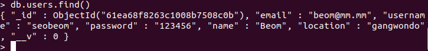

[위에서](#3-유저-생성) 말했다싶히 Password를 그대로 넣어줄 경우 보안상 문제가 있습니다. 여기서 **Hashing(해싱)** 이라는 개념이 나옵니다.

### 3.3 Password Hashing

개인정보를 숨기기 위해 암호화 과정이 필요한 것은 이해했습니다. 그렇다면 어떤 방식으로 암호화를 해야하는 것일까요? 우리가 평소에 많이 봐왔던 **암호화(Encryption)** 는 **Hahsing**과는 다른 개념입니다. 가장 큰 차이는 **'방향성'** 입니다. **Encryption**은 **양방향**이지만, **Hashing**의 경우 **단방향**입니다. 간단하게 말하자면, **_Encrpytion은 결과값으로 부터 입력값을 알 수 있지만, Hashing의 경우 알 수 있는 방법이 없습니다._**

**예를 들어,** hashing의 경우 121212 를 입력했을 때 -> c4f76645 이런식으로 hashing을 합니다. 이것은 입력값에서의 출력값은 고정되어 있지만, 출력값에서 결과값을 알 수 있는 방법은 없는 것입니다. [해당 사이트](https://emn178.github.io/online-tools/index.html)를 참고하면 됩니다.

#### 3.3.1 Hash Function Feature

**해시함수의 특징**은 다음과 같습니다.

1.  **어떤 입력 값에도 항상 고정된 길이의 해시 값을 출력합니다.**
2.  **입력 값의 아주 일부만 변경되어도 전혀 다른 결과 값을 출력합니다.(눈사태 효과)**
3.  **출력된 결과 값을 토대로 입력 값을 유츄할 수 없습니다.**
4.  **입력 값은 항상 동일한 해시 값을 출력합니다.**

> 흔히 알고있는 **비트코인**에서는 **SHA-256 방식의 해시 함수**를 사용하고 있습니다.

위와 같이 해시 함수는 입력 값이 동일하면 시간과 상관 없이 동일한 해시 값을 출력합니다. 이것을 **deterministic function(결정적 함수)** 이라고 합니다.

> **결정적 함수**는 데이터베이스의 상태가 같을 경우 특정 입력 값 집합으로 호출될 때마다 항상 동일한 결과를 반환합니다.

> **비결정적 함수**는 액세스하는 데이터베이스의 상태가 동일하게 유지되더라도 특정 입력 값 집합으로 호출될 때마다 다른 결과를 반환할 수 있습니다.

그렇다면 **해시 함수**를 사용하면 보안이 철처하게 이루어 지는 것인가?

꼭 그렇지만은 않습니다.

**Rainbow Table**은 해시 함수를 사용하여 변환 가능한 모든 해시 값을 저장시켜 놓은 표입니다. 이것을 이용하여 공격하는 방식이 존재합니다. 미리 가능한 패스워드 조합을 다 계산한 테이블을 가지고 비교만 수행하며 공격하는 것입니다. 이것이 **사전 공격**인데, 이 **dictionary**를 해시값 검색에 최적화시킨 것을 **Rainbow Table**이라고 하는것입니다. 이러한 것들 때문에 **"Salt"** 라는 개념이 추가된 **bcrypt**를 사용할 것이다.

#### 3.3.2 bcrypt

**bcrypt**는 NodeJS에서 사용되는 **Hash Function을 사용한 패스워드 암호화 패키지(라이브러리)**입니다. Blowfish 암호를 기반으로 설계된 **암호화 함수**이며 현재까지 사용중인 **가장 강력한 해시 메커니즘 중 하나**입니다.위에서 말했다싶히 **bcrypt**는 Rainbow Table을 이용한 공격을 사전에 방지하기 위해 **Salt**라는 개념이 추가되었습니다.

**Salting**은 음식에 간을 치듯이, 유저가 어떤 비밀번호를 설정했든지 상관없이, 거기에 난수까지 추가하여 해시함수에 집어넣는 것입니다. 즉,
비밀번호의 복잡도를 키워 보안을 높이는 것입니다.

사용하는 방법은 다음과 같습니다.

    bcrypt.hash(myPlaintextPassword, saltRounds, function(){ });

여기서 **SaltRounds Argument**의 사용방법은 다음과 같습니다.

**예를 들어, SaltRounds**가 **2**라고 한다면 **_123456 -> 9f0b9sdfuxc7 -> h2fassd452sd_** 이런식으로 **Hashing을 두번 거치는 것입니다.** SaltRounds에 입력한 숫자만큼 Hashing을 해주는 것입니다.

이제 프로젝트에 적용해 가며 어떻게 사용하는지 익혀봅시다.

#### 3.3.3 적용

비밀번호를 해싱하는 것은 유저를 생성(저장)하기 전에 실행되면 될 것 같습니다. 그렇다면 이전에 배웠던 것을 사용할 수 있습니다. 바로 **pre("save", function {})** 입니다. User.js 에 다음과 같이 하면 됩니다.

models/User.js

```js
userSchema.pre("save", async function () {
  console.log("Users password:", this.password);
  this.password = await bcrypt.hash(this.password, 5);
  console.log("Hahsed password:", this.password);
});
```

이제 **SaltRounds**가 5인 Hash Function을 적용시켰습니다. 출력 결과는 다음과 같습니다.

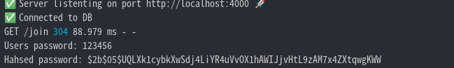

이렇게 해서 유저 생성을 하는 것은 얼추 마무리가 된 것 같습니다. 이제 처리해야 될 것은 **유저를 생성할 때 발생할 수 있는 문제점**들을 하나씩 고쳐나가도록 하겠습니다.

### 3.4 기능 추가

이제 유저를 생성할 때 발생할 수 있는 문제점들을 고치기 위해 필요한 기능들을 추가해야 합니다.

#### 3.4.1 중복 계정

현재 Model을 다시 살펴보면 다음과 같이 되어 있습니다.

models/User.js

```js
import mongoose from "mongoose";

const userSchema = new mongoose.Schema({
  email: { type: String, required: true, unique: true },
  username: { type: String, required: true, unique: true },
  password: { type: String, required: true },
  name: { type: String, required: true },
  location: String,
});
```

**required와 unique를 준 필드**에 **데이터베이스에 추가되어 있는 정보를 입력하면 서버에서 오류**가 나올 것인데 **유저 또한 에러를 알 수 있도록** 해줘야 합니다. 현재는 오류가 발생했을 때 상황 처리를 하지 않아 단순히 오류만 띄어줄 뿐입니다.

    MongoError: E11000 duplicate key error collection

어떻게 하면 될까요? template에 errorMessage를 받았을 때 띄울 수 있도록 해놓고 controller에서 처리해서 보내주면 될 것 같습니다.

#### 3.4.2 Template & Controller

join.pug와 userController.js는 다음과 같이 해주면 될 것 같습니다.

join.pug

```pug
extends base

block content
	if errorMessage
		span=errorMessage
  form(method="post")
    input(placeholder="Name" name="name" , type="text", required )
    input(placeholder="Eamil" name="email" , type="email", required )
    input(placeholder="Username" name="username" , type="text", required )
    input(placeholder="Password" name="password" , type="password", required )
    input(placeholder="Confirm Password" name="password2" , type="password", required )
    input(placeholder="Location" name="location" , type="text", required )
    input(type="submit", value="Join")
```

userController.js

```js
export const postJoin = async (req, res) => {
  const { name, username, email, password, location } = req.body;
  const pageTitle = "Join";
  if (password !== password2) {
    return res.render("join", {
      pageTitle,
      errorMessage: "Password confirmation dose not match.",
    });
  }
  const usernameExists = await User.exists({ username });
  if (usernameExists) {
    return res.render("join", {
      pageTitle,
      errorMessage: "This username is already taken.",
    });
  }
  const emailExists = await User.exists({ email });
  if (emailExists) {
    return res.render("join", {
      pageTitle,
      errorMessage: "This email is already taken.",
    });
  }

  await User.create({
    name,
    username,
    email,
    password,
    location,
  });
  return res.redirect("/login");
};
```

이전 챕터에서 배웠던 **exists()** 함수를 사용하여 controller에서 처리한 코드입니다. 하지만 **userName**의 코드와 **email**의 코드가 유사한 것을 확인 할 수 있습니다. 그럴 때 사용할 수 있는것이 **$or Operator**입니다.

#### 3.4.3 $or Operator

먼저 **$or연산자**를 알아보기 전에 **쿼리 연산자**가 무엇인지 알아보도록 하겠습니다. **쿼리 연산자**에는 **비교 쿼리**와 **논리 쿼리**로 나눠져 있고, 종류별로 각기 다른 기능을 가지고 있습니다. 종류가 많으므로 링크만 달아 놓겠습니다. [(MongoDB) 비교,논리 쿼리 연산자 - ZeroCho Blog](https://www.zerocho.com/category/MongoDB/post/57a17d114105f0a03bc55f74)

> SQL 쿼리 모습: SELECT \* FROM table WHERE column="value"

> MongoDB 쿼리 모습: collection.find({"field": "value}, {})

사용하는 방법은 다음과 같이 사용하면 됩니다.

    const exists = await User.exists({ $or: [{ username }, { email }] });

이렇게 하면 username이나 email 둘 중 하나라도 User database안에 있을 때 True값을 반환해 줍니다.

만약 다음과 같이 하면 어떻게 될까요?

    const usernameExists = await User.exists({ username, email });

username과 email이 **동시에 일치할 때만** True값을 반환해 줄 것입니다.

다만, **$or Operator**을 썼을 때 단점은 유저에게 username이 중복되서 오류가 난건지, email이 중복되서 오류가 난건지 알려줄 수 없고 단지 username 혹은 email이 중복되었다는 Message를 전달 할 수 밖에 없는것입니다. 다음과 같이 말이죠.

```js
  if (exists) {
    return rex.render("join", {
      pageTitle,
      errorMessage: "This username/email is already taken.",
    });
```

이 부분은 어쩔 수 없습니다. 이 상태로 냅두고 다음 문제로 넘어가 봅시다.

#### 3.4.4 Status Code

만약 구글 크롬에서 계정을 생성하는데 username이나 email이 중복되어서 Page에서 errorMessage를 받는다고 해봅시다. **그런데 크롬에선 아이디와 비밀번호를 저장하겠냐고 물어봅니다.** 이것은 이상하다. 분명 errorMessage도 받고 중복되는 것인데 이런것을 물어본다는 것은 브라우저에선 문제가 있다고 판단하지 않은 것입니다.

Logger에 찍히는 Status Code를 보니 200이 찍혀 있었습니다. 이것은 브라우저가 문제 없이 돌아 간다 즉, OK라고 말하는 것입니다.

[위키백과 HTTP 상태코드](https://ko.wikipedia.org/wiki/HTTP_%EC%83%81%ED%83%9C_%EC%BD%94%EB%93%9C)

코드를 수정할 필요가 있을 것 같습니다.

다음과 같이 코드를 처리해주면 됩니다.

controller.js

```js
...

if (exists) {
return res.status(400).render("join", {
pageTitle,
errorMessage: "This username/email is already taken.",
});
}

...
```

Status Code를 보내는 것이 그렇게 중요하지 않게 보일 수 있지만 그렇지 않습니다.

브라우저에서는 방문한 웹사이트의 히스토리를 저장하는데, 만약 문제가 있는 웹사이트를 방문했고 status code 200을 받는다면 그대로 히스토리에 저장을 할 것입니다. 하지만, status code 400을 받는다면 히스토리에 남기지 않습니다.
**이것이 브라우저에게 유일하게 알려주는 방법입니다.**

최종적으로 **try-catch문**까지 처리를 하고 나면 다음과 같이 **postJoin**이 마무리됩니다.

```js
export const postJoin = async (req, res) => {
  const { name, username, email, password, password2, location } = req.body;
  const pageTitle = "Join";
  const exists = await User.exists({ $or: [{ username }, { email }] });

  if (password !== password2) {
    return rex.status(400).render("join", {
      pageTitle,
      errorMessage: "Password confirmation dose not match.",
    });
  }

  if (exists) {
    return rex.status(400).render("join", {
      pageTitle,
      errorMessage: "This username/email is already taken.",
    });
  }
  try {
    await User.create({
      name,
      username,
      email,
      password,
      location,
    });
    return res.redirect("/login");
  } catch (error) {
    return res.status(400).render("join", {
      pageTitle: pageTitle,
      errorMessage: error._message,
    });
  }
};
```

이렇게 해서 계정 생성 페이지는 완료가 되었습니다.

## 4. 유저 로그인

이 부분에서 신경써줘야 할 것을 생각해보니 다음과 같을 것 같습니다.

우리가 평소에 웹사이트를 방문해서 로그인을 하면 **해당 웹사이트내에서 움직여도 로그인이 유지**가 되어 있는것을 볼 수 있습니다. 또한, 페이지를 닫았다가 빠르게 다시 들어가면 로그인이 되어 있는 경우도 종종 볼 수 있습니다.

또한, 계정을 생성할 때 **Hashing**과정을 거쳤는데, 로그인할 때 데이터 베이스에 있는 정보랑 비교할 때 신경 써줘야 할 것 같습니다.

이 부분들을 생각해 가면서 진행해 가면 되겠습니다.

### 4.1 Template & Controller

Login Page의 경우 Join Page와 유사할 것입니다.

login.pug

```pug
extends base

block content
  form(method="post")
    input(placeholder="Username" name="username" , type="text", required )
    input(placeholder="Password" name="password1" , type="password", required )
    input(type="submit", value="Join")

  hr
  div
    span Don't have an account?
    a(href="/join") Create one now &rarr;
```

이 내용들을 받고 데이터 베이스에 username이 일치하는 것이 있는지 확인하는 과정까지 보면 다음과 같습니다.

userController.js

```js
export const postLogin = async (req, res) => {
  const { username, password } = req.body;
  const exists = await User.exists({ username });
  if (!exists) {
    return res.status(400).render("login", {
      pageTitle: "Login",
      errorMessage: "An account with this username dose not exists.",
    });
  }
  // check if password correct
  return res.end();
};
```

이제 비밀번호를 비교해 볼 것인데, 위에서 말했다싶히 이전에 비밀번호는 [해싱 처리](#333-적용)를 했습니다.

**Hash Function**의 특징상 **입력값이 동일**하다면 시간에 구애받지 않고 **동일한 결과값을 출력**한다고 말했습니다.

그렇게해서 비교하는 것이 **bcrypt.compare**입니다.

사용방법은 다음과 같습니다.

    bcrypt.compare(myPlaintextPassword, hash)

controller에 직접 적용해서 해보면 다음과 같이 해서 처리할 수 있습니다.

controller.js

```js
export const postLogin = async (req, res) => {
  const { username, password } = req.body;
  const pageTitle = "Login";
  const user = await User.findOne({ username });
  if (!user) {
    return res.status(400).render("login", {
      pageTitle,
      errorMessage: "An account with this username dose not exists.",
    });
  }
  const ok = await bcrypt.compare(password, user.password);
  if (!ok) {
    return res.status(400).render("login", {
      pageTitle,
      errorMessage: "Wrong Password",
    });
  }
  console.log("Log User IN! Coming Soon!");
  return res.redirect("/");
};
```

> 여기서 생기는 궁금증이 있다.
>
> 현재 [위에서](#333-적용) 보면 **Hashing**을 하는 과정에서 **Salting**을 해줬는데 그것은 신경 쓰지 않고 compare 함수를 사용하면 되는것인가?
>
> > Hash값을 들여다 보면 다음과 같이 되어 있다.
> > 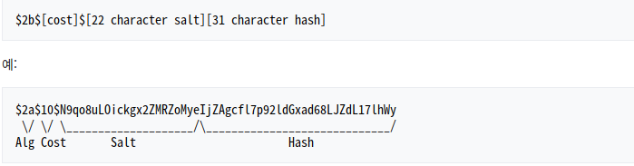
> > 참고: [bcrypt - 위키백과, 우리 모두의 백과사전](https://ko.wikipedia.org/wiki/Bcrypt)

여기까지 한 것으론 아직 웹사이트내의 모든 페이지에서 로그인을 유지하는 기능을 구현하지 못했습니다. 그것은 **Session**을 알아보면서 구현하도록 해봅시다.

### 4.2 Session(세션)

세션은 간단하게 말하자면, 백엔드와 브라우저 간에 어떤 활동을 했는지 기억하는 것을 말합니다. 평소에 우리는 쿠키라는 단어는 많이 들어 봤을 것입니다. 쿠키랑 세션. 어떤 차이를 가지고 있고 무엇을 의미하는지 알아봅시다.

#### 4.2.1 Session vs Cookie

먼저 **Cookie의 개념**을 살펴봅시다.

**쿠키(Cookie)** 란 **하이퍼 텍스트의 기록서(HTTP)** 의 일종으로서 인터넷 사용자가 어떠한 웹사이트를 방문할 경우 그 사이트가 사용하고 있는 서버를 통해 인터넷 사용자의 컴퓨터에 설치되는 작은 기록 정보 파일을 일컫는다.

**쿠키 종류**는 다음과 같습니다.

- 기술적 쿠키: 검색하는 주체가 사람인지 아니면 어플리케이션인지 이용자 구분 기능 수행

- 분석 쿠키: 어떤 종류 검색하는지, 많이 검색하는지, 시간, 언어 대상 등의 정보를 수집

- 광고 쿠키: 검색 내용, 국가 ,언어에 따라 광고 게재

그렇다면 **Session**이란 무엇일까요?

**세션(Session)** 이란 사용자가 웹 브라우저를 통해 웹서버에 접속한 시점으로부터 웹 브라우저를 종료하여 연결을 끝내는 시점까지, 같은 사용자로부터 오는 일련의 요청을 하나의 상태로 보고, **그 상태를 일정하게 유지하는 기술**을 말합니다.

공톰점과 차이점을 간단하게 보면 다음과 같다.

- **공통점**: 웹 통신간 유지하려는 정보를 저장하기 위해 사용하는 것
- **차이점**: 저장위치, 저장형식, 용량제한, 만료시점 등
  - **쿠키**: **개인 PC**에 저장됨.
  - **세션**: 접속중인 **웹 서버**에 저장됨.

왜 이렇게 나눠서 사용을 할까 하면 **보안상의 문제점**을 보면 알 수 있습니다.

Google을 사용한다고 생각해 봅시다.

인터넷을 사용하면서 google 페이지는 접속시마다 로그인 상태를 유지하고 있습니다.

**_만약 쿠키를 통해서 사용자의 로그인 ID, 비밀번호를 그대로 쿠키에 저장하게 된다고 생각해 봅시다._**

페이지 이동 시에 **쿠키를 통해 로그인 정보를 서버에 전달**하고, **서버에서는 해당 사용자를 식별하여 로그인 상태를 유지**할 수 있습니다. **_이부분에 대해서는 문제가 없습니다._**

하지만, 이 방식은 쿠키가 노출되어 보안 문제를 일으킬 수 있습니다.

그래서 사용하는 것이 **세션(Session)** 인 것입니다.

**세션(Session)** 은 비밀번호 같이 **인증 정보를** 쿠키에 저장하지 않고, **사용자의 식별자인 Session ID로 저장**합니다.

**_서버에서는 인증 정보와 같이 이 ID에 해당하는 로그인 상태, 시간, 닉네임, 만료기한 등 정보를 저장합니다._**

**서버는 해당 세션ID로 정보를 관리하기 때문에 보안상 안전 할 수 있습니다.**

참고: [웹브라우저 쿠키란? - 쿠키 개념, 세션 개념 (Cookie & Session) :: 세상에 도움이 되는 블로그](https://lovefor-you.tistory.com/247)
[쿠키Cookie와 세션Session 이란? 차이점.](https://cheershennah.tistory.com/135)

> 이러한 것들을 사용하는 이유는 HTTP가 Stateless 특징을 가지고 있기 때문이다.
> 웹 서버가 클라이언트의 이전 상태를 보존하지 않는다는 의미를 가지고 있다.

#### 4.2.2 세션 처리 환경 구축

웹 브라우저에서 쿠키가 생성된 것을 확인하고 싶으면 다음과 같이 하면 된다.

관리자 도구 -> inspect -> Application -> Storage -> Cookies

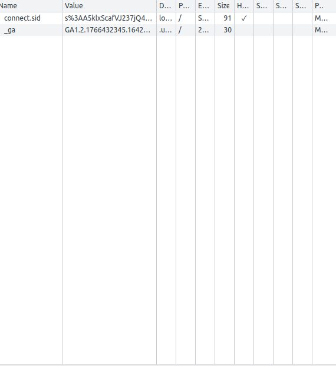

이 쿠키가 무슨 역할을 하는지 확인하기 위해 **두가지 방식**으로 console.log를 사용해 보았다.

첫 번째 방식은 다음과 같다.

```js
app.use((req, res, next) => {
  console.log(req.headers);
  next();
});
```

맨 밑에 출력을 보면 cookie가 있는 것을 확인할 수 있다.

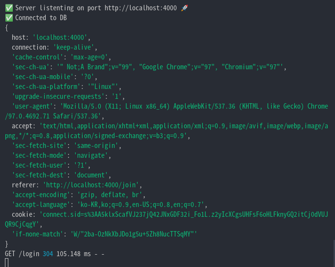

두 번째 방식은 다음과 같다.

HomePage에 두 개의 쿠키를 담고 sessionStore를 확인해 봤다.

```js
app.use((req, res, next) => {
  req.sessionStore.all((error, sessions) => {
    console.log(sessions);
    next();
  });
});
```

쿠키에 담겨져온 내용을 확인할 수 있다.

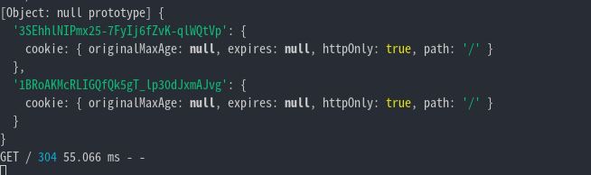

만약 서버를 종료하고 다시 시작하면 이 세션들은 사라진다. **_아직 이 세션들은 데이터 베이스에 넣어져 있는것이 아닌 서버 메모리에 저장되어 있기 때문이다._**

그래서 필요한 세션들을 받고 저장해서 데이터베이스에 넣어주는 것까지 이루어져야 할 것 같다. 이제 본격적으로 구현해 보자.

NodeJS에서 Session은 Express-session Middleware를 활용하여 세션 처리를 할 수 있게 해준다.

주의할 점은 router가 나오기 전에 사용해야 하는 것이다.

server.js

```js
...

app.use(
  session({
    secret: "Hello!",
    resave: false,
    saveUninitialized: false,
  })
);

...
```

**resave** 와 **saveUninitialize**가 무엇을 의미하는지는 다음과 같다.

**resave?**

모든 request마다 기존에 있던 session에 아무런 변경사항이 없을 시에도 그 session을 다시 저장하는 옵션입니다. **(매 request 마다 세션을 계속 저장하는 것.)**

**saveUninitialized?**

request가 들어오면 해당 request에서 새로 생성된 session에 아무런 작업이 이루어지지 않은 상황을 말합니다. **이것을 true로 해놓으면** uninitialized 상태의 session을 강제로 저장합니다. **_따라서 아무 내용 없는 session이 계속해서 저장될 수 있습니다._**

참고: [express-session 패키지의 resave, saveUninitialized 옵션](https://fierycoding.tistory.com/36)

**Session Id**는 어떻게 처리되는 것인가?

만약 내가 homepage에서 다음과 같이 코드를 해놓고 새로고침을 여러번 했다고 생각해 보자.

```js
app.get("/add-one", (req, res, next) => {
  req.session.potato += 1;
  return res.send(`${req.session.id}`);
});
```

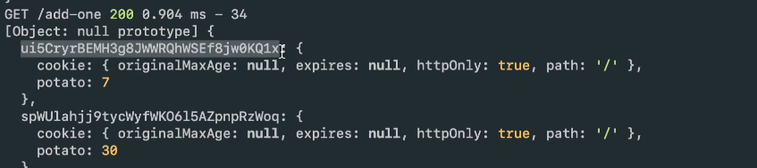

참고로 하나는 일반 크롬으로 하나는 시크릿 모드로해서 새로고침을 몇번씩 한 것이다.

이와 같이 브라우저에서 웹사이트를 처음 방문할 때 **Session Middelware**가 있으면 **express**가 알아서 그 브라우저를 위한 **Session Id**를 만들고 브라우저한테 보내준다. 그러면 브라우저가 **쿠키에 Session Id를 저장**하고 **express에서 또한 이 Session을 Session DB에 저장**할 것이다. 이제 브라우저는 웹사이트를 방문할 때 마다 **request와 함께 Session Id**를 함께 보낼 것이다. 그러면 **서버(백엔드)** 에선 어떤 유저가 어떤 브라우저에서 요청을 보냈는지 알 수 있는 것이다.

#### 4.2.3 세션 처리

현재 session에 변경 사항이 있을 때 다시 저장하도록 해놓았습니다. session을 저장할 필요가 있는 시점이 언제일까? 그것은 로그인 할 때 입니다. 그래서 controller로 가서 postLogin function에 코드를 추가해 놓으면 됩니다.

userController.js

```js
export const postLogin = async (req, res) => {
  const { username, password } = req.body;
  const pageTitle = "Login";
  const user = await User.findOne({ username });
  if (!user) {
    return res.status(400).render("login", {
      pageTitle,
      errorMessage: "An account with this username dose not exists.",
    });
  }
  const ok = await bcrypt.compare(password, user.password);
  if (!ok) {
    return res.status(400).render("login", {
      pageTitle,
      errorMessage: "Wrong Password",
    });
  }
  req.session.loggenIn = true;
  req.session.user = user;
  return res.redirect("/");
};
```

이와 같이 해주면 login했을 때 Session의 출력은 다음과 같이 나온다.

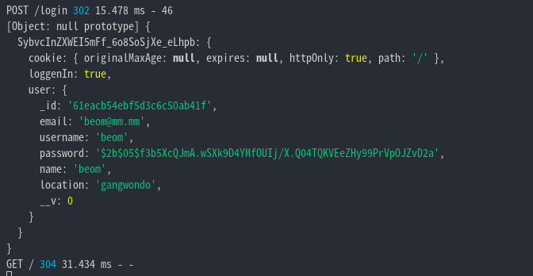

자 이렇게 백엔드는 이제 이 유저가 이 웹사이트의 어느 URL을 이동하던 간데 이 정보를 가지고 있을 것이다. 하지만 여기서 두가지 문제점이 있다. 이 정보는 **백엔드에서 가지고 있는 것으로 아직 Template(프론트)은 받지 못한 정보**이다. 또한 **모든 URL에서 이 정보를 받게** 해줘야 한다.

그래서 사용할 수 있는 것이 **res.locals**이다.

> req.locals
>
> > 모든 페이지(클라이언트 사이드)에서 이 객체에 넣어준 것은 전부 사용할 수 있다. 즉, 이 객체(함수)를 쓰면 렌더링시 중복되는 값들을 저장해놓고 계속해서 쓸 수 있는 것이다.

이것을 이용해서 **global Middleware**를 만들어 줄 수 있다.

middlewares.js

```js
export const localsMiddleware = (req, res, next) => {
  res.locals.siteName = "Wetube";
  res.locals.loggedIn = Boolean(req.session.loggedIn);
  res.locals.loggedInUser = req.session.user;
  next();
};
```

코드 분석을 조금 해보자면 **Boolean()을 사용한 이유**는 req.session.loggedIn에 True, False가 아닌 **undefined**로 들어가 있을 수도 있기 때문에 이렇게 해준 것이다.

이렇게 해줌으로써 모든 Template에서 사용가능해졌다.

다음과 같이 해주면 된다.

base.pug

```pug
doctype html
html(lang="ko")
    head
        title #{pageTitle} | #{siteName}
        link(rel="stylesheet" href="https://unpkg.com/mvp.css")
    body
        header
            h1=pageTitle
            nav
                ul
                    li
                        a(href="videos/upload") Upload Video
                    if loggedIn
                        li
                            a(href="/logout") Log Out
                        li
                            a(href="/my-profile") #{loggedInUser.name}의 Profile
                    else
                        li
                            a(href="/join") Join
                        li
                            a(href="/login") Login
                    li
                        a(href="/") Home
                    li
                        a(href="/search") Search
        main
            block content
    include partials/footer.pug
```

이제 세션은 모든 프론트 사이드에선 유효해졌다.

하지만 서버를 종료하고 재시작하면 세션이 사라지고만다. 이 문제점을 해결해 보자.

#### 4.2.4 Session connect-mongo

**_현재 Session data의 경우 server-side에 저장되기는 하지만 이것은 MongoDB를 의미하는 것이 아니다._**

서버에 저장되는 **dafault session storage**는 **MeomoryStore**이고, 실제 사용하기 위해 있는것은 아니다.

그래서 **Session**을 **MongoDB**에 저장하기위해서 **connect-mongo**를 사용한다. 설치는 다음과 같다.

    npm i connect-mongo

MongoStore를 import하는 법은 다음과 같다.

    import MongoStore from "connect-mongo"

mongo database의 URL을 가지고 있는 **Configuration object**를 만들어야 한다.

server.js

```js
app.use(
  session({
    secret: "Hello!",
    resave: false,
    saveUninitialized: false,
    store: MongoStore.create({ mongoUrl: "mongodb://127.0.0.1:27017/wetube" }),
  })
);
```

이렇게 해줌으로써 서버를 재시작해도 로그인이 되어있는 것을 확인할 수 있다.

> 별 다른 코드 수정없이 백엔드 메모리에서 데이터를 가져오는 것을 DB에서 데이터 가져오는 것으로 바꿔지는 것을 볼 수있다.

> 동작 원리를 한번만 더 확인해 보자.
>
> app.use(session({})) 이 Middleware가 내부적으로 조용히 req객체의 Property로 session이라고 하는 객체를 추가해 주는것으로 생각해 보면된다.
>
> 그렇게 생각하면 store를 MongoDB에 하든 서버 Memory에 하든 Router에 도달하기 전 Middleware에서 어디로 저장했는지 확인 후 꺼내와서 req.session에 넣어주면 되므로 코드 수정이 필요 없다고 생각된다.

**Store Option**은 저장 방식으로 MongoStore.create() 메소드를 사용하여 MongoDB URL을 지정해준 것이다. 이제 세션은 MongoDB안에 만들어 질 때 보관된다.

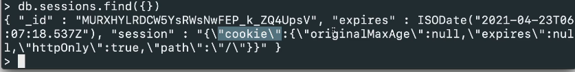

**ISODate**의 경우 이 날짜 이후로 데이터를 지우겠다는 것을 나타낸다.

**secret**의 경우 특정 문자열을 이용하여 사용자의 정보를 암호화한 후 쿠키에 저장하게 된다.

> secret을 사용하는 이유는 다음과 같다.
>
> > 우리가 쿠키에 sign 할 때 사용하는 String을 secret이라고 하는데, 이것을 하는 이유는 backend가 쿠키를 줬다는 것을 보여주기 위함이다. session hijack이라는 공격 유형이 있는데 누군가 너의 쿠키를 훔쳐 너인척 하는 것을 방지하기 위해 secret을 사용하는 것이다.

여기서 문제점은 그렇제 중요한 문자열을 저렇게 대놓고 써놓은 상태로 코드 배포를 하면 문제가 생길 것이다.

이것은 .env로 해결을 할 것이다.

### 4.3 .env

NodeJS에서 프로그래밍에 필요한 값들을 서술할 수 있는 **환경변수 파일(enviornment file)** 을 말한다.

#### 4.3.1 활용법

.env에는 보통 **배포되면 안되는 값들**을 넣어준다. 그리고 관습적으로 env파일에 추가하는 모든 것들은 **대문자**로 적어줘야 한다.

env파일에 있는 값들을 넣어주고 사용하기 위해선 우선 dotenv를 설치해 줘야한다.

    $ npm i doetenv

**env를 import할때 주의할 점**은 다음과 같이 써져있다.

> As early as possible in your application, require and configure dotenv.

package.json에 가보면 확인을 할 수 있다.

```js
  "scripts": {
    "dev": "nodemon --exec babel-node src/init.js"
  },
```

현재 src폴더에 있는 init.js를 가장 먼저 실행하고 있는 것을 확인할 수 있다.

그래서 init.js에 import를 해주면 된다.

init.js

```js
require("dotenv").config();
```

> 이 방식으로 했을 때 오류가 발생 할 수 있는데 이전에 import하는 방식으로 다음의 방식을 사용해 왔다.
>
> > import "dotenv/config";
>
> **require과 import가 중복되서 사용**되면 오류가 발생 할수 있으니 주의하자.
>
> 추가적으로 주의할 것은 **가장 먼저 import**해줘야 하는 것에 주의하자.

env파일을 만들고, 여기에 모든 **API key**나 **비밀로 해야 되는 값**을 넣어줘 보자.

.env

```env
COOKIE_SECRET=asdlnfklasidhjkfbklasjdnfjionxcova
DB_URL=http://secret.url
```

env파일에 있는 값들을 가져오는 방법은 다음과 같이 해주면 된다.

server.js

```js
...

app.use(
  session({
    secret: process.env.COOKIE_SECRET,
    resave: false,
    saveUninitialized: false,
    store: MongoSotre.create({ mongoUrl: process.env.DB_URL }),
  })
);

...
```

## 5. 소셜 로그인 구현

소셜 로그인이란 국내외 대표 포털 사이트, 소셜 미디어 등의 계정 정보를 이용해 다른 여러 인터넷 서비스를 로그인 또는 회원가입할 수 있는 기능을 말한다. **네이버, 카카오, 페이스북, 구글, 애플, 깃허브, 등등** 굉장히 많은 서비스에서 지원을 해주고 있다. 이중에 깃허브를 이용해서 구현을 할 것이다.

### 5.1 Github 로그인 동작 원리

Github의 경우 다음과 같이 동작한다고 보면 된다.

1. 서버에서 유저를 Github로 보내준다.
2. 정보를 공유하는 승인 과정을 거친후 Github에서 다시 사용자를 우리 웹사이트로 돌려 보내준다.
3. 돌려 보내주는 과정에서 token과 함께 보내줌으로써 서버에서 그 token으로 사용자의 정보를 받아오는 것이다.

자세한 내용은 과정을 살펴보면서 확인해보자.

### 5.2 Github에 등록하기.

github의 소셜로그인 서비스를 이용하기 위해서는 github의 OAuth를 사용해야하고 등록 과정을 거쳐야 한다.

- 보통 검색창에 바로 **사용하고자 하는 소셜서비스와 OAuth를 검색**하면 해당 페이지로 바로 들어갈 수 있다.
- github의 경우, OAuth 등록을 위해서는 다음과 같이 해준다.
  - 1. 로그인
  - 2. my page의 settings
  - 3. developer setting
  - 4. OAuth App 클릭
  - 5. New OAuth App 클릭

이 과정을 거치고 나면 다음과 같은 화면이 나올 것이다.

자세한 내용은 [홈페이지](https://docs.github.com/en/developers/apps/building-oauth-apps/authorizing-oauth-apps)를 참고하자.

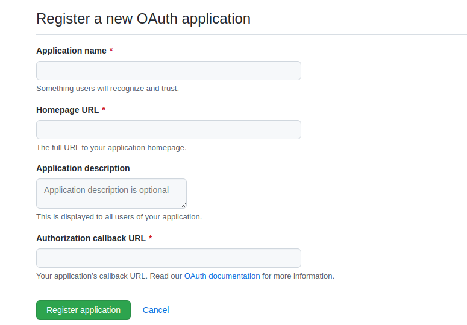

순서대로 작성해 주면 되고 여기서 **Authorization callback URL**에 작성해야 할 것은 [아래](#521-oauth-application)에 적어놓았다.

#### 5.2.1 OAuth Application

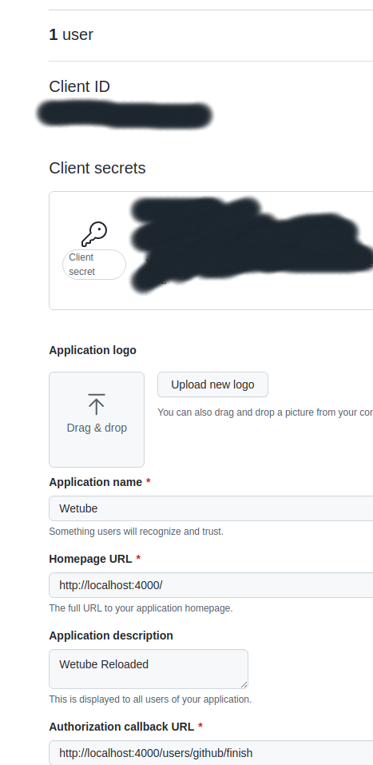

하나씩 설명하면 다음과 같다.

- **Client ID**: 내가 구현 할 Application인 Client를 식별 할 수 있는 ID
- **Client Secret**: 내가 구현 할 Application인 Client를 식별 할 수 있는 PW(절대, 코드에 노출되면 안되는 정보!)
- **Homepage URL**: 내 서비스의 URL
- **Authorization callback URL**: 사용자가 Github로그인을 하면 Redirect될 페이지의 주소.

### 5.3 Github로 유저 전송

유저를 Github로 보내주기 위해서 페이지 이동을 할 수 있도록 프론트에서 수정을 해줘야 한다.

anchor를 이용하면 되고 URL의 경우 홈페이지에 나와있다. 다음과 같이 해주면 된다.

login.pug

```pug
...
a(href="https://github.com/login/oauth/authorize") Continue with Github &rarr;
...
// 위 아래 코드는 생략하겠다.
```

이 링크를 타고 이동하면 다음과 같은 페이지를 만날 것이다.


이것은 현재 보내줘야할 parameter를 보내주지 않아서 그런 것이다.

url을 이와같이 해서 보내주면 된다.

"https://github.com/login/oauth/authorize?client_id=[위에서 받은 client id]&allow_signup=false&scope= "

여기서 문제점이 발생한다. **allow_sighup**은 사용자가 Github 계정이 없다면 계정 생성을 할 수 잇도록 해줄 것인지 아니면 계정 있는 사람만 사용할 수 있도록 할 것인지를 정해준다. **scope**에는 유저에게서 얼마나 많은 정보를 읽어내고 어떤 정보를 가져올 것인가에 대한 것을 적어주는 것이다. **scope의 경우 공백**으로 구분한다. 이외에도 Parameters는 **redirect_url**, **login**, **state**가 있다. 이러한 것을 한 string으로 anchor안에 넣어준다면 가독성이 매우 나빠지고 관리하기도 안 좋아질 것이다.

#### 5.3.1 가독성 좋은 코드로 수정

가독성 좋은 코드로 수정하기 위해서 할 수 있는 것을 생각해 보자. link를 타고 이동을 했을 때 그 페이지의 controller에서 코드를 깔끔하게 수정하고 redirect를 이용해서 페이지 이동을 해주면 좋을 것 같다.

먼저, pug를 다음과 같이 수정해 준다.

```pug
a(href="/users/github/start") Continue with Github &rarr;
```

다음은 Router를 손봐준다.

userRouter.js

```js
userRouter.get("/github/start", startGithubLogin);
```

마지막으로 controller에서 처리해주면 되겠다.

userController.js

```js
export const startGithubLogin = (req, res) => {
  const baseUrl = `https://github.com/login/oauth/authorize`;
  const config = {
    clientId: "[위에서 받은 client id]",
    allow_signup: false,
    scope: "read:user user:email",
  };
  const params = new URLSearchParams(config).toString();
  const finalUrl = `${baseUrl}?${params}`;
  return res.redirect(finalUrl);
};
```

코드 분석을 해보자.

[URLSearchParams](https://developer.mozilla.org/ko/docs/Web/API/URLSearchParams)의 경우 **객체 또는 배열을 URL의 쿼리 파라미터들로 수정**하거나 혹은 **URL에서 쿼리 파라미터들을 읽을 때** 사용합니다.

[toString()](https://developer.mozilla.org/ko/docs/Web/JavaScript/Reference/Global_Objects/Object/toString)은 문자열을 반환하는 Object의 대표적인 방법이다.

이와같이 baseUrl과 params를 구분하여 작성해준 다음 마지막이 finalUrl로 합쳐서 해당 페이지로 redirect해줌으로 써 **코드의 가독성이 높아지고 유지 보수하기 편해진 것**을 확인할 수 있습니다.

예시는 다음과 같습니다.

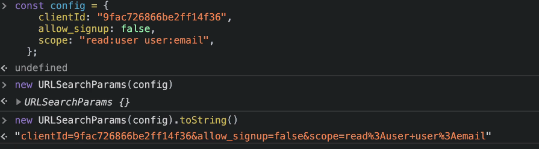

이제 페이지를 이동하면 다음과 같은 화면을 볼 수 있습니다.

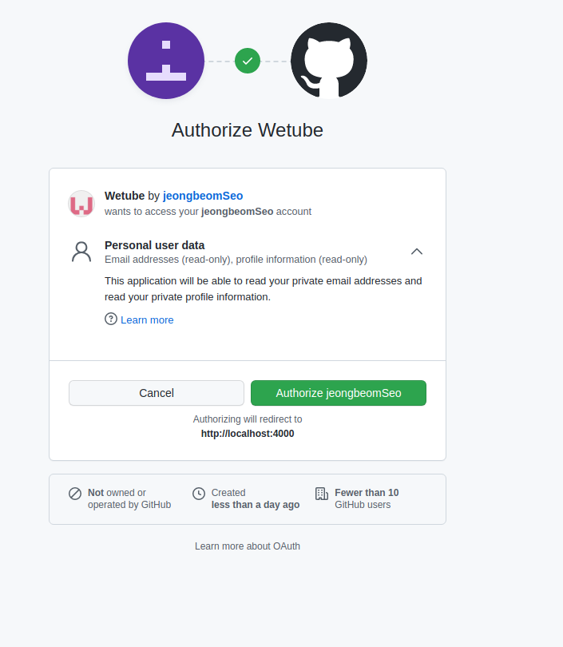

### 5.4 Access Token

승인을 해주면 다음과 같은 페이지로 이동을 하게 된다.

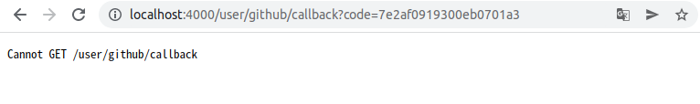

이 URL의 경우 아까 [위에서](#521-oauth-application) 봤던 Authorization callback URL일 것이다. 유저가 깃허브에서 승인을 받고 인증이 됐으면 **Token을 가지고 해당 URL로 redirect해서 이동을 하는 것**이다.

**_그렇다면 Token은 어디있는가?_**

위에 URL을 살펴보면 code안에 value값이 들어가 있는 것을 확인할 수 있다. 이것은 temporary code로 10분 후에 반료되는 code이다. 이것을 Access Token으로 교환하여 사용하는 것이다. 이것도 위의 방식과 동일하게 [홈페이지](https://docs.github.com/en/developers/apps/building-oauth-apps/authorizing-oauth-apps)에서 준 baseURL을 사용하여 처리해주면 된다.

router에 get메소드를 추가해주고 controller를 수정해주면 된다.

userRouter.js

```js
userRouter.get("/github/callback", finishGithubLogin);
```

userController.js

```js
export const finishGithubLogin = (req, res) => {
  const baseUrl = "https://github.com/login/oauth/access_token";
  const config = {
    client_id: process.env.GH_CLIENT,
    client_secret: process.env.GH_CLIENT,
    code: req.query.code,
  };
  const params = new URLSearchParams(config).toString();
  const finalUrl = `${baseUrl}?${params}`;
};
```

이 URL은 redirect를 하려고 만든 URL이 아니다.

이 특정 URL로부터 정보를 받아오기 위함이다. 그럴 때 사용하는 것이 fetch API이다.

#### 5.4.1 Fetch

웹 개발을 할 때, ajax통신을 자주 사용하게 된다. ajax를 사용할 때, **XHR, JQuery, Fetch**를 쓸 수 있다.

**fetch란** 자바스크립트에서 서버로 네트워크 요청(request)를 보내고 응답(response)를 받을 수 있도록 해주는 메서드

XMLHttpRequest와 비슷하지만 fetch는 **Promise 기반**으로 구성되어 있어서 더 간편하게 사용할 수 있다.

**비동기 요청**의 가장 대표적인 사례를 꼽으라고 한다면, 단연 **네트워크 요청**을 들 수 있다. 다양한 네트워크 요청 중, **URL로 요청**하는 경우가 가장 흔하다. 이를 가능하게 해주는 API가 바로 **fetch API**다

참고: [[Node.js] fetch API / SPRINT-비동기💯️](https://velog.io/@delilah/Node.js-fetch-API)

fetch의 경우 원래 브라우저에서 사용하는 메소드이다. NodeJS에서 사용하기 위해선 설치를 해주어야 한다.

    $ npm install node-fetch

> **[ERR_REQUIRE_ESM] Error 해결** <br />
> node-fetch가 Version 3를 내면서 npm install node-fetch를 하면, version 3.0.0이 설치됩니다. <br />
> 현재 설명하고 있는 **version은 2.6.1 기준**입니다. <br />
> Version 3으로 설치되어 실행시키면, 아마 **[ERR_REQUIRE_ESM]** 가 뜰겁니다. <br />
> 이것은 node-fetch가 Version 3부터는 **ESM-only Module**이어서 그런 것 같습니다. <br />
> 공식문서에서는 CSM(CommonJS)를 쓰는 사람들은 버전 2로 쓸 것을 권장한다고 합니다. <br />
> 이미 설치하셨으면, npm uninstall node-fetch로 제거하시고 npm install node-fetch@2.6.1 명령어 실행하시면 오류가 해결 될 것입니다.

> [ESM과 CommonJS의 차이](https://velog.io/@kakasoo/ESM%EA%B3%BC-CommonJS%EC%9D%98-%EC%B0%A8%EC%9D%B4)

fecth를 사용하여 정보를 가져오는 방법은 다음과 같이 해주면 된다.

userController.js

```js
export const finishGithubLogin = async (req, res) => {
  const baseUrl = "https://github.com/login/oauth/access_token";
  const config = {
    client_id: process.env.GH_CLIENT,
    client_secret: process.env.GH_CLIENT,
    code: req.query.code,
  };
  const params = new URLSearchParams(config).toString();
  const finalUrl = `${baseUrl}?${params}`;
  const data = await fetch(finalUrl, {
    method: "POST",
    headers: {
      Accept: "application / json",
    },
  });
  const json = await data.json();
  console.log(json);
  res.send(JSON.stringify(json));
};
```

> 여기서 headers는 [HTTP 헤더](https://developer.mozilla.org/ko/docs/Web/HTTP/Headers)를 의미한다.

실행 시켜보면 console.log는 다음과 같이 출력됩니다.


Front end쪽을 확인해보면 다음과 같이 되어 있습니다.


#### 5.4.2 API 접근

이제 **access_token**을 갖고 **API에 접근**하는 단계이다.

JSON에 있는 access_token을 가지고 오자.

userController.js

```js
const { access_token } = json;
const userRequest = await fetch("https://api.github.com/user", {
  headers: {
    Authorization: `token ${access_token}`,
  },
});
```

access_token을 JSON으로부터 꺼내서, headers에 authorization에 보내줘야 한다.

이와 같이하면 코드 중복이 나므로 코드 중복을 줄이고, access_token이 안들어있는 상황을 고려해 조건문을 추가해준다.

userController.js

```js
export const finishGithubLogin = async (req, res) => {
  const baseUrl = "https://github.com/login/oauth/access_token";
  const config = {
    client_id: process.env.GH_CLIENT,
    client_secret: process.env.GH_SECRET,
    code: req.query.code,
  };
  const params = new URLSearchParams(config).toString();
  const finalUrl = `${baseUrl}?${params}`;
  const tokenRequest = await (
    await fetch(finalUrl, {
      method: "POST",
      headers: {
        Accept: "application/json",
      },
    })
  ).json();
  console.log(tokenRequest);
  if ("access_token" in tokenRequest) {
    const { access_token } = tokenRequest;
    const userRequest = await (
      await fetch("https://api.github.com/user", {
        headers: {
          Authorization: `token ${access_token}`,
        },
      })
    ).json();
    console.log(userRequest);
  } else {
    return res.redirect("/login");
  }
};
```

결과는 다음과 같다.

**tokenRequest**
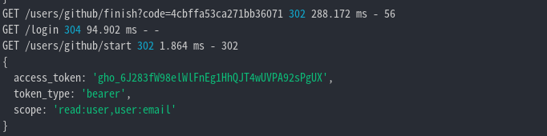

**userRequest**
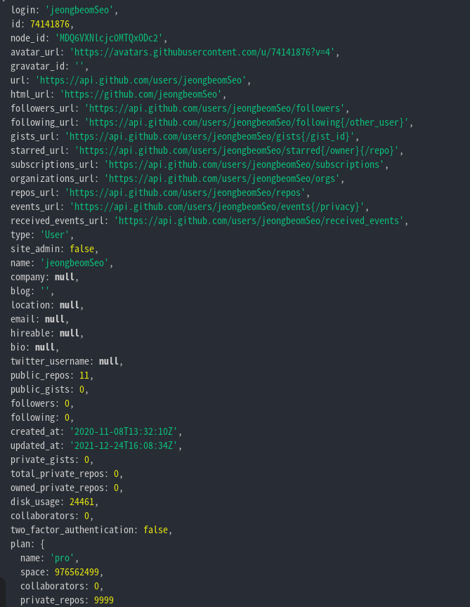

여기서 보면 scope에는 **user:email**이 작성되어 있는 것을 확인할 수 있지만 userRequest를 보면 **email: null**인 것을 확인할 수 있습니다.

분명 scope에 적은 내용에 대해서는 정보를 얻을 수 있다고 했다.

**_왜 이런 상황이 나온 것일까?_**

이는 access_token이 할 수 있도록 만들어 줘야 하는데 하지 않아서 그렇다. 즉, 현재 access_token을 가지고 한 것은 **첫번째 scope**인 **read:user**만을 하고 있던 것이다.

다음과 같이 해보고 결과를 확인해 보자.

```js
const userData = await (
  await fetch("https://api.github.com/user", {
    headers: {
      Authorization: `token ${access_token}`,
    },
  })
).json();
console.log(userData);

if ("access_token" in tokenRequest) {
const { access_token } = tokenRequest;
const emailData = await (
  await fetch(`${apiUrl}/user/emails`, {
    headers: {
      Authorization: `token ${access_token}`,
    },
  })
).json();
```

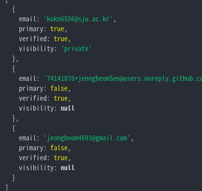

여기서 email **verifed**이면서 **primary**인 것들로 찾아야 하는 것이다.

```js
const emailObj = emailData.find(
  (email) => email.primary === true && email.verified === true
);
```

코드를 완성 시키기 전에, 고려해야 될 경우가 두 가지가 존재한다.

현재는 계정 ID와 Password를 받는 형식으로 Schema가 만들어져 있다. 하지만, 소셜 로그인을 통해 로그인을 하는 방식은 Password가 존재하지 않는다.

즉,

- 우리 웹사이트에서 계정 ID, Password와 email을 입력하여 계정을 생성하는 방법
- 소셜로그인을 통해 email로만 로그인 하는 방법

이렇게 두가지 방식이 존재하는 것이다.

그런데 만약 여기서, **_우리 웹사이트에서 생성한 계정이 DB에 존재하는데, 소셜 로그인을 통해 로그인을 하려면?_**

이때, **계정을 새로 만들수도 있고**, 아니면 **계정을 연동시켜주는** 두 가지 상황이 존재한다.

우리는 **계정을 연동시켜준다고 생각하고 처리를 해주자.**

마지막으로 정리하자면,

1. 유저를 Github로 보내주고 인증을 받으면 Token과 함께 웹사이트로 넘어온다.
2. 받은 Token을 access_token으로 바꾼후에 userData와 emailData를 뽑아준다.
3. 받은 Data를 이용해서 두 가지 경우로 구분을 하여 Login 혹은 계정 생성후 로그인을 진행하여 마무리를 짓는다.

그것을 구현한 것이 다음의 코드다.

userController.js

```js
export const finishGithubLogin = async (req, res) => {
  const baseUrl = "https://github.com/login/oauth/access_token";
  const config = {
    client_id: process.env.GH_CLIENT,
    client_secret: process.env.GH_SECRET,
    code: req.query.code,
  };
  const params = new URLSearchParams(config).toString();
  const finalUrl = `${baseUrl}?${params}`;
  const tokenRequest = await (
    await fetch(finalUrl, {
      method: "POST",
      headers: {
        Accept: "application/json",
      },
    })
  ).json();
  if ("access_token" in tokenRequest) {
    const { access_token } = tokenRequest;
    const apiUrl = "https://api.github.com";
    const userData = await (
      await fetch(`${apiUrl}/user`, {
        headers: {
          Authorization: `token ${access_token}`,
        },
      })
    ).json();
    const emailData = await (
      await fetch(`${apiUrl}/user/emails`, {
        headers: {
          Authorization: `token ${access_token}`,
        },
      })
    ).json();
    const emailObj = emailData.find(
      (email) => email.primary === true && email.verified === true
    );
    if (!emailObj) {
      return res.redirect("/login");
    }
    let user = await User.findOne({ email: emailObj.email });
    if (!user) {
      user = await User.create({
        name: userData.name,
        username: userData.login,
        email: emailObj.email,
        password: "",
        socialOnly: true,
        location: userData.location,
      });
    }
    req.session.loggedIn = true;
    req.session.user = user;
    return res.redirect("/");
  } else {
    return res.redirect("/login");
  }
};
```

현재 보면, **emailObj가 없으면** login page로 redirect시켜주고 있다. 또, **findOne()** 을 이용해서 **email이 Database에 존재하는지 확인**을 하고 existingUser에 True 혹은 False를 넣어주는 것이 보인다. **True이면 그대로 로그인**을 시켜주고, **False라면 계정을 생성**해줘야 한다.

## 6. Log Out

Log Out을 구현하는 것은 간단하다.

1. base.pug 즉, Templates에 Log Out button(anchor)를 구현해 놓는다.
2. 해당 링크로 이동을 했을 때 controller에서 받아서 session을 파괴시켜 준다.

Templates를 수정하는 부분은 생략하고 controller만 확인하면 다음과 같다.

```js
export const logout = (req, res) => {
  req.session.destroy();
  return res.redirect("/");
};
```

이렇게 **User-Authentication**이 마무리가 된다.
