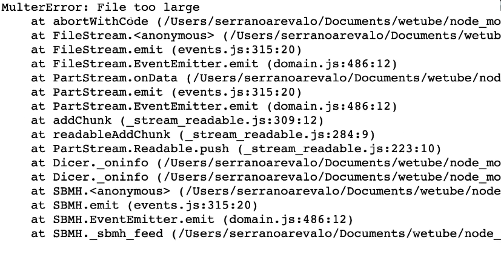
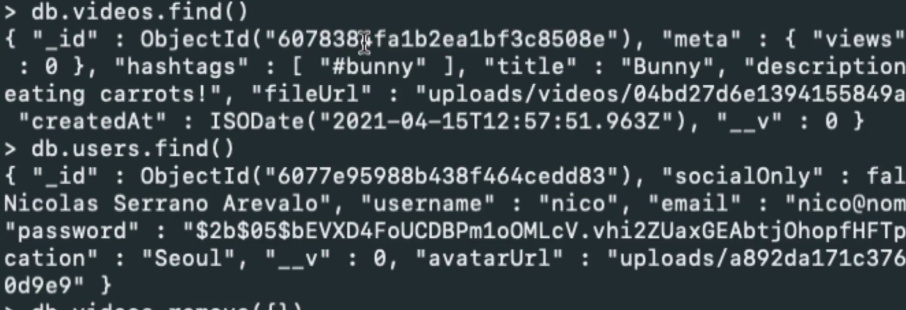
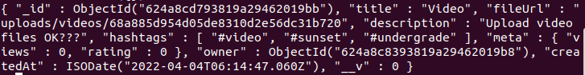
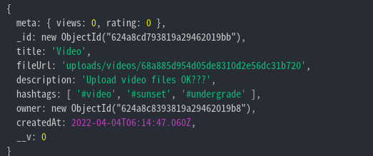
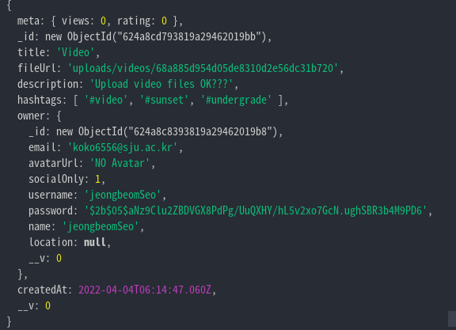
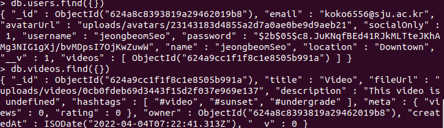

# User Profile

## 1. Edit Profile

Edit Page를 만들건데 이전과 동일한 순서대로 해보면 될 것 같습니다.

1.  먼저, Template를 만들어 줍니다.
2.  Router를 만들고 Controller가서 기능을 구현합니다.
3.  필요한 추가 작업들을 추가합니다.
4.  문제가 날 것 같은 부분을 수정해주고, 새롭게 추가된 기능을 통해 Code를 Refactoring할 수 있으면 해줍니다.

이렇게 하면 될 것 같다.

### 1.1 Template

먼저 Template를 만들어 주도록 하자.

edit-profile.pug

```pug
extends base

block content
  form(method="POST")
    input(placeholder="Name", name="name", tpye="text", required, value=loggedInUser.name)
    input(placeholder="Email", name="email", tpye="email", required, value=loggedInUser.email)
    input(placeholder="Username", name="username", tpye="text", required, value=loggedInUser.username)
    input(placeholder="Location", name="location", tpye="text", required, value=loggedInUser.location)
    input(type="submit", value="Update Profile")
    hr
    a(href="change-password") Change Password &rarr;
```

Password 수정하는 부분을 따로 빼놓은것을 확일할 수 있을 것이다.

그 이유는 로그인 하는 방식에서 찾아볼 수 있다.

우리는 로그인 하는 방식을 두 가지 방식으로 구현해 놓았다.

1. 우리 홈페이지를 이용해서 회원가입 후 로그인하기.
2. 소셜(Github)을 통해서 회원가입 후 로그인하기.

**여기서 소셜 로그인 방식은 비밀번호를 사용하지 않는다.**

이러한 이유로 비밀번호를 수정하는 페이지는 따로 뺴놓은 것이다.

또 input을 살펴보면 **value**에 **loggedInUser**가 들어가있는 것을 확인할 수 있을 것이다.

이것은 이전에 **req.locals**에 담아둔 변수를 사용한 것으로 **전역 변수**로써 사용된다고 했다.

이렇게 해서 template를 만들었지만, 두가지 문제점이 있다.

### 1.2 Template 문제점 잡기

1. 로그인 되어 있지 않은 사람들이 Edit URL로 접근을 할 수 있다.
2. loggednInUser에 접근하려는데 로그인 되어 있지 않으면 생기는 에러

여기서 2번의 경우

```js
req.locals.loggedInUser = req.session.user || {};
```

이렇게 한다면 프론트엔드에서 에러가 뜨지는 않는다. 다만, 문제는 누구든 접근할 수 있게 된다.

먼저, 로그인 하지 않은 사람들이 Edit Page로 강제로 이동하려는 것을 막기위해 필요한 것은 **localsMiddleware**이다.

- 로그인이 되어 있지 않았다면, 로그인 페이지로 redirect
- 로그인이 되어 있다면 그대로 Edit Page로 갈 수 있게 한다.

이 두가지 기능은 앞서 살펴본 기능중에 있는 것 같다.

바로, **Protect Middleware**를 구현해 보면서 봤던 내용이다.

middleware.js

```js
// Protect Middleware
export const protectorMiddleware = (req, res, next) => {
  if (req.session.loggedIn) {
    next();
  } else {
    return res.redirect("/login");
  }
};

// 로그인 되어 있는 사람들은 로그인 페이지로 못 가게 하기 위함.
export const publicOnlyMiddleware = (req, res, next) => {
  if (!req.session.loggedIn) {
    return next();
  } else {
    return res.redirect("/");
  }
};
```

이것을 router에 추가해주면 될 것이다.

**예를 들어, logOut의 경우 loggedIn이 True인 경우에만 이루어져야 한다.**

```js
userRouter.get("/logout", protectorMiddleware, logout);
```

Edit Page의 경우 다음과 같이 될 것이다.

```js
userRouter
  .route("/edit")
  .get(protectorMiddleware, getEdit)
  .post(protectorMiddleware, postEdit);
```

**protectorMiddleware**가 반복해서 사용되는 것을 줄여주는 express 기능 중 하나가 **all()** 이다.

```js
userRouter.route("/edit").all(protectorMiddleware).get(getEdit).post(postEdit);
```

1번의 문제를 해결하고 보니 2번의 문제는 1번을 해결하면서 자연스럽게 해결이 된 것 같다.

### 1.3 Controller

이제 Controller를 살펴보자.

getEdit의 경우 앞서 했던 내용에서 크게 다르지 않으므로 넘어 가겠다. 단순히 render만 해주면된다.

postEdit을 살펴보자.

userController.js

```js
export const postEdit = (req, res) => {
  const {
    session: {
      user: { _id },
    },
    body: { name, email, username, location },
  } = req;
  await User.findByIdAndUpdate(_id, {
    name,
    email,
    username,
    location,
  });
  return res.render("edit-profile");
};
```

여기서 보면, **id**가 아닌 **\_id**를 사용했는데 그 이유는 mongoDB에 들어가는 **primary ID의 경우 key값이 id가 아닌 \_id**로 들어가기 때문이다.

여기까지 하면 문제없이 잘 작동 할 것 같다. 하지만, **_프론트 엔드 쪽에선 수정된 것이 재대로 반영이 되지 않는 것같다. 근데 여기서 이상한 것은 DB에선 내용이 수정되어 있다._**

이것은 controller에선 기능이 잘 작동 하지만, 프론트 엔드 쪽에서 수정된 내용을 반영하지 못하는 코드가 있는 것으로 짐작해볼 수 있을것 같다.

[edit-profile](#11-template)를 다시한번 보고 오자.

현재 value값에 loggedInUser의 변수가 들어가 있다. 이것은 어디서 오는 것일까? 바로, 전역 변수인 **localsMiddleware**에서 생성된다.

middlewares.js

```js
export const localsMiddleware = (req, res, next) => {
  res.locals.siteName = "Wetube";
  res.locals.loggedIn = Boolean(req.session.loggedIn);
  res.locals.loggedInUser = req.session.user || {};
  next();
};

...
```

그렇다면, req.session.user은 언제 생성되는 것일까?

로그인 할 때 우리는 req.session을 만들었다.

즉, user는 업데이트를 해서 그 내용이 DB에는 반영이 되었지만, session에서는 업데이트가 되지 않아서 프론트쪽에서 수정된 내용을 확인하지 못한 것이다.

방법은 두가지가 있습니다.

1. 일일히 다 입력하기.

userController.js

```js
...

  req.session.user = {
		...req.session.user,
    name,
    email,
    username,
    location,
  };

...
```

이 내용을 postEdit에 추가해주는 것입니다. 하지만, 이것을 또 사용하기에는 굉장히 불필요해 보입니다. postEdit을 살펴보면 session을 수정하기 전에 DB를 업데이트 하면서 비슷한 내용이 들어갑니다. 이것을 활용할 수 있으면 좋을 것 같습니다.

userController.js

```js
export const postEdit = async (req, res) => {
  const {
    session: {
      user: { _id },
    },
    body: { name, email, username, location },
  } = req;
  const updatedUser = await User.findByIdAndUpdate(
    _id,
    {
      name,
      email,
      username,
      location,
    },
    { new: true }
  );
  req.session.user = updatedUser;
  return res.redirect("/users/edit");
};
```

코드 분석을 좀 해보자면,

원래 **User.findByIdAndUpdate**는 return값으로 새롭게 수정된 User가 아닌 기존의 User를 return해주는 것이 Default입니다.

그래서

    { new: true }

이 부분을 주면서, 새롭게 수정된 User를 return 해줌으로써 그 값을 사용하여 session을 수정해주고 있는 부분입니다.

여기서 또한, 문제가 생깁니다.

### 1.4 Controller 문제점 잡기

만약, User가 이미 있던 name이나 email을 적어서 보낼 때 업데이트가 되지 않도록 해줘야 합니다.

어떤 방식으로 코드를 짜야될 것인가?

경우의 수를 확인해보자.

1. Name과 Email을 둘 다 수정하지 않고 보내는 경우
2. 둘 중 하나만 수정해서 보내는 경우
3. Name과 Eamil을 둘 다 수정해서 보내는 경우

이렇게 3가지 경우를 생각해 볼 수 있을 것 같다.

하지만, 이렇게 케이스를 나누면 안된다. 케이스를 나누는 방식은 수정을 하고 안하는 문제가 아닌 **이미 있던** 이 부분이 중요한 것이다.

즉,

1. Name과 Email을 둘 다 수정하지 않고 보내는 경우
2. Nmae 혹은 Email을 둘 중 하나 수정하는데 DB에 없는 데이터인 경우
3. Name 혹은 Email을 둘 중 하나 수정하는데 DB에 있는 경우
4. Name과 Email 둘 다 수정하는데 DB에 없는 경우
5. Name과 Email 둘 다 수정하는데 DB에 있는 경우

**1번 케이스**

수정하지 않고 보내는 경우 User에게서 받은 정보를 DB에서 find하면 당연히 있을 것이다. 로그인 하고 있는 유저의 정보를 가져올 것이다.

즉, 해당 케이스는 **User에게서 받은 정보와 session의 User정보를 비교했을 때 같다는 결과**가 나올 것이다.

**2번 케이스**

데이터를 수정하는데 DB에 없는 경우 User에게서 받은 정보를 DB에서 find하면 null값을 가져올 것이다. 그리고 나머지 하나는 수정하지 않으므로 session의 User정보와 동일한 정보를 가져올 것이다.

즉, 해당 케이스는 **한 쪽은 null값을, 한 쪽은 User에게서 받은 정보와 session의 User정보를 비교했을 때 같다는 결과**가 나올 것이다.

**3번 케이스**

Name혹은 Eamil을 수정하는데 그 값이 이미 다른 사람이 사용하고 있는 경우이다. 이 경우 바꾸는 데이터를 가지고 DB에서 find를 한다면 null값이 아니라 재대로 된 값을 가져올 것이다. 하지만, 그 값은 session이 가지고 있는 값과는 다른 값을 가지고 올 것이다.

즉, 해당 케이스는 **한 쪽은 User에게서 받은 정보와 session의 User정보를 비교했을 때 다른 결과를 가져오고 다른 한 쪽은 정반대 결과**를 가져 올 것이다. 그리고 이 케이스의 경우 **수정이 되면 안된다.**

**4번 케이스**

둘 다 수정하지만 바꾸는 데이터가 DB에 없는경우 User에게서 받은 정보를 DB에서 find하면 둘 다 null값을 가져올 것이다.

즉, 해당 케이스는 **둘 다 null값을 가지고 있을 것이다.**

**5번 케이스**

둘 다 수정을 하는데 둘 다 다른 사람이 사용하고 있는 경우이다.
이 경우, User가 준 데이터를 가지고 DB에서 find를 하면 값은 가져오지만 그것은 session과 다른 값일 것이다.

즉, 해당 케이스는 **User에게서 받은 정보와 session의 User정보를 비교했을 때 둘 다 다른 결과를 가져올 것이다.** 그리고 이 케이스의 경우 **수정이 되면 안된다.**

자 이렇게 5가지 경우를 살펴봤다. 현재 수정이 되면 안되는 케이스는 **3번 케이스**와 **5번 케이스**이다.

1번, 2번, 4번 케이스는 수정이 되어도 문제가 없다.

**_사실 1번, 2번, 4번 케이스는 공통점이 있다._**

바로, DB에 존재하지 않아서 null값을 가져온다는 것이다.

그렇다면, **null값이 아니다 && session과 일치하지 않는다.** 이 명제가 **3번과 5번 케이스**를 해결해 줄 것이다.

다음을 구현한 코드가 아래 코드이다.

```js
export const postEdit = async (req, res) => {
  const {
    body: { name, email, username, location },
    session: {
      user: { _id },
    },
  } = req;
  const findUsername = await User.findOne({ username });
  const findEmail = await User.findOne({ email });
  if (
    (findUsername != null && findUsername._id != _id) ||
    (findEmail != null && findEmail._id != _id)
  ) {
    return res.render("editProfile", {
      pageTitle: "Edit  Profile",
      errorMessage: "User is exist",
    });
  }
  const updatedUser = await User.findByIdAndUpdate(
    _id,
    {
      name,
      email,
      username,
      location,
    },
    { new: true }
  );
  req.session.user = updatedUser;
  return res.redirect("/users/edit");
};
```

이제 비밀번호를 변경해주는 페이지를 살펴볼 차례이다.

### 1.5 Change Password

먼저 Password를 수정하는 페이지로 가기위한 Link는 edit-profile.pug에 구현을 해놓았다.

그렇다면 그것을 위한 get과 post를 만들고 controller를 만들면 될 것이다.

userController.js

```js
export const getChangePassword = (req, res) => {
  return res.render("users/change-password", { pageTitle: "Change Password" });
};

export const postChangePassword = (req, res) => {
  // send notification
  return res.redirect("/");
};
```

router를 추가하는 과정은 생략하도록 하곘다.

change-password를 해주는 template를 살펴보면 다음과 같다.

```pug
extends ../base

block content
  form(method="post")
    input(placeholder="Old Password")
    input(placeholder="New Password")
    input(placeholder="New Password Confirmation")
    input(value="Change Password", type="submit")
```

본격적으로 Controller에 들어가기전에 조그마한 문제점을 짚고 넘어가자.

위에서도 말했듯이 소셜 로그인하는 경우 Password를 치지 않았다.

소셜 로그인으로 로그인을 한 경우 패스워드 변경을 할 수 없도록 해야 할 것이다.

**두 가지 방법**이 존재한다.

1.  UserController의 getChagePassword에서 로그인된 사용자의 정보를 확인하는 것이다.
2.  다른 방법은, form을 볼 수 있지만, 사용할 수 없게 만드는 것이다.

1번의 방법은 다음과 같다.

```js
...
if(req.session.user.socialOnly === true) {
	return res.redirect("/");
	}
...
```

2번의 방법은 다음과 같다.

```pug
    if !loggedInUser.socialOnly
      hr
      a(href="change-password") Change Password &rarr;
```

이제 Controller를 봐줄건데 postEdit를 만들 때 신경써야하는 부분은 다음과 같다.

1.  new Password와 new Password Confirmation이 같지 않은 경우
2.  입력한 Old Password와 원래 Password가 다른 경우
3.  모든 조건을 통과할 경우 비밀 번호 변경

1번의 경우 다음과 같은 처리를 해주면 된다.

```js
export const postChangePassword = (req, res) => {
  const {
    body: { oldPassword, newPassword, newPasswordConfirmation },
    session: {
      user: { _id, password },
    },
  } = req;
  if (newPassword !== newPasswordConfirmation) {
    return res.status(400).render("users/change-password", {
      pageTitle: "Change Password",
      errorMessage: "The password does not match the confirmation",
    });
  }

...
};
```

그렇게 어렵지 않다. 2번의 경우도 바로 살펴보자.

```js
...

  const ok = await bcrypt.compare(oldPassword, password);
  if (!ok) {
    return res.status(400).render("users/change-password", {
      pageTitle: "Change Password",
      errorMessage: "The current password is incorrect",
    });
  }

...
```

이제 3번을 볼 것인데, 우리는 앞서 비밀 번호 저장을 할 때 Model에서 pre를 선언해 놓았다.

User.js

```js
...
userSchema.pre("save", async function () {
  this.password = await bcrypt.hash(this.password, 5);
});

```

이것을 활용하기 위해서 3가지 과정을 거치면 될 것같다.

1. session을 이용하여 id를 통해 DB에서 user를 불러오기
2. 해당 user의 password를 새로운 password로 변경
3. user.save()

다음의 결과를 한 번 봐보자.

```js
const user = await User.findById(_id);
console.log("Old password", user.password);
user.password = newPassword;
console.log("New unhashed pw", user.password);
await user.save();
console.log("New pw", user.password);
```

이것의 결과 화면은 다음과 같다.


이렇게 한 후 프론트 쪽으로 가서 비밀번호를 다시 한번 변경하려 하니깐 되지 않는다.

이유가 무엇일까?

생각해본건데, 실행은 되지만 데이터 베이스에서 수정이 되지 않은 것일까라는 생각이 든다.


아니다. DB를 보니깐 수정이 되어 있는 데이터가 들어가있다.

이것은 변경된 비밀번호를 session에 있는 비밀번호와 비교해서 그런 것이다.

즉, session을 수정해줘야 하는데 수정하지 않은 것이다.

    req.session.user.password = user.password;

이제 코드를 마무리 짓자.

최종 코드를 보면 다음과 같다.

```js
export const postChangePassword = async (req, res) => {
  const {
    body: { oldPassword, newPassword, newPasswordConfirmation },
    session: {
      user: { _id },
    },
  } = req;
  const user = await User.findById(_id);
  const ok = await bcrypt.compare(oldPassword, user.password);
  if (!ok) {
    return res.status(400).render("users/change-password", {
      pageTitle: "Change Password",
      errorMessage: "The current password is incorrect",
    });
  }
  if (newPassword !== newPasswordConfirmation) {
    return res.status(400).render("users/change-password", {
      pageTitle: "Change Password",
      errorMessage: "The password does not match the confirmation",
    });
  }
  user.password = newPassword;
  await user.save();
  // send notification
  return res.redirect("/users/logout");
};
```

## 2. File & Video Upload

이제 file 과 video를 upload하는 부분을 살펴볼 것이다.

이 부분에서 중요한 것이 있다.

**바로, 파일 통채로 DB에 넣는것이 아니라는 것이다.**

정리하자면, **DB에는 file path가 들어갈 것이고, file의 경우 npm 라이브러리인 multer을 이용하여 파일을 encode 해서 서버에서 지정한 곳에 저장을 할 것이다.**

시작하기 전에 MongoDB에 업로드 하기 위해서 필요한 라이브러리인 multer을 설치해놓자.

    npm i multer

### 2.1 File Template

먼저 User가 file을 업로드할 수 있도록 프론트쪽을 수정해주자.

file을 업로드 하는것은 form을 사용하면 된다.

edit-profile.pug

```pug
    form(action="post")
      label(for="avatar") Avatar
      input(type="file", id="avatar", name="avatar", accept="image/*")
    ...

```

이런식으로 하면 프론트쪽에선 구현이 된다. 하지만, 이것만으론 부족하다. 우리는 multer을 사용해서 파일을 encoding해야하기 때문에 **form을 multipart form**으로 만들어야 한다.

```pug
  form(method="POST", enctype="multipart/form-data")
    label(for="avatar") Avatar
    input(type="file", id="avatar", name="avatar", accept="image/*")
    ...
```

확실히 기억해 둘 필요가 있다. 해당 부분이 안들어가면 재대로 작동이 안될것이다.

    enctype="multipart/form-data"

명심해두고 백엔드로 가서 어디에 저장할 것인지와 DB에 어떻게 넣어줄 것인지 처리하자.

### 2.2 File Upload

먼저 해당 파일을 서버측에 어디에 저장할지 알려주는 Middleware를 구현해야 한다.

우리는 만들어 놓은 global middleware에다가 새롭게 만들어 놓으면 된다.

middleware.js

```js
export const uploadFiles = multer({
  dest: "uploads/",
});
```

dest에 우리 서버 어디 폴더에 저장되는 지를 적어주면 된다.

참고 : [NPM Multer](https://www.npmjs.com/package/multer)

이것을 controller에서 사용하면 된다.

```js
userRouter
  .route("/edit")
  .all(protectorMiddleware)
  .get(getEdit)
  .post(uploadFiles.single("avatar"), postEdit);
```

yploadFiles뒤에 쓰이는 것은 여러가지 있는데, fields, none, single array, 등이 있다.

사용자가 다수의 파일을 보낼 때도 있고 해서 여러가지 경우의 수를 위해서 있는 것이고, 우리는 하나의 파일만 취급할 것이므로 single을 사용한다.

single()안의 매개변수에는 **어디로부터 오는지**를 적어주면 된다. 즉, Template에 적어둔 **input(type+"file")의 attr인 name**을 적어주면 된다.

순서대로 살펴보면,

1. input으로 avatar파일을 받아서 그 파일을 uploads폴더에 저장한다.
2. 그 파일 정보를 postEdit에 전달해 준다.

이렇게 함으로써 postEdit에선 req.file을 사용할 수 있다.

다음의 결과를 한번 확인해 보자.

```js
const {
  body: { name, email, username, location },
  session: {
    user: { _id },
  },
  file,
} = req;
console.log(file);
```


이 사진을 보면 path라는 key값이 담겨있는 것을 확인할 수 있다.

이것을 이용할 것이다.

> 참고로 uploads폴더에 가서 파일을 보면 확장자(.jpg)가 붙어있지 않은데, 이것은 브라우저가 이해하기 때문에 문제없다.

path를 이용해서 DB에 넣어주면 되고, 위에 [1.4](#14-controller-문제점-잡기)에서 구현해 놓았던 postEdit에다가 추가를 해주면 될 것 같다. 최종 코드는 다음과 같다.

```js
export const postEdit = async (req, res) => {
  const {
    body: { name, email, username, location },
    session: {
      user: { _id },
    },
    file,
  } = req;
  const findUsername = await User.findOne({ username });
  const findEmail = await User.findOne({ email });
  if (
    (findUsername != null && findUsername._id != _id) ||
    (findEmail != null && findEmail._id != _id)
  ) {
    return res.render("editProfile", {
      pageTitle: "Edit  Profile",
      errorMessage: "User is exist",
    });
  }
  const updatedUser = await User.findByIdAndUpdate(
    _id,
    {
      avatarUrl: file ? file.path : avatarUrl,
      name,
      email,
      username,
      location,
    },
    { new: true }
  );
  req.session.user = updatedUser;
  return res.redirect("/users/edit");
};
```

**findByIdAndUpdate function**에 path가 추가된 것을 확인할 수 있고, avatar를 수정하지 않는 경우를 생각해서 **삼항 연산자**를 활용했다.


이제 프론트 쪽에서 최종적으로 확인하면 된다.

edit-profile.pug

```pug
  img(src=loggedInUser.avatarUrl, width="100", height="100").

...
```

하지만 이렇게하면 출력이 재대로 되지 않는다.

그 이유는 url을 확인해보니 확인할 수 있었다.

http://localhost:4000/users/uploads/7da2e8635f3eb7d6387235df22387e8c

우리는 users가 앞에 붙으면 안된다. 즉, 문제는 내가 상대경로를 사용하고 있는게 문제였다.

다음과 같이 수정하고 마무리하자.

    img(src="/" + loggedInUser.avatarUrl, width="100", height="100")

이제 출력이 되어야 하는데, 아직 출력이 되지 않는다.

이것은, **우리가 이 해당 주소를 router로 처리하지 않아서 그렇다.** **모든 경로는 router에서 처리를 해줘야 한다.**

우리는 express를 이용하여 노출시키고 싶은 폴더를 설정할 수 있다. 다음과 같이 말이다.

    app.use("/uploads", express.static("uploads"));

static안에는 노출시키고 싶은 폴더를 적으면 된다.

### 2.3 file upload 문제점

몇가지 문제점이 발생한다.

1. 사진을 바꿀때 마다 uploads폴더에 있던 파일이 삭제후 새로 생기는 것이 아닌 계속해서 생기기만 한다.
2. 서버가 종료되고 다시 시작할 때 이전 서버에 저장되어 있던 파일들은 날아간다.
3. 사람이 너무 많아서 서버를 두개 이상 운영할 때 uploads폴더를 공유하는 것일까?

이 부분의 문제점들은 나중에 서버에 배포할 때 고쳐보자.

### 2.4 Video Upload

이제 Video를 업로드 해볼 것인데, 먼저 Template을 수정해줘야 할 것이다.

앞서 봤던 것과 비슷하고 중요한 것은 꼭 **enctype**을 적어줘야 한다는 것이다.

```js
extends base.pug

block content
    if errorMessage
        span=errorMessage
    form(method="POST", enctype="multipart/form-data")
        label(for="video") Video File
        input(type="file", accept="video/*", required, id="video", name="video")
        input(placeholder="Title", required, type="text", name="title", maxlength=80)
        input(placeholder="Description", required, type="text", name="description", minlength=20)
        input(placeholder="Hashtags, separated by comma.", required, type="text", name="hashtags")
        input(type="submit", value="Upload Video")
```

middleware로 가서 function을 만들어 준 후, router로 가서 middleware를 추가해준다.

middlewares.js

```js
export const avatarUpload = multer({
  dest: "uploads/avatars",
  limits: 3000000,
});

export const videoUpload = multer({
  dest: "uploads/videos",
  limits: 10000000,
});
```

**limits**은 attribute로 **Maximum File Size**이다.

VideoRouterr.js

```js
...

videoRouter
  .route("/upload")
  .all(protectorMiddleware)
  .get(getUpload)
  .post(videoUpload.single("video"), postUpload);
...
```

위와 동일하게 이런식으로 해주면 되는데, 여기서 만약 설정해둔 file size보다 더 큰 것을 받으면 어떻게 될까?

다음과 같은 오류를 확인할 수 있다.



사실 오류도 이런 방식으로 뜨는 것이 아니라 사용자가 재대로 된 메세지를 볼 수 있도록 해줘야 한다.

이 부분은 upload하는 것을 다 마무리 짓고 해보도록 하자.

req.file에 video file정보가 담겨져 올 것이고, 그것의 path를 받아서 DB에 넣어주면 된다.

위에서 한 것과 동일하게 하면 되므로 생략하도록 하겠습니다.

처리를 한 후 비디오를 볼 수 있는 template를 만들어 주면 마무리가 되겠습니다.

```pug
extends base.pug

block content
    video(src="/" + video.fileUrl, controls)
    div
        p=video.description
        small=video.createdAt
    a(href=`${video.id}/edit`) Edit Video &rarr;
    br
    a(href=`${video.id}/delete`) Delete Video &rarr;
```

## 3. User Profile

이제 마지막으로 User Profile을 만들어 보자.

User Profile에 들어가면 해당 유저가 업로드한 영상들을 볼 수 있게 해줄 것이다.

그럴라면 먼저 Video에 누가 올린 것인지에 대한 정보가 들어가 있어야 할것이다.

**Video Model에 owner을 추가해 주자.**

그리고 **User Model에는 Video List를 추가해주자.**

### 3.1 Template & Controller

먼저 template에 가서 다음 코드를 추가하자.

    a(href=`users/${loggedInUser._id}`) My Profile

그 다음 라우터에 가서 userRouter.js의 맨 마지막에 바인딩 해놓으면 될 것같다.

userRouter.js

```js

...

userRouter.get("/:id", see);
```

이제 Controller인 see를 만들면 되는데, profile을 확이하는 부분은 session으로 하는 것이 아니라 url에서 받아서 쓰는 것이 좋을 것이다. 왜나하면 **session으로 해버리면 다른 사람의 profile에 접근할 수 없기 때문**이다.

**Profile Page는 Private Page가 아닌 Public Page로 만들어져야 한다.**

```js
export const see = async (req, res) => {
	const { id } = req.params;
	const user = await User.findById(id);
	if(!user_ {
		return res.status(404).render("404", {pageTitle: "User not found."});
	}
	return res. render("users/profile", {
		pageTitle: `${user.name}`,
		user
	}
}
```

### 3.2 Model ( Relation )

이제 **Video** 와 **User**를 연결하는 작업을 해줄 것이다.

mongoose나 mongoDB를 활용해 연결시키려면 **id**를 활용해야 한다.

Why? **id는 각자 하나 밖에 없는 고유숫자이기 때문이다.**

먼저, Video Schema에 'owner'를 추가해보자.

    owner: { type: objectId }

이와 같이 사용하면 인지하지 못한다. 왜냐하면 javaScript에서 지원해주지 않기 때문이다.

우리는 mongoose를 활용해야 한다.

또한 **reference를 넣어줘서 'mongoose'에게 owner에 id를 저장하겠다고 알려줘야 한다.**

최종적으로 추가되는 코드는 다음과 같다.

    owner: { type: mongoose.Schema.Types.ObjectId, required: true, ref: "User" },

> 여기서, **ref: "User"**에서 "User"에 들어가는 부분은 Model 이름이 들어가면 된다. 현재 나는 const User = mongoose.model("User", userSchema);로 선언해 놓은 상태이다.

DB에서 확인을 해보자면 다음과 같다.



이제 이렇게 했으니 우리는 영상을 업로드하기 전에 사용자의 'id'를 controller를 이용해서 전송해주면 될 것이다. 최종 controller의 코드는 다음과 같다.

```js
export const postUpload = async (req, res) => {
  const {
    user: { _id },
  } = req.session;
  const { path: fileUrl } = req.file;
  const { title, description, hashtags } = req.body;
  try {
    await Video.create({
      title,
      description,
      fileUrl,
      owner: _id,
      hashtags: Video.formatHashtags(hashtags),
    });
    return res.redirect("/");
  } catch (error) {
    return res.status(400).render("upload", {
      pageTitle: "Upload Video",
      errorMessage: error._message,
    });
  }
};
```

영상을 업로드 해보면 다음과 같이 DB에 저장되는 것을 확인할 수 있습니다.



### 3.3 User Profile 문제점 잡기

문제점이 있는데 일단 다음 사진부터 확인해 보자.


만약 id가 다른 사람 즉, 업로드한 사람이 아닌 다른 사람이 이 영상을 edit하거나 delete할 수 있는 권한이 주어지면 안된다.

그리고 유저가 봤을 때 누가 업로드 한 것인지 알 수 있도록 명시해줘야할 필요성이 보인다.

먼저 업로드한 본인이 아닐때는 Button 자체를 안보이게 하자.

localsMiddlewares를 이용하여 조건문을 활용하자.

watch.pug

```pug
extends base.pug

block content
    video(src="/" + video.fileUrl, controls)
    div
        p=video.description
        small=video.createdAt
    if loggedInUser
        if String(video.owner) === String(loggedInUser._id)
            a(href=`${video.id}/edit`) Edit Video &rarr;
            br
            a(href=`${video.id}/delete`) Delete Video &rarr;
```

> 여기서, 주의할 점은 두 가지가 있다.
>
> 1. if loggedInUser를 쓰지 않을 경우 loggedInUser가 빈 껍데기 일 때 문제가 발생 할 여지가 있다.
> 2. video.owner === loggedInUser.\_id 만약 이렇게 바로 비교한다면 원하는 화면이 출력되지 않을 것이다.

먼저 1번을 살펴보면, **loggedInUser가 undefined로 되어있다면 오류가 날 것이다.** 예를 들어, 어떤 유저가 로그인도 하지 않은채로, URL을 직접 쳐서 들어왔다면 loggedInUser는 선언도 되어있지 않은 undefined일 것 입니다.

그 다음으로 2번을 살펴보자면, **video객체 owner의 type은 'Object ID'인 반면에, loggedInUser.\_id는 'String'형태의 데이터**이므로 value와 type을 둘 다 검증하는 '==='을 사용하면 당연히 False의 결과값을 출력할 것이다. 그래서 String type으로 형변환을 한 후 비교를 진행하는 것이다.

Button을 지워주는 것까진 된 것 같다.

이제, 업로드한 사람을 프론트쪽에 명시해 주자.

먼저 controller에서 template에 owner정보를 넘겨줘야 한다.

VideoController.js

```js
export const watch = async (req, res) => {
  const { id } = req.params;
  const video = await Video.findById(id);
  const owner = await User.findById(video.owner);
  if (!video) {
    return res.render("404", { pageTitle: "Video not found." });
  }
  return res.render("watch", { pageTitle: video.title, video, owner });
};
```

그 다음 template에서 구현해 놓는 것은 매우 간단하므로 생략하도록 하곘다.

거의 다 손 봐준것 같은데, 이제 코드를 좀 더 깔끔하게 만들어보자.

사실 'mongoose'가 지원하는 기능중에 **Model에서 Reference를 준 속성으로 연결된 다른 Model을 사용할 수 있게 해주는 기능**이 있다.

바로 **'populate'기능**이다.

```js
export const watch = async (req, res) => {
  const { id } = req.params;
  const video = await Video.findById(id).populate("owner");
  if (!video) {
    return res.render("404", { pageTitle: "Video not found." });
  }
  return res.render("watch", { pageTitle: video.title, video, owner });
};
```

다음과 같이 했을 때 어떻게 나오는지 확인해보자.

먼저 이것을 하기전에는 출력이 다음과 같다.



'populate'를 사용한 후 출력은 다음과 같습니다.



여기서 보면 'populate'는 해당 부분만 바꿔서 return 해주는 것이 아니라, 특정 부분을 실제 데이터로 바꿔서 기존 데이터와 같이 return 해주는 것을 확인할 수 있습니다.

이것을 응용해서 불필요한 코드를 제거할 수도 있게 됐습니다.

이것에 맞춰서 template을 수정하면 됩니다. 간단하므로 넘어가겠습니다.

이것이 바로 **Mongoose Relationship**이다.

### 3.4 마무리 짓기

이제 마지막으로 user profile에 갔을 때 해당 유저가 업로드한 동영상을 볼 수 있는 기능을 추가하면서 마무리 짓겠다.

userController.js

```js
export const see = async (req, res) => {
  const { id } = req.params;
  const user = await User.findById(id);
  if (!user) {
    return res.status(404).render("404");
  }
  const videos = await Video.find({ owner: user._id });
  return res.render("users/profile", {
    pageTitle: `${user.name}`,
    user,
    videos,
  });
};
```

template에서 하는것은 Mixin을 활용해주면 된다.

그리고 User Model에 본인이 올린 video정보들을 넣어주는 Video Array를 추가해줄 필요가 있다.

    videos: [{ type: mongoose.Schema.Types.ObjectId, ref: "Video" }]

'videos'는 Video Model에 연결된 'ObjectId'로 구성된 Array이다.

이제 User에 Video Array가 있으니, 새로 업로드하는 영상의 'id'를 'user model'에 저장해주기 위해 다음과 같이 해주면 된다.

```js
export const postUpload = async (req, res) => {
  const {
    user: { _id },
  } = req.session;
  const { path: fileUrl } = req.file;
  const { title, description, hashtags } = req.body;
  try {
    const newVideo = await Video.create({
      title,
      description,
      fileUrl,
      owner: _id,
      hashtags: Video.formatHashtags(hashtags),
    });
    const user = await User.findById(_id);
    user.videos.push(newVideo._id);
    user.save();
    return res.redirect("/");
  } catch (error) {
    return res.status(400).render("upload", {
      pageTitle: "Upload Video",
      errorMessage: error._message,
    });
  }
};
```

이와 같이 하고 결과를 확인할 때 다음과 같이 나온다.



**'video array'에 요소를 추가하기 위해 push()를 사용**했습니다.

여기서 user.save()를 사용하는데, 문제가 있다. User Model을 보면 우리는 save에 'pre'로 hook를 걸어 놓았다.

```js
userSchema.pre("save", async function () {
  this.password = await bcrypt.hash(this.password, 5);
});
```

만약 이렇게 위와같이 controller를하고 비디오가 업로드 된다면 업로드할 때 마다 비밀번호가 'hash'될 것이다.

다음과 같이 해서 해결하면 된다.

```js
userSchema.pre("save", async function () {
  if (this.isModified("password")) {
    this.password = await bcrypt.hash(this.password, 5);
  }
});
```

'this'는 이전에도 말했지만 저장하려는 Model을 가르킨다. **isModified()** 는 수정이 되었으면 True를 return해주고, 수정을 하지 않았으면 False를 return해준다. 그렇다면, 수정이 된지 안된지는 어떻게 아는것일까? **해당 값이 DB에 기록된 값과 비교해서 변경이 된지 안된지**를 확인한다.

마지막으로 getEdit이나, postEdit, deleteVideo등에서는 영상 주인이외에는 해당 페이지로 접근하는 것을 막아줘야 할 것이다.

다음과 같은 코드를 추가하면 된다.

```js
...
  if (String(video.owner) !== String(_id)) {
    return res.status(403).redirect("/");
  }
...
```
