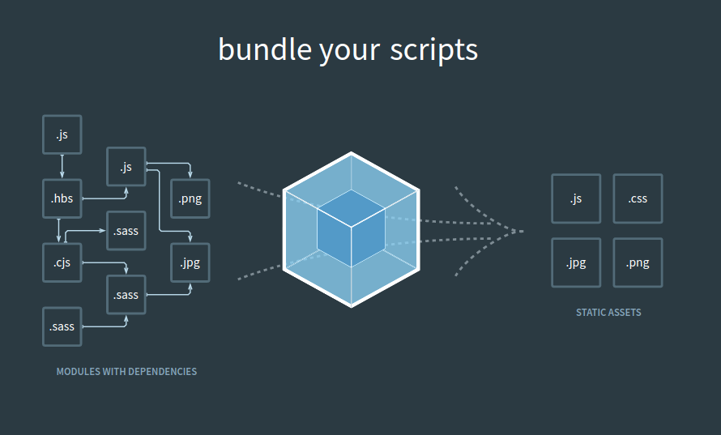
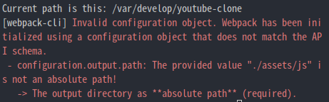
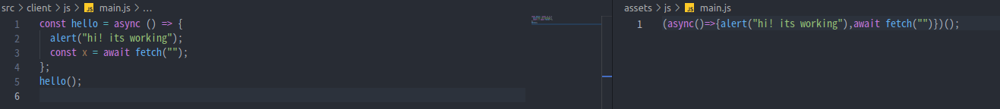
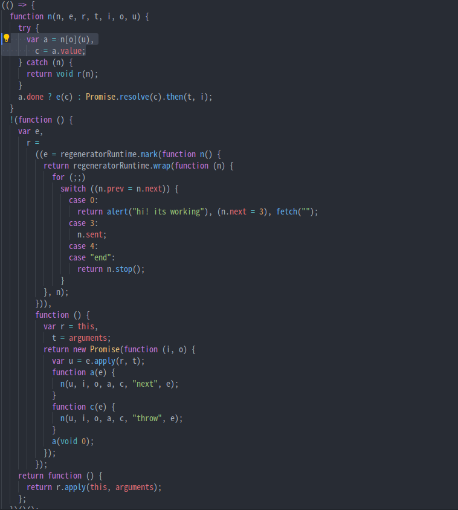
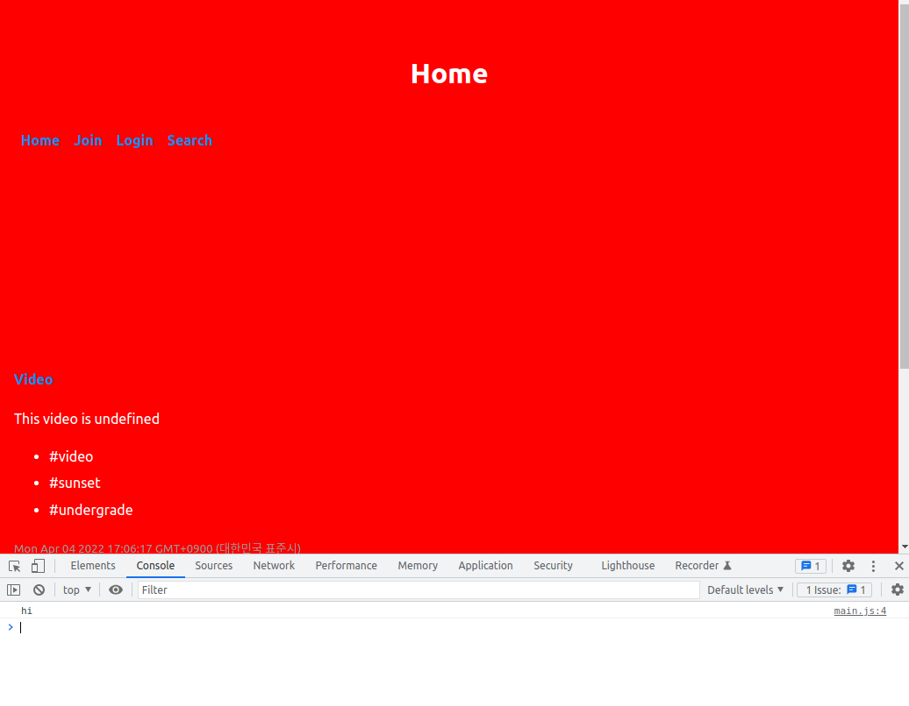
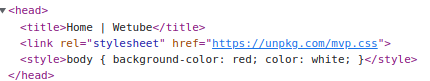

# WebPack

## 1. webpack이란?

프론트엔드 개발자라면 꼭 알아야 하는 기술중 하나라고 한다.

- **Webpack** = **모듈 번들링**이라고 한다.
- **_Javascript Application의 Static Module Bundler_**
- html 파일에 들어가는 자바스크립트 파일들을 하나의 자바스크립트 파일로 만들어주는 방식을 **모듈 번들링**이라고 한다.
- 쉽게 말하면, 필요한 다수의 자바스크립트 파일을 하나의 자바스크립트 파일로 만들어 주는 것을 **Webpack**이라고 한다.

### 1.1 Webpack 왜 사용하는 것일까?

- 2000년대 초 쯤만하더라도 정적인 페이지를 운영하는 형식이라 페이지가 변화할때마다 새로운 HTML을 요청하여 화면을 그렸다. 그래서 그 당시엔 자바스크립트는 DOM을 조작하는 간단한 역할만 했기 때문에 HTML에 script태그를 넣는것으로 충분했다.
- 요즘 **SPA(Single Page Application)** 은 하나의 HTML에 수백개의 자바스크립트 파일을 포함하기에 비중이 어마어마하게 커졌다.
- SPA가 연광죄어 있는 자바스크립트 종속성 있는 파일들을 하나의 파일로 묶어줘서 관리하기 편하다.
- 파일을 컴파일 할 때, 여러 모듈들의 파일을 읽어오는데 시간이 오래 걸린다. 그 부분을 해결하기 위해 여러 파일을 하나의 파일로 번들링 해준다. **웹페이지 성능 최적화**

좀 더 예시를 들어가며 확인을 해보자.

자바스크립트 파일이 많아지면서 기존에 생성된 전역변수가 덮어지는 실수가 생기기도 하고, 많은 양의 스크립트를 사용하기에 네트워크 병목현상이 생기는 등의 문제도 있었다.

예를 들어, **페이스북**같은 경우에 댓글을 달면 DB에 그 내용을 저장하고 좋아요 및 부가기능들도 물론 DB에 저장을 할 것이다.

이러한 기능들이 파일 내부에서 작성되어 있다면, 적어도 1000줄이상에 방대한 코드가 될것이며, 또한 가독성 및 추후에 어떤 부분에 기능을 개선할때도 그 어떤 부분과 관계없이 다른 기능들의 코드를 전부 다 봐야하는 문제도 발생한다.

그래서 이러 저러한 기능들을 파일들로 따로 구성하는 것을 **모듈화**라고 볼 수 있고, 이러한 관점에서 프로그래밍을 하는것을 **모듈화 프로그래밍**이라고 한다.

하지만, 위 모듈화 프로그래밍도 효율성이 좋다고만 볼 수는 없으며, 소프트웨어가 커지면 커질수록 각각의 세분화된 모듈들은 많이지고 이러한 모듈 단위의 파일들을 호출할 때 신경써야하는 변수들의 스코프 문제, 그리고 호출할 때 생겨나는 네트워크 쪽의 코스트도 신경써야한다.

> 스코프(scope): 변수가 사용될 수 있는 영역

> 스코프 문제같은 경우 반복문과 비동기 함수가 만나는 경우를 예시로 볼 수 있다.

> ```js
> for (var i = 0; i < 50; i++) {
>   setTimeout(function () {
>     console.log(i);
>   }, 1000);
> }
> ```
>
> 이런식으로 되어 있는 상황에서 우리가 기대하는 결과값은, 0 1 2 3 4 ... 49가 찍히는 것인데 실제 결과는 50 50 50 50 50 .... 50 이렇게 나온다. 참고: [자바스크립트 스코프(scope) - 도롱뇽 BLOG](https://nscworld.net/2021/01/28/%EC%9E%90%EB%B0%94%EC%8A%A4%ED%81%AC%EB%A6%BD%ED%8A%B8-%EC%8A%A4%EC%BD%94%ED%94%84scope/)

그래서 이러한 문제를 바탕으로 나온 것이 **웹팩(Webpack)의 번들링 개념**이다.

그렇다면 번들링을 하면 무엇이 좋을까?

## 1.2 번들링 이점

1. 이전에 방식에서는 각 파일들마다 서버에 요청을 하여 자원을 얻어와야 했지만, 웹팩을 이용한 번들링은 같은 타입(html,css,js등)의 파일을 묶어서 요청/응답을 받기 때문에 **네트워크 코스트가 줄게된다**.
2. Webpack ver.4 부터는 development모드, production모드 두가지의 모드를 지원하여 production모드로 번들링을 진행할경우 코드 난독화, 압축, 최적화 작업을 한다. 한마디로 **상용화된 프로그램을 사용자가 느끼기에 더욱 쾌적한 환경 및 보안까지 신경쓰면서 노출시킬 수 있다는 점**이다.
3. Webpack의 주요 구성 요소 중 하나인 로더(Loader)가 일부 브라우저에서 지원이 되지 않는 **ES6 형식의 자바스크립트 파일을 ES5로 변환**하여 사용할 수 있게 만들어준다. 웹 개발을 할때 모든 브라우저에 대해 고려해야 하므로 Webpack Loader가 아주 큰역할을 한다는 것을 볼 수 있다.



## 2. webpack.config.js 기본 설정

이제 본격적으로 Webpack을 사용하면서 구성요소 및 활용법을 알아보자.

일단 먼저 설치부터 해줘야 한다.

    $ npm i webpack webpack-cli --save-dev

이것들은 devDependencies에 저장되어야 한다.

만약 패키지가 재대로 설치되었는지 확인하고 싶다면, 다음 CLI를 쳐주면 된다.

    $ ./node_modules/.bin/webpack -v

Webpack을 사용하기 앞서 자바스크립트 설정파일을 만들어 줘야 한다.

**Webpack을 만들 최상위 경로에 webpack.config.js라는 자바스크립트 파일을 만들어주자.**

### 2.1 webpack.config.js 구성 요소

먼저 webpack.config.js의 구성요소부터 설명한 후 코드로 이어나가며 알아보자.

```js
const path = require("path");

module.exports = {
  entry: "./src/test.js",
  output: {
    filename: "bundle.js",
    path: path.resolve(__dirname + "/build"),
  },
  mode: "none",
};
```

구성 요소를 알아보자.

- **path**: 파일의 경로를 다루고 변경하는 유틸리티
- **output**: build의 결과를 저장할 경로
- **entry**: build의 대상이 될 파일
- **Plug-in**: build 된 bundle 파일을 동적으로 특정 html 페이지에 추가 할 수 있으며 build시에 javascript, css, html 등의 파일을 난독화 및 압축을 진행할 수 있다.

자바스크립트 파일 중에는 여러가지 파일들이 있다. CSS/ img /jsx 등 이 파일들을 하나의 webpack으로 말아주기 위해서는 그 파일들을 설정해줘야 한다. 거기서 **Loader이 사용**된다.
Loader은 나중에 살펴보기로 하자.

### 2.2 webpack.config.js 설정 { entry, output }

이제 우리 코드로 알아보도록 하자.

먼저 우리가 설정해줘야 할 것은 entry, output이다.

**Entry**는 우리가 처리하고자 하는 파일이 들어가면 되는데, src 가서 **client**라는 폴더를 만들자. (폴더명은 client말고 **frontend** 혹은 **asset**으로 사용하기도 한다. 물론, 아예 다른 명을 사용해도 된다.)

client안에 js라는 폴더를 만들었고, main.js 파일을 만들면 되겠다. client -> js -> main.js

이러면 우리는 client 폴더 안에 있는 코드인 프론트 엔드쪽과 나머지 백엔드 쪽을 구분지어 놓은 것이다.

entry와 output은 다음과 같이 해두면 된다.

module.exports = {
entry: "./src/client/js/main.js",
output: {
filename: "main.js",
path: "./assets/js",
},
};

**output**을 위해서 파일명을 정해주면 되고, 파일을 어디에 저장할지 지정해주면 된다.(해당 파일과 폴더가 없어도 자동으로 생성된다.)

이 부분을 해석하자면 "현재 src/client/js에 있는 main.js파일을 ( ) 방식으로 변경/전환 시켜서 작업이 끝난 후에 그 파일을 main.js라는 파일명으로 ./assets/js에 저장해줘!" 라고 보면 된다.

( ) 방식을 설정해줘야 하겠지만, 일단 먼저 실행이 되는지 부터 확인해 보자.

webpack실행은 nodemon실행할 때와 동일하게 package.json가서 설정을 해주면 된다.

```js
  "scripts": {
    "dev": "nodemon --exec babel-node src/init.js",
    "assets": "webpack --config webpack.config.js"
  },
```

이렇게 하면 configuration output의 경로가 absolute path가 아니라는 오류가 나온다.

이것을 **dirname이 해결해준다. **dirname을 출력해보자.

```js
console.log("Current path is this: " + __dirname);
module.exports = {
  entry: "./src/client/js/main.js",
  output: {
    filename: "main.js",
    path: "./assets/js",
  },
};
```



[dirname(directory name)](https://nodejs.org/api/path.html#pathdirnamepath) 은 말 그대로 파일까지의 경로 전체를 말하는 것이다.

그리고 [path.resolve()](https://nodejs.org/api/path.html#pathresolvepaths)도 사용할 것인데, 이 함수는 몇 개가 됐든 입력하는 파트들을 모아서 경로로 만들어 주는 것이다.

다음을 출력해보자.

    console.log(path.resolve(__dirname, "assets", "js"));


```js
const path = require("path");

module.exports = {
  entry: "./src/client/js/main.js",
  output: {
    filename: "main.js",
    path: path.resolve(__dirname, "assets", "js"),
  },
};
```

이렇게 함으로써 기본적인 entry와 output설정을 완료했다.

### 2.3 webpack.config.js 기본 설정 { Loader }

먼저 위에 코드를 실행했을 때 'mode'를 설정하지 않았다고 메세지가 나온다.

'mode'의 경우 3가지가 있다.

1.  **development**: 개발 모드
2.  **production**: 배포 모드(기본 값)
3.  **none**: 기본 최적화 옵션 설정 해제

참고: [Webpack 모드 - Webpack 러닝 가이드](https://yamoo9.gitbook.io/webpack/webpack/config-webpack-dev-environment/webpack-mode)

production mode로 설정이 되어 있을 경우 코드들을 매번 압축할텐데 개발 도중에는 별로 좋지 않다. 그래서 현재로썬 development가 좋을 것 같다.

내가 작성한 코드와 압축된 코드는 다음과 같이 볼 수 있다.



이제 **Loader**로 넘어가자.

**로더(Loader)** 는 웹팩이 웹 애플리케이션을 해설할 때 자바스크립트 파일이 아닌 웹 자원(HTML, CSS, Images, 폰트 등)을을 변환할 수 있도록 도와주는 속성이다.

CSS Loader를 적용한 예시를 살펴보자면, 코드는 다음과 같다.

```js
// webpack.config.js
module.exports = {
  entry: "./app.js",
  output: {
    filename: "bundle.js",
  },
  module: {
    rules: [
      {
        test: /\.css$/i,
        use: ["style-loader", "css-loader"],
      },
    ],
  },
};
```

위의 **module쪽 코드를 보면 rules 배열에 객체 한 쌍을 추가**했다. 그리고 그 객체에는 두가지 속성이 들어가 있는데 아래와 같은 역할을 합니다.

- **test**: 로더를 적용할 파일 유형 (일반적으로 정규 표현식 사용)
- **use**: 해당 파일에 적용할 로더의 이름

여기서 rules라는 개념도 한번 짚고 넘어가자.

- rules: 각각의 파일 종류에 따라 어떤 전환을 할 것인지를 결정

위 코드 rules에 의하면 모든 CSS파일들을 가져다가 해당 변환('style-loader')를 적용시킬 것이다.

물론 현재 우리가 필요한 것은 CSS쪽이 아닌 javascirpt 그 중에서도 Babel이다.

그래서 우리는 babel-loader를 사용할 것인데, 다음과 같이 설치부터 해주자.

    $ npm install -D babel-loader @babel/core @babel/preset-env webpack

그리고 다음과 같은 방식으로 사용하면 된다.

```js
const path = require("path");

module.exports = {
  entry: "./src/client/js/main.js",
  output: {
    filename: "main.js",
    path: path.resolve(__dirname, "assets", "js"),
  },
  module: {
    rules: [
      {
        test: /\.js$/,
        use: {
          loader: "babel-loader",
          options: {
            presets: [["@babel/preset-env", { targets: "defaults" }]],
          },
        },
      },
    ],
  },
};
```

해당 코드는 javascript 코드를 babel-loader이라는 loader로 가공하는 것이다.

webpack은 node-modules에서 babel-node를 찾을것이고, 우리는 몇가지 옵션을 건네주는 것이다.

옵션은 해당 페이지를 참고하자

참고: [Configuration | webpack](https://webpack.js.org/configuration/)

실행 결과는 다음과 같다.



이제 webpack.config.js에서의 기본 설정은 마무리가 되었다.

## 3. WebPack 활용

이제 본격적으로 webpack을 활용해서 진행해보자.

먼저, 현재까지 진행해 왔다면 실행하는데 있어서 문제는 없을것이다. 하지만, 프론트쪽에서는 재대로 작동이 되지는 않을 것이다.

왜그럴까?

우린 아직 Express에게 assets/js/main.js 의 존재를 알려주지 않았다. 즉, 서버는 아직 main.js파일의 존재조차 모르고 있는 것이다.

이전 [File Upload부분](./user-profile.md)에서 upload폴더를 static 파일들로 설정했던것이 기억나는가?

그와 동일한 방식으로 처리해주면 된다.

server.js

```js
app.use("/assets", express.static("assets"));
```

이렇게 함으로써 localhost:4000/assets/js/main.js 해당 URL에 User가 접근을 할 수 있게 되었다.

> 만약 여기서 /assets대신 /static을 사용하면 어떻게 될까?
> localhost:4000/static/js/main.js로 가면 화면이 나올까? 나온다.
>
> 결국 설정해둔 url이랑 폴더명이랑 달라도 설정해둔 url을 입력하면 해당 폴더로 접근하게 된다는 것이다.

이제 assets/js/main.js를 base.pug랑 연결시켜주면 된다.

base.pug

```pug
...

...

script(src="/static/js/main.js")
```

### 3.1 webpack CSS

이제 CSS를 처리해 보자.

먼저, client폴더 안에 scss폴더를 만들고 그 안에 styles.scss와 \_variables.scss 파일들을 만들어 주자.

이제 해야할 것은, 모든 scss 파일들을 변활할 것이다.

그걸 위해 세가지 다른 loader들을 사용할 것이다.

loader를 사용하는 방식에 집중해볼 필요가 있는데 크게 두가지가 있다.

1. Object{객체}를 사용하는 방법
2. 여러가지 loader들을 가져다가 한 가지의 변형

우리가 할 것은 **scss파일을 가져다가 일반적인 css로 바꿀것이다.**

3가지 Loader를 알아보자.

1. **sass-loader**: scss를 가져다가 일반 css로 변형해줄 Loader
2. **css-loader**: 폰트같은걸 불러올 때 css에 굉장히 유용하게 쓰일 Loader
3. **style-loader**: 변환한 css를 웹사이트에 적용시킬 Loader

차례대로 설치부터 해주자.

    $ npm install sass-loader sass webpack --save-dev

    $ npm install --save-dev css-loader

    $ npm install --save-dev style-loader

style-loaer같은 경우 css를 DOM에 주입한다.

이제 loader를 합쳐야하는데 어떻게 하는것이 좋을까?

**중요한 것은 제일 마지막 loader부터 시작해야 한다는 것이다.(역순)**

```js
      {
        test: /\.scss$/,
        use: ["style-loader", "css-loader", "sass-loader"],
      },
```

왜 역순일까? **webpack은 뒤에서부터 시작하기 때문이다.**

> 참고삼아 말하는데, styles-loader가 아닌 것에 주의하자.

재대로 작동하는지 확인하기 위해서 client/js/main.js에 다음과 같이 해주자.

main.js

```js
import "../scss/styles.css";
console.log("hi");
```

이어서 두 css파일엔 다음과 같이 해주자.

\_variables.scss

```css
$red: red;
```

styles.scss

```css
@import "./_variables";

body {
  background-color: $red;
  color: white;
}
```

결과는 다음과 같다.



webpack은 해당 css코드를 브라우저로 가져가서 head태그 안에 넣어준 것을 확인할 수 있습니다.



몇 가지 옵션이 있는데, 우리가 필요한 것은 이거다.

1. 어디에 코드를 적을 수 있는지
2. 어떻게 style을 넣을지

scss안에 작성한 코드가 html의 head태그에 그대로 들어가 버리는 것은 좋은 것 같지 않다. html과 css가 분리되면 좋겠다.

해당 페이지를 참고해서 다음의 코드를 보자.

```js
webpack.config.js

module.exports = {
  module: {
    rules: [
      {
        test: /\.css$/i,
        use: [
          // The `injectType`  option can be avoided because it is default behaviour
          { loader: "style-loader", options: { injectType: "styleTag" } },
          "css-loader",
        ],
      },
    ],
  },
};
참고: [Style Loader](https://webpack.js.org/loaders/style-loader/#root)
```

이 코드를 보자면, 이건 **css-loader와 style-loader를 합치는 예시**이다.

이제 볼건, 두 파일을 얻기 위해 **webpack plugin**을 쓰는 방법이다.

위에서 말했던 것처럼 우리는 javascript가 css를 넣기보단, 분리된 css파일을 만들면 좋겟다.

그 이유는 **javascript가 로딩되는 걸 기다려야 하므로 분리하면 좋겟다.** 바로 화면에 띄우고 싶다.

그래서 사용하는 것이 MiniCssExtractPlugin이다.

    $ npm install --save-dev mini-css-extract-plugin

이건 **해당 코드를 다른 파일로 분리시키는 역할**을 한다.

webpack.config.js에서 코드를 살펴보자.

```js
const MiniCssExtractPlugin = require("mini-css-extract-plugin");
...

      {
        test: /\.scss$/,
        use: [MiniCssExtractPlugin.loader, "css-loader", "sass-loader"],
      },

...
```

이와 같이 해주고 그 다음으로 수정해야 될 것은 js폴더에 있다.

css와 javascript를 따로 관리하기 위해서 다음과 같이 코드를 수정해준다.

```js
  plugins: [
    new MiniCssExtractPlugin({
      filename: "css/styles.css",
    }),
  ],
  output: {
    filename: "js/main.js",
    path: path.resolve(__dirname, "assets"),
    clean: true,
  },
```

이렇게 함으로써 assets폴더안에 js폴더와 css폴더가 생겨서 관리될 것이다.

아까 Template을 수정했는데 이제 javascript가 css코드를 넣어주는게 아니므로 다음과 같이 수정하자.

    $ link(rel="stylesheet", href="/static/css/styles.css")

이제 두가지를 해주면 된다.

1. 실행하기 전, **항상 assets을 삭제**하고싶다. 왜냐하면 가끔 오래된, 새것이 아닌 복사본들이 남아있다.
2. SCSS나 프론트엔드쪽 자바스크립트에서 무언가를 변경할 때마다 npm run assets을 실행하는건 귀찮다. **자동으로 해주자.**

1번 의 경우 **clean: true**를 output에 주면 된다. 다음과 같이 하면 된다.

```js
  output: {
    filename: "js/main.js",
    path: path.resolve(__dirname, "assets"),
    clean: true,
  },
```

clean의 역할은 말그대로 output folder를 build 하기 전에 clean 해주는 것이다.

2번을 해결해주기 위해서 **watch**를 사용하자.

webpack.config.js

```js
...

watch: true,

...
```

이렇게 하면 이제 npm run assets을 실행하고나면, 코드를 저장할 때 수정이 되어 있으면 알아서 실행해 줄 것이다.

그래서 우리는 console을 두 가지를 써야한다.

하나는 "npm run dev", 다른 하나는 "npm run assets"을 실행시키게 될 것이다.

근데 여기서 저렇게만 둔다면 문제가 있다. 프론트엔드 자바스크립트 코드가 변경될 때 백엔드도 다시 재시작을 한다.

이 부분을 고쳐주기 위해 nodemon을 조금 변경하자.

현재 우리는 package.json을 보면 다음과 같이 "script"를 작성해 놓았다.

```js
  "scripts": {
    "dev": "nodemon --exec babel-node src/init.js",
    "assets": "webpack --config webpack.config.js"
  },
```

특히 저 dev를 저렇게 하는 것이 아니라 설정파일을 하나 생성해 줄 것이다.

nodemon.json

```js
{
  "ignore": ["webpack.config.js", "src/client/*", "assets/*"],
  "exec": "babel-node src/init.js"
}
```

이렇게 해줌으로써 igonore에 적어둔 파일들은 front-end code가 수정되어도 재시작 하지 않을 것이다.

그리고 package.json에선 다음과 같이 해주면 된다.

package.json

```js
  "scripts": {
    "dev:server": "nodemon",
    "dev:assets": "webpack"
  },
```

> - "nodemon"이라고 써져 있는것을 보고 nodemon.json을 자동적으로 실행해 줄 것이다.
> - "assets"도 "webpack"만 썻을 때 문제가 없는 이유는 webpack.config.js파일이 webpack이 실행 될 때 기본적으로 찾는 default 설정 파일이기 때문이다.
